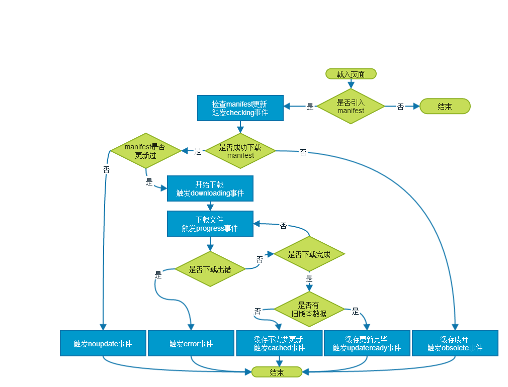
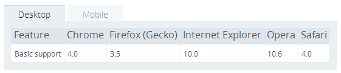
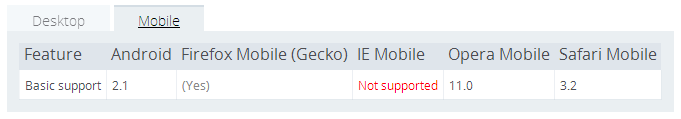
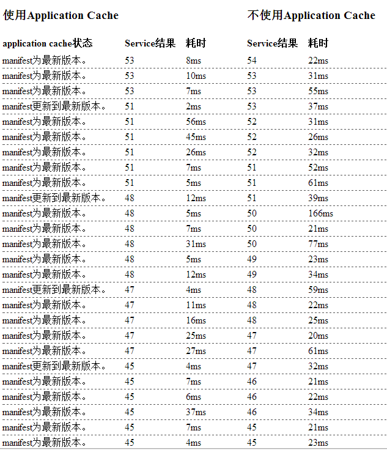
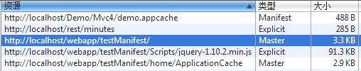

_Application Cache_ 是 HTML5 为 web 应用离线使用而增加的 api，虽然都是有关存储，但与 LocalStorage、 Cookie、SessionStorage 有相当大的不同。Application Cache 存储的是一系列的请求资源，允许浏览器在请求这些资源的时候，不必通过网络。如果设计良好的话，使用 Application Cache 能达到离线状态下，web 应用仍能带来友好的用户体验。

## 使用方法

### 过程与原理

Application Cache 的使用要做两个方面的工作，浏览器端和服务器端。在服务器端需要维护一个缓存清单 _manifest_ 文件，这个文件里面记录了需要缓存的请求、不需要加入缓存的请求等内容。具体的 manifest 文件的语法及示例参见 [http://www.w3school.com.cn/html5/html_5_app_cache.asp](http://www.w3school.com.cn/html5/html_5_app_cache.asp)。浏览器通过请求这个 manifest 文件来判断是否可以使用 application cache，以及 application cache 是否需要更新等。浏览器对于 manifest 文件的新旧判断依据很简单，就是是否一样，只要有一点区别，浏览器就认为 manifest 文件有更新，需要重新缓存所有数据。所以我们常常通过更改 manifest 注释的方式来提醒浏览器要更新缓存。需要注意的是，manifest 文件的文件名及路径没有特别要求，但对于它的 _MIME-type_ 必须设置为 `text/cache-manifest`。

在浏览器端的设置很容易，只需要在HTML标签上添加 manifest 属性即可，类似：

```html
<html manifest="cache.appcache"></html>
```

仅仅这样做就完成了 Application Cache 的配置，关于 cache 的检查、更新、读取都是浏览器自动完成。

<div class="mix-light mix-both">



</div>

<p class="captain">图1：manifest的解析过程</p>

浏览器解析 manifest 的过程如上图所示。HTML5 定义了 Application Cache 的几种事件，并允许 JS 捕获这些事件。事实上 JS 对 application cache 很难主动地进行操作，也没有读写接口，绝大部分情况下，application cache 的使用是不必借助 JS 的。还有一点需要补充，以上是网络连接正常时的流程，当网络连接不正常时，浏览器请求 manifest 文件时连接失败，则进入离线模式，直接从 application cache 中加载页面，同时 application cache 会触发 `error` 事件。

需要注意的是，下载 manifest 清单里的内容是与页面载入同时进行的，也就是说，如果本次载入需要更新缓存，则本次页面载入时无法使用最新版本的缓存。

### 可用性

Application Cache 被支持情况见下图：



<p class="captain">图2：桌面浏览器的支持情况</p>



<p class="captain">图3：移动浏览器的支持情况</p>

参考：[https://developer.mozilla.org/en-US/docs/HTML/Using_the_application_cache](https://developer.mozilla.org/en-US/docs/HTML/Using_the_application_cache)。

整体上，Application Cache 的受支持情况比较理想。即使对于不支持的浏览器而言，通常情况下也不会产生不一致的表现，所以兼容性问题不是应用 Application Cache 的拦路虎。

在测试的过程中，我对浏览器允许 manifest 列表长度及允许的 cache 空间比较感兴趣。网上传言各浏览器对这两点会有限制。但在我不完备的测试中，没有发现具体的限制。在桌面版的 Chrome 中，缓存1000+条请求，1G+的数据均未出错；安卓手机中也尝试缓存过1000+条请求，100M+的数据，同样正常。我觉得这样的测试很极限，实际应用不可能出现这样的场景。当缓存请求数过多，数据量太大，那么在页面载入的时候会进行漫长的下载过程，对用户体验、流量和服务器来说都不合适。反过来说呢，我推测在我们正常应用范围内，不需要对 cache 空间和请求数目太过担心，唯一需要担心的是考虑把什么样的数据缓存起来才最合适。

## 优点

使用 Application Cache 的优点主要体现在网络性能的提升上。把一些 http 的请求转为从本地存储中读取，有效降低网络延迟，提升请求加载速度。这点从下面测试截图中可以看出。同时，cache 的使用减少了用户网络请求的次数，从而节约了用户流量。并且能够在一定程度上降低 web 应用对网络的依赖性。

除此之外，我觉得 Application Cache 的使用足够简单，向开发人员屏蔽了实现细节，只需要很小的工作量就可以使用。不仅如此，在成熟项目中使用此功能，对原有逻辑几乎没有影响，即使设备不支持也不会产生副作用。

<div class="mix-light mix-both">



</div>

<p class="captain">图4：本地搭建环境测试结果</p>

### 问题点

在测试过程中，我也发现了一些值得注意的问题：

1. 新版本缓存不立刻生效问题

   受制于 Application Cache 的实现机制，当检测到 Manifest 新版本，并更新缓存时，页面加载过程已经开始，甚至页面加载完成时，cache 更新还没有完成。于是浏览器的策略是当 manifest 有更新时，此次加载不会使用新版数据。不仅如此，直到下次检查 manifest 更新之前的所有请求的缓存均为旧版本缓存。这意味着如果页面一直不刷新，那么通过 application cache 请求到的都是旧版本数据。

   Application Cache 提供了 `update()` 方法来手动发起 manifest 版本的检测；提供了 `swapCache()` 方法手动启用新版数据。如果应用对数据版本新旧不敏感，则可以使用这两个方法来保持 cache 最新数据。

2. Manifest 中的请求路径相对于 manifest 文件，而非当面加载页面

   如果在 _www.a.com/index.html_ 页面上指定了 manifest 地址为：_www.a.com/manifest/app.cache_，那么在 manifest 中定义的一条请求地址如果是 a.jpg，那么它代表的 URL 为 _www.a.com/mainifest/a.jpg_。

3. 被缓存的不仅仅是manifest清单的内容

   
   <p class="captain">图5：浏览器cache情况</p>

   如上图所示，被缓存的数据还包含 manifest 本身，其类型为 Manifest，以及启用 application cache 的页面，其类型为 Master。至于 application 中缓存 Master 类型的机制我还不是十分清楚，这里无法详谈。

4. 卸载 application cache 问题

   Application cache 的卸载略微麻烦。文档上说只要当 manifest 请求返回 4xx 即可卸载 application cache，但实际操作下来发现，需要给**所有**类型为 Master 的页面指定一个不存在有 manifest，才可以卸载 cache，而且这个过程也不是实时的，往往有一定的延迟，可能与浏览器的实现有关。

5. “回滚悖论”

   这个问题很少被人提到，名字我自己取的，但在我的测试中，这个问题相当典型。目前浏览器在解析 manifest 的策略有这样两个：

   - 如果处理 manifest 清单过程中触发 `error` 事件，则为保证内容一致性，废弃此次所有下载的内容，使用旧版本数据；
   - 如果下载文件失败，则触发 `error` 事件。

   假设现在 manifest 清单上有一个文件的访问出现异常，例如 restful 服务调整、图片名称变更等等，哪怕这个文件根本用不到，它也会导致整个 application cache 更新失败。浏览器执行这样策略的出发点是为了保证 application cache 中的内容保持同一版本，但似乎矫枉过正。实际应用中我们无法改变这个策略，但需要知道这里的风险，当清单中有文件无法下载，则会导致缓存永远无法更新，直到 manifest 文件修复。在此期间，浏览器每次都加执行 manifest 的解析、下载、失败、回滚这样的循环，造成服务器和网络的浪费。

6. “更新悖论”

   其实上一个问题称之为“悖论”有点夸张，但这个问题却不一定。考虑这样一个问题，如果我们将 index.html 的 manifest 的指向从 a.cache 改为 b.cache 会发生什么。答案是如果不更新或删除 a.cache 的内容，缓存将不更新。原因是 index.html 被浏览器缓存了，每次解析的时候仍然是检查 a.cache 的更新情况，即使我们在更新资源的同时，记得更新 b.cache，结果每次检查的结果也全是 `noupdate`。

7. 多页面多 manifest 与多页面单 manifest

   首先需要留意 application cache 是由 manifest 管理的。例如 _a.html_ 的 manifest 为 _a.cache_，_b.html_ 的 manifest 为 _b.cache_，两个 manifest 都加入了 _common.js_ 的缓存。现在更新了 _common.js_ 的内容，并修改了两个 manifest 的版本号，如果加载 _a.html_，则 _common.js_ 会更新到 application cache中，那么再加载 _b.html_ 时，从 application cache 中读出的是新版本的 common.js 还是旧版本的呢？是旧版本的，因为每个 manifest 独立管理自己的 application cache 内容，虽然在同一个站点下，虽然请求内容完全一样，但 _common.js_ 却是被缓存在两处，彼此独立。

   类似的，_a.html_ 和 _b.html_ 的 manifest 都是 _a.cache_，现在更新了 _common.js_ 和 _a.cache_，如果加载了 _a.html_，_common.js_ 更新到了 application cache 中，那么此时加载 _b.html_ 会加载新版本还是旧版本的 _common.js_ 呢？是新版本，因为两个页面的 _common.js_ 由同一个 manifest 管理。

8. 受制于 HTTP 报头的 `Cache-control` 字段

   若此字段设置为 `no-cache`，则不通过 application cache 获取数据。但检查 manifest 的流程并没有变，依然会更新最新的 manifest，并下载 manifest 内规定的文件。
   所以通过 ajax 请求数据，且希望使用到 application cache 时，注意配置（如有必要）：

   ```js
   $.ajaxSetup({
     cache: true
   });
   ```

9. Application cache 更新进度的问题

   如果需要追踪 Application cache 的更新进度，理论上可以通过监听 application cache 的 `progress` 事件来完成，每个文件下载时会触发 `progress` 事件。但由于 manifest 解析流程和页面加载流程同时进行，所以在处理 `progress` 事件时极有可能 dom 或 js 库尚未加载，可能很难在页面上做呈现。不过如果手动触发 `update()` 方法，并监听 `progress` 事件，相对会可控得多。

## 总结

我认为使用 application cache 从技术上和可用性上而言，实现成本比较低，开发量比较少，副作用比较小，适用性比较广。但怎么用，用多少是需要考虑的点。由于原理上，application cache 是把 manifest 上的资源一起下载下来，所以 manifest 里的内容不宜过多，数据量不宜过大；由于 manifest 的解析通常以页面刷新为触发点，且更新的缓存不会立即被使用，所以缓存的资源应以静态资源、更新频率比较低的资源为主。另外要做好对 manifest 文件的管理，避免上面所提的由于清单内文件不可访问或 manifest 更新不及时造成的一些问题。
