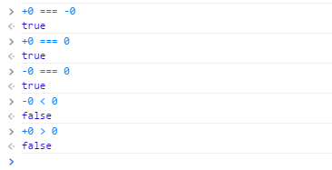
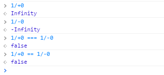

自古js多奇葩，语言层面上有许多坑，入坑多了也就习惯了。那就再多一个坑吧。

javascript在判断两个值是否相等时，有两种方式 `==` 和 `===`。这两者的区别我就不多说了，随便一本 js 书上都有，总之一般情形下我们有这样的结论：`==` 省事，但结果混乱，很多情形下近乎伪科学，不建议使用，很多人更是视其为洪水猛兽，避之不及（它的坑太多，我写不完，不写了）；`===` 很严谨，在绝大多数情形下，应该使用。这个结论我是很认同的，并且尽量这么做。但是，javascript 作为一门任性的语言，不打打脸怎么好玩呢。那么一起来愉快地玩坏 `===` 吧 😎。

要玩坏 `===`，只需要用到0。没错，就是数字0。在 javascript 中，数字都是以浮点数的形式参与运算，其编码规则遵循 [IEEE_754](http://baike.baidu.com/view/1698149.htm) 标准（$0.2+0.1$不等于0.3这个问题怪它！）。重点也不是这个标准，重点是按照这个标准，数字编码会有一位符号位表示正负，所以对于任何数字，非正即负。那么问题来了，0呢？答案是0也是有正负的。通常我们看到的，它义的0都是+0，但在 javascript 中-0也是存在的。而在实际运算中，某些场景下，计算结果会产生+0和-0的差异；同样+0和-0参与计算时，可能会导致不同的结果。但在直观感受上，很明显+0和-0应该是相等的才对，于是 javascript 在语言层面上想消除这种差异，所以：

<div class="mix-light">



</div>

看起来很合理，虽然有点奇怪。但是再看这样的运算：

<div class="mix-light">



</div>

这不科学，明明判定为完全相同的值，进行相同的运算后，结果会不相等。对于开发者而言，我们并不能在任何场景下信任 `===`，它也有不靠谱的时候。

应对这种“不科学”的情形也很简单：

```javascript
function isEqual(a, b) {
  if (a !== b)
    return false;
  return a !== 0 || 1 / a === 1 / b;
}
```

---

2015年5月14日补充：

强调一下本文的重点吧，我从来没想质疑正负 Infinity 不相等的问题，我想分享的要点是：**在 js 中，+0 === -0，但它们并不是完全相等的。**

---

2015年5月26日补充：

头一回回复评论比正文还长……集中整理一下吧。

## 关于 IEEE_754 标准

这是一个使用二进制表示浮点数的方案，应用很广泛。它规定了一位符号位表示正负，0也不例外，这是负0产生的原因。这是带符号位的浮点数表示方案的通病，当然，不带符号位的方案就可以避免这个问题。不过这个问题并不严重，通常程序语言并不希望开发者知道负0的存在，直接在语言层面上规定正0和负0相等，这才是 `+0 === -0` 的本质原因。

我说负0的问题并不严重，是因为其使用场景少，出 bug 机率低。说到不严重，肯定有严重的问题，那就是浮点数精度的问题，数值是精确的、连续的；而数值编码是离散的，很多时候不准确的。毕竟32位也好、64位也好，能表现的浮点数是有限的。从0.1、0.2到0.9，真正能精确表达的只有0.5，其他的数字都是近似值。你可以自己尝试一下，不管 js、java 还是 c++，浮点数运算从来不可靠，比如 $0.2+0.1$ 并不等于0.3。如果你有过 c++ 或者 java 编程经验，很可能接触过一些奇葩的代码来处理浮点数比较，比如定义一个精度 0.002f（假设），如果 `abs(floatA - floatB) < 0.002f`，则认为两者相等。很反人类，但没办法。编程语言有错吗？没有，但现实就是要妥协。

## 关于负0

负0在数学上并没有意义，0是无符号的。但如果一个数值趋向于0，那么它是有符号的，可以为负。但对于这种情况，IEEE_754 标准并没有定义。所以实际开发场景中，如果一个数值趋向于0，那么它就是0，此时，负0就有意义了，它可能代表的是趋向于0的负数。本质上这还是 IEEE_754 精度，或者表达范围的问题。但当负0有了具体意义的时候，再说 `+0 === -0`，我觉得有待商榷的。

## 负0常见吗

首先我要说负0不常见，但绝不是大家想的通常不可能出现。其实一些常见的、简单的场景下就有可能出现-0。比如 `Math.ceil(-0.1)`、`Math.round(-0.1)`；还有不常见的 `Math.atan2(-1, Infinity)` 等。由正负0而产生不同计算结果的操作相对会更多一点，比如文章中的举例的倒数运算。

参考资料：

- [https://developer.mozilla.org/en-US/docs/Web/JavaScript/Equality_comparisons_and_sameness](https://developer.mozilla.org/en-US/docs/Web/JavaScript/Equality_comparisons_and_sameness)

## javascript 与 === 运算

通常情况下，=== 在 js 中，表示判断类型和值是否都完全相等。都说通常了，肯定有反例。很多熟悉js的人都知道这样一个知识点，`NaN !== NaN`。所以我们常常可以看到这样的代码：

```javascript
function isNaN(num) {
  return num !== num;
}
```

这就是编程语言为了满足直观的理解而操纵运算符的结果。+0和-0同样是这样，它们的编码并不同，但却判定它们相等。

对于以上两个点，EmacScript 6中加入了 `Object.is` 方法来处理：

```javascript
Object.defineProperty(Object, 'is', {
  configurable: true,
  enumerable: false,
  value(x, y) {
    if (x === y) {
      // 0 === -0, but they are not identical
      return x !== 0 || 1 / x === 1 / y;
    }

    // NaN !== NaN, but they are identical.
    // NaNs are the only non-reflexive value, i.e., if x !== x,
    // then x is a NaN.
    // isNaN is broken: it converts its argument to number, so
    // isNaN("foo") => true
    return x !== x && y !== y;
  },
  writable: true
});
```

参考资料：

- [http://wiki.ecmascript.org/doku.php?id=harmony:egal](http://wiki.ecmascript.org/doku.php?id=harmony:egal)
- [https://developer.mozilla.org/en-US/docs/Web/JavaScript/Reference/Global_Objects/Object/is](https://developer.mozilla.org/en-US/docs/Web/JavaScript/Reference/Global_Objects/Object/is)

对于负0的问题，EmacScript 5 中同样加入了 `isNegative0` 来处理-0。

参考资料：

- [http://www.wirfs-brock.com/allen/posts/128](http://www.wirfs-brock.com/allen/posts/128)

不仅如此，一些工具类库中也加入了类似的处理，如 underscore 的 `isEqual` 方法。

## So

对于绝大部分开发场景而言，-0根本没有存在感；但我把这个点分享出来，让更多的人知道有-0这个东西，让更多的人知道可能存在看似相同的输入，经过相同的计算，产生完全不同结果的可能，避免他们遭遇奇怪的bug。
