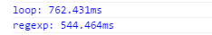

今天上午刷到一道题，大体是写一个方法判断一个单词中是否有重复的字母（或者说一个字符串中是否有重复的字符）。我的思路是一个字符一个字符地遍历，如果发现有重复的停止：

```javascript
function isIsogram(str) {
  str = str.toLowerCase();

  for (let i = 0; i < str.length; i++) {
    if (str.includes(str.charAt(i), i + 1)) {
      return false;
    }
  }

  return true;
}
```

这种简单的场景下谈性能没什么意义，两次循环速度并不慢（`str.indexOf()` 也认为是一次循环，但由于是 native 的行为，速度很快）。

后来我看到了别人用正则的实现，虽然很简单，但一开始我确实没住这方面想：

```javascript
function isIsogram2(str) {
  return !/(.).*\1/.test(str);
}
```

或者：

```javascript
function isIsogram2(str) {
  return !/^.*(.).*\1/.test(str);
}
```

这两个其实没什么区别，前者优先查找字符串尾端，后者优先查找字符串前端。这个正则比较好理解，不多解释，比较让我惊讶的这个匹配的性能。因为判断一个字符串是否有重复字符这样的任务太简单，正因为太简单，所以代表目标字符串的规律性太小。如果用正则必然带来大量尝试和回溯，其实主观上会让人觉得性能很不好。不过好不好不是随便想一想就行的，还是要验证一下。决定性能到底是好是坏，当然看最坏情况下，两个算法的执行时间。构造这样一个单词：`qwertyuiopas`，没有字母重复，意味着两种算法都要跑完整的循环。

```javascript
console.time('loop');
for (var i = 0; i < 400000; i++) {
  isIsogram('qwertyuiopas');
}
console.timeEnd('loop');

console.time('regexp');
for (var i = 0; i < 400000; i++) {
  isIsogram2('qwertyuiopas');
}
console.timeEnd('regexp');
```

看看运行结果：



Amazing! 这个实验证实了一个问题：javascript 对正则确实有优化，使用正则的效率非常高。当然这句话也可以反过来理解，javascript 中的字符串操作、循环太慢了。那么，对于正则还等什么呢，赶快用起来吧。
