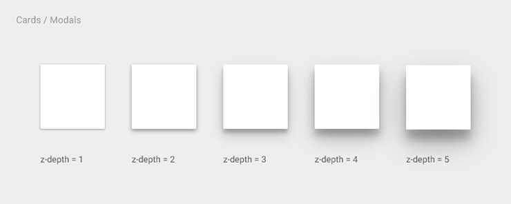
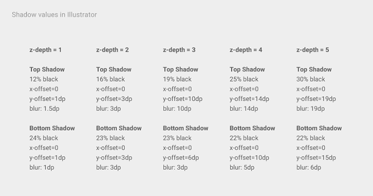

Box-shadow 虽然是一个 css3 的属性，但由于浏览器支持不错，且用它来营造一种立体感、层次感着实方便，这让它成为了互联网上随处可见的 css3 特效。不过我感觉想写好阴影不是一件容易的事情。至少我常常摸索半天，写出来的阴影却总让人很难受。 上周在知乎上看到了一个问答，很受启发：[如何理解 Material Design 中卡片的两层阴影](http://www.zhihu.com/question/28865209)，于是特意去看了 Meterial Design 的设计准则（[中文翻译](http://design.1sters.com/material_design/layout/layout-principles.html)），觉得其中的一些设计思想和细节追求很值得我们去借签。

本文标题是“更优雅地绘制阴影”，但其实我并不懂“优雅”是什么，只是觉得别人的做法比我的好，比我的优雅。那么就来看看别人是怎么理解阴影的。

Meterial Design 把 App 的部件、面板、模态框等都抽象成了卡片。对于一个个上面，除了有 x/y 轴坐标的定义，还增加了 z 轴。处于不同层级的卡片，有着相对独立的交互逻辑。可以说，卡片和层级就是一个 app 页面的交互隐喻。而层次的视觉定义就是通过阴影来完成。下面搬运两张图：




以上的阴影定义虽然是 AI 的格式，但很容易就能转换成前端的语言：

```css
.z-index-1 {
  box-shadow:
    0 1px 1.5px rgba(0, 0, 0, 0.12),
    0 1px 1px rgba(0, 0, 0, 0.24);
}
.z-index-2 {
  box-shadow:
    0 3px 3px 0 rgba(0, 0, 0, 0.16),
    0 3px 3px 0 rgba(0, 0, 0, 0.23);
}
.z-index-3 {
  box-shadow:
    0 10px 10px rgba(0, 0, 0, 0.19),
    0 6px 3px rgba(0, 0, 0, 0.23);
}
.z-index-4 {
  box-shadow:
    0 14px 14px rgba(0, 0, 0, 0.25),
    0 10px 5px rgba(0, 0, 0, 0.22);
}
.z-index-5 {
  box-shadow:
    0 19px 19px rgba(0, 0, 0, 0.3),
    0 15px 6px rgba(0, 0, 0, 0.22);
}
```

看看效果：

<div class="box-container">
    <div class="box z-index-1"></div>
    <div class="box z-index-2"></div>
    <div class="box z-index-3"></div>
    <div class="box z-index-4"></div>
    <div class="box z-index-5"></div>
</div>

嗯，确实比我自己实现的感觉要优雅。

> 先插几句话，`box-shadow` 属性很有意思，它允许有若干重属性值，效果是相互叠加。张鑫旭有一篇博客谈这个问题（[传送门](http://www.zhangxinxu.com/wordpress/2013/11/css-css3-box-shadow-%E7%9B%92%E9%98%B4%E5%BD%B1-%E5%9B%BE%E5%BD%A2%E7%94%9F%E6%88%90%E6%8A%80%E6%9C%AF/)），写得很好，大家可以参考一下。

这样的阴影效果大家自行感受，我觉得不管怎么样，好过我自己编造、瞎调出来的。但为什么要使用双重阴影？官方解释是用两个光源来模拟现实场景，一个是关键光，一个是环境光，所以会产生两个阴影。另外 [@jordanfc 迟方的回答](http://www.zhihu.com/question/28865209/answer/42385558) 很棒，但很多是结论性的东西，我们需要更多一点思考。

---

原文中大量内容不够严谨，现全部删除。

<style>
.z-index-1{
    box-shadow: 0 1px 1.5px rgba(0,0,0,0.12), 0 1px 1px rgba(0,0,0,0.24);
}
.z-index-2{
    box-shadow: 0 3px 3px 0 rgba(0,0,0,0.16), 0 3px 3px 0 rgba(0,0,0,0.23);
}
.z-index-3{
    box-shadow: 0 10px 10px rgba(0,0,0,0.19), 0 6px 3px rgba(0,0,0,0.23);
}
.z-index-4{
    box-shadow: 0 14px 14px rgba(0,0,0,0.25), 0 10px 5px rgba(0,0,0,0.22);
}
.z-index-5{
    box-shadow: 0 19px 19px rgba(0,0,0,0.30), 0 15px 6px rgba(0,0,0,0.22);
}
.box-container {
    width: 480px;
    display: flex;
    justify-content: space-around;
    height: 150px;
    align-items: center;
    background: #f0f0f0;
    margin: 0 auto 40px;
}
.box {
    width: 60px;
    height: 60px;
    background: #fff;
}
</style>
