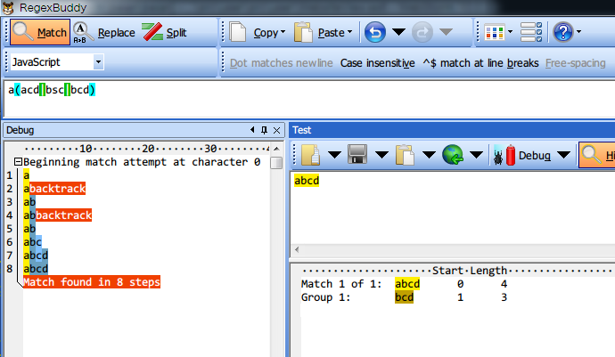
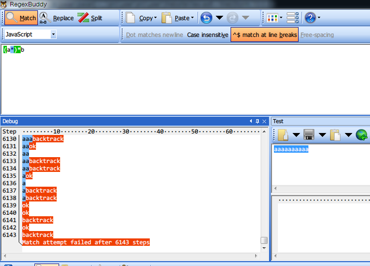
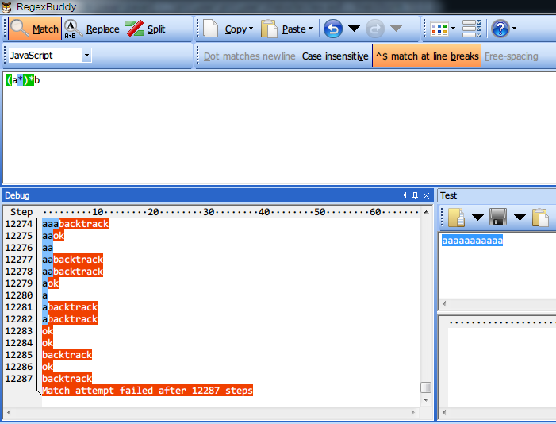

不知才哪儿看来的：

> 如果你有一个问题，你想到可以用正则来解决，那么你有两个问题了。

我觉得正则表达式实在是一种人难以理解的语言，比 xml 还要逆天。不过它真的很好用。正则表达式的坑在于，看到一个正则，我们很难直观地知道它要做什么；写了一个正则，我们也很难直观地想像机器是怎么处理的。因而常常出现想不到或者没想到的问题。今天我们谈谈一个严重影响性能的问题，我称之为回溯陷阱，或者叫灾难性回溯（Catastrophic Backtracking）。

## 回溯

对于正则而言，回溯并不是必需的，这跟具体的正则引擎有关。简单地说，正则引擎分为 NFA 和 DFA。这东西难懂且无聊，我就挑重点说。DFA（确定型有穷自动机），从匹配文本入手，从左到右，每个字符不会匹配两次，它的时间复杂度是多项式的，所以通常情况下，它的速度更快，但支持的特性很少，不支持捕获组、各种引用等等；而 NFA（非确定型有穷自动机）则是从正则表达式入手，不断读入字符，尝试是否匹配当前正则，不匹配则吐出字符重新尝试，通常它的速度比较慢，最优时间复杂度为多项式的，最差情况为指数级的。但 NFA 支持更多的特性，因而绝大多数编程场景下（包括 js），我们面对的是 NFA。

NFA 匹配的过程就是吃入字符，尝试匹配，如果通过，再吃入尝试；如果不通过，就吐出，回到上一个状态，因为同一个字符串在正则中可能存在一种状态不同转化路径，这时正则引擎换一个转化状态进行尝试，如果通过，继续吃入字符，否则继续吐出字符，回到再上一个状态。这种尝试不成功就返回上一状态的过程，我们称为回溯。正则匹配的性能好坏，就看回溯的情况，回溯越多，性能越差。

为了说清楚这个问题，我们做一个实验，用 `/a(acd|bsc|bcd)/` 这个正则来对 “abcd” 这个字符串进行匹配。



截图上方是正则表达式，右侧是要匹配的文本，左侧是匹配的过程。

可以看到，匹配这 4 个字母花了 8 步，分别看看这 8 步都在干什么。

- 第一步：从正则表达式第一个字符 a 开始，吃进 “abcd” 的第一个字符，也是 a，匹配成功！
- 第二步：这时正则表达式遇到了分支，后面有三种匹配可能，分别是 acd、bsc、bcd。先选择第一个路径 acd，吃入 “abcd” 的第二个字符，是 b，匹配不成功。这时就需要进行一次回溯了（backtrack），把吃进来的最后一个字符 b 还回去，同时放弃第一个路径，选择第二个路径 bsc；
- 第三步：第二个路径 bsc 中，第一个字符是 b，吃进 “abcd” 中的第二个字符，也是 b，匹配成功！
- 第四步：第二个路径 bsc 中，下一个字符是 s，吃进 “abcd” 中的第三个字符是 c，匹配失败，又要进行回溯了。把刚刚吃进的 c 和 b 还回去，回到第二步的状态，并选择第三个路径 bcd；
- 第五步~第七步：依次匹配 bcd 和 “abcd” 中的剩余字符，均匹配成功。
- 第八步：完成匹配。

从这个并不复杂的例子中，光 b 这个字母就匹配了三次，可见回溯在正则表达式中相当普遍。

## 量词嵌套

考虑这样一个正则 `/(a*)*b/`，用它来匹配 "aaaaaaaaaa"（10 个 a 组成的字符串）。看起来不复杂呀，实验一下：



哦，天哪，竟然花费了 6143 步才完成！如果再加上一个 a 呢，变成 11 个 a 组成的字符串会怎么样？



变成 12287 步了，翻了一倍。事实就是这样，当出现以上这种量词嵌套时，如果遭遇最坏情况（最后一个字符才能确实匹配不成功），那么这时正则引擎陷入灾难性回溯，时间复杂度为指数级）。

如果你试着再嵌套一层，9 个 a 组成的字符串就能突破 100 万步了……

## 其他情况

很多时候，并不是上面所述的那么极端的情况，更多的可能是对一个复杂的子句加量词，而这个子句中本身就含有量词；或者子句中有比较复杂的分组。这些情况实际应用中很可能会出现，虽然达不到夸张的指数级复杂度，但对性能依然是不小的挑战。

有一个例子我觉得比较有趣，对于性能优化这个问题，也有参考价值。什么例子呢？用正则表达式匹配一个数字是否为质数。呃……这有点跳跃，看似风马牛不相及，但还真能做到。我们就简单一点，不考虑 1。首先，把数字转成字符串，是几就写几个 1。比如 5 就转成 5 个 1 组成的字符串 11111。用来匹配的正则是 `/^(11+)\1+$/`，如果匹配通过，则是合数；不通过说明是质数。这个原理并不复杂，我不多说了。同样还有一些用正则测试二元一次方程整数解的问题，原理也类似。

这个例子其实没什么用，因为好玩所以印象深刻。那对于我们有什么参考价值呢？就是别写这么费性能的正则！这个例子中，看起来没有量词嵌套等情况，但与其他问题类似的，这里对引用值加了量词，而这个引用词并不确定，回溯仍然会很多。所以我们除了要注意量词嵌套、复杂子表达式加量词或分组加量词这些情况外，还要注意引用加量词，这点是我没见别人提到过的。

## 一些解决手段

### 量词运算

对于量词嵌套的情况，一些简单的运算可以消除嵌套：

```
(a*)* <==> (a+)* <==> (a*)+ <==> a*
(a+)+ <==> a+
```

很简单，不多说。

### 占有优先量词（Possessive Quantifiers）

这个有点意思，可惜 javascript 还不支持，我说简单说说。用法很简单，在量词的后面再加上一个+。类似 `/a++b/`，那么这和 `/a+b/` 有什么区别呢？占有优先量词并不保存回溯状态，换言之，前者不能回溯。如果匹配成功，没什么区别；如果最后 b 匹配不成功，那么前者不会进行回溯，而是直接匹配失败，后者会再进行回溯。

### 固化分组（或原子分组，Atomic Grouping）

这个更有意思，它控制一个这个字串整体不回溯。用法是这样的 `/(?>abc)/`。嗯，不幸的是 javascript 依然不支持。不过用其他语言的时候一定要对这个特性保持关注，本身它的兼容性要比占有优先量词要高（比如 c# 支持原子分组不支持占有优先量词），另外它完全可以模拟出占有优先量词的功能，用法也更灵活。

参考：

- [http://html-js.com/article/2846](http://html-js.com/article/2846)
- [http://www.regular-expressions.info/catastrophic.html](http://www.regular-expressions.info/catastrophic.html)
- [http://www.regular-expressions.info/possessive.html](http://www.regular-expressions.info/possessive.html)
- [http://www.regular-expressions.info/atomic.html](http://www.regular-expressions.info/atomic.html)
