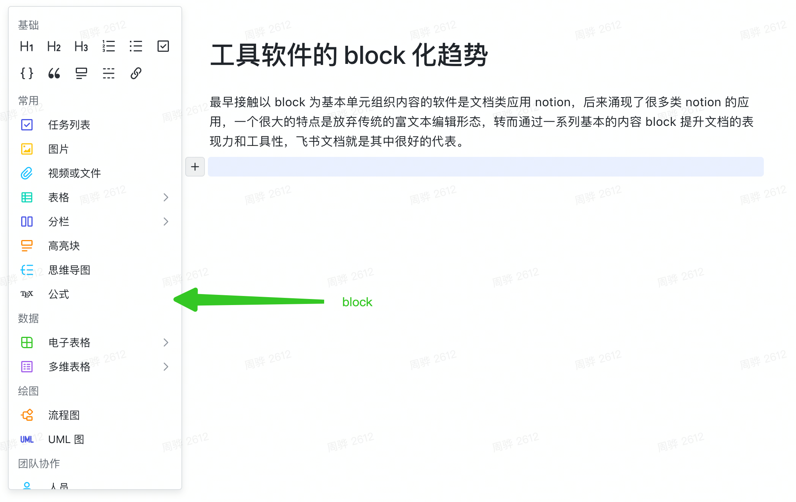
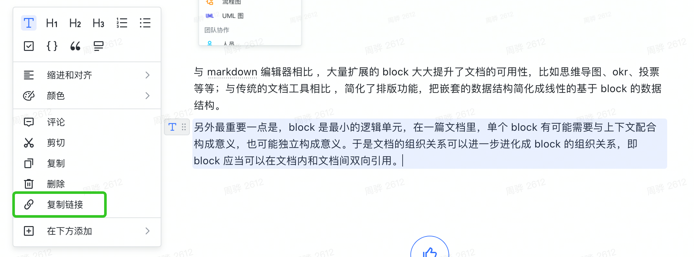
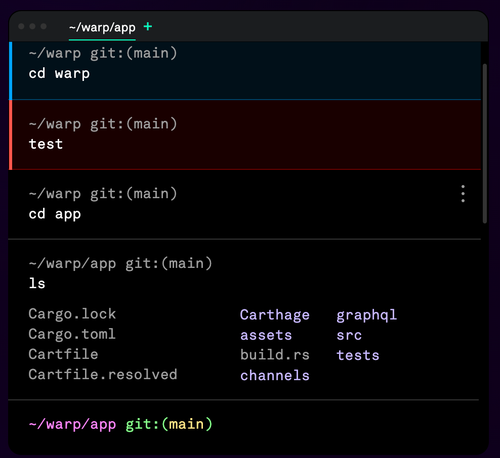

最早接触以 block 为基本单元组织内容的软件是文档类应用 notion，后来涌现了很多类 notion 的应用，一个很大的特点是放弃传统的富文本编辑形态，转而通过一系列基本的内容 block 提升文档的表现力、工具性和多人协作的便利性，飞书文档就是其中很好的代表。

与 markdown 编辑器相比 ，大量扩展的 block 大大提升了文档的可用性，比如思维导图、okr、投票等等；与传统的文档工具相比 ，简化了排版功能，把嵌套的数据结构简化成线性的基于 block 的数据结构。

另外最重要一点是，block 是最小的逻辑单元，在一篇文档里，单个 block 有可能需要与上下文配合构成意义，也可能独立构成意义。于是文档的组织关系可以进一步进化成 block 的组织关系，即 block 应当可以在文档内和文档间双向引用。这其实能极大地提升文档间碎片信息的关联性，在知识管理、wiki 等很多地方可以提升可玩性。

飞书的这个功能还很初级，只有复制 block 的链接，在链接的 mention 和预览里等同于文档本身的链接，预计这个功能飞书还会进一步迭代。

最近还看到了一个 terminal 软件叫 [wrap](https://www.warp.dev/)，它的特点恰恰也是『block 化』，它的所谓 block 化是指每一个命令执行的过程和结果会框在一个 block 内。这与普通的 terminal 好像也没什么本质的区别呀？

确实，在功能层面上 block 化带来的更多是易用性的提升，让我们快速翻阅之前的各种命令，特别是有些命令输出内容非常长时，帮助巨大；另外也为我们分享命令执行情况给其他人提供方便。然而 wrap 自己的野心可不止于此，它更希望利用 block 作为独立原子单元的特点，更好地为基于 terminal 的多人协作场景和团队分享打下基础。

我仅仅看到了两种软件，似乎也说明不了什么问题，但是我想 block 化一定程度上能提供更细粒度的信息和信息组织关系，为增加新功能减小了风险和边际成本，为多人协作和信息流通提供了更好的土壤，所以 block 化有可能是未来工具软件的新的趋势。
