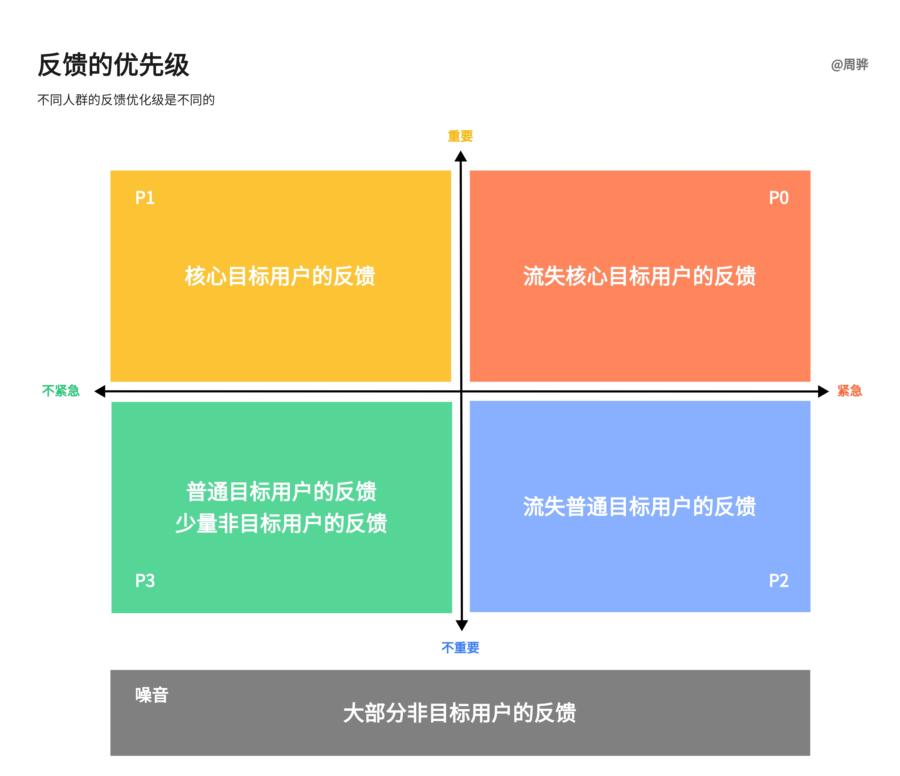

开始今天的话题前，我们先思考一个问题，我们的产品应该什么时候面向用户？初代学习灯是在2020 年 11 月发布的，但实际上软件功能与发布前 6 个月，基于 9 个月、12 个月前并无本质差异，那么中间这段时间是否是损失？我们有更多的产品/功能是仅仅快速完成了 mvp 版本，就正式推向市场的，比如家教、自习室、闪电搜题等等，那么是否不完善的功能影响了用户口碑？

在互联网时代，快速迭代，小步快跑是主流，所以当我们打造一款产品时，我们希望尽快让它接受用户的检验，收集用户和市场的反馈，及时调整步伐，使之越来越适应用户和市场的需求。从这个角度想，台灯上市的时间实在太晚，实际上我们在 2019 年上半年就已经在做用户测试了，其实是非常需要更大范围的用户反馈的输入。

那么产品是越早推出越好吗？也未必，因为用户是有分层的。我们不妨把用户分为几类：非目标用户、普通目标用户、核心目标用户。当一个产品刚推出的时候，就被吸引过来的，通常是比较核心的目标用户，他们的特点是：

1. 与产品的匹配度高，极有可能贡献更高的 ltv；
2. 对产品领域有所了解，可能他们本身正在寻找同类产品；
3. 对产品有一定的了解，能发现产品的亮点，能容忍一定的不方便和一定的功能缺失，但不能容忍出问题和核心功能缺失；
4. 如果对产品产生了负面体验，很难再挽回，甚至有负面观点的输出；
5. 如果对产品产生了正向的体验，那么可能会转化为长期的核心用户。

随后会逐渐有大量的非目标用户和普通目标用户的涌入。对，也会有很多非目标用户的进入，他们很难对你们产品贡献价值，相反可能会引入一些噪音。

所以基于这个认知，我们推出的第一版正式的产品（特别是 B 端产品），目标应该是要能留住核心目标用户（实际上这个阶段用户流失是很高的），要求我们的产品核心功能打磨完整、流畅、收益明确（反例：《无人深空》），有明确的亮点或差异点（如早期微信），绝对不能有降低用户体验的 bug（反例：《赛博朋克2077》），以及反馈通道。如果这些特点都满足了，那么我认为应该迟早推出，接受市场的体验。而在更早的阶段，应该进行小规模的用户测试（内测）帮助我们提升产品力。而至于用户体验提升、中长期留存提升、用户激励或者运营活动等方面，则没有必要通过前期小规模用户测试来实现。

OK，通过分析产品面市的时间点的问题，我把用户分成了三个层次，现在我们进一步看看用户反馈。用户反馈对我们真的是有益的吗？这取决于我们如何消费这些反馈：

上图没有理论依据，是我的感性判断。产生这样的判断原因有几个：

1. 用户流失是我们的损失，包括从一开始就不选择我们产品的用户，他们为什么流失、为什么不选择我们的产品，这是我们最紧急要解决的问题，越晚解决，损失越大。所以流失用户关心的问题，是『紧急』问题。
2. 核心用户对我们的产品或产品领域有更深的理解，他们的反馈和满意度相对而言会比其他用户的反馈和满意度更重要。所以核心用户的问题是『重要』问题。
3. 大部分的用户反馈既不重要也不紧急，因为这些问题没有阻碍他们成为我们的用户，甚至我们的用户是比我们的流失用户对产品抱有更高的容忍性。
4. 少量非目标用户的声音是有价值的，有可能扩大我们的受众范围，转化一部分非目标用户成为目标用户。
5. 绝大多数非目标用户的声音是噪音，满足了他们的需求对我们的目标用户的体验可能是有伤害的。

然而在实践中有很大的难点。

- 第一，核心用户如何甄别和画像。内容生产量？活跃和留存？付费？反馈量？知识、收入背景？KOL？我觉得这对于任何一个产品而言，都应该是一个需要严肃思考的问题。
- 第二，如何收集流失用户的反馈。流失用户通常是沉默的，特别是在前置漏斗里就没有选择我们产品的人，而这部分用户的潜力是非常大的。所以收集流失用户的声音是一种应该长期投入的工作。
- 第三，什么样的反馈是噪音。其实很简单，违背产品原则、产品目标、核心用户利益的反馈就是噪音。说起来简单，做起来就很难。比如产品原则，普通人很难有敏锐的产品 sense，会被压力推着向着走。比如产品目标，我们通常并不是没有目标，而是目标太多太分散，很难聚集到一个核心数值上，那么做一件事是不是符合目标，就有争议的空间了。比如核心用户的利益，这其实要从产品效用的角度看，我们常看一个功能的收益，但忽略变更对用户产生的成本，`用户价值 = 新体验 - 旧体验 - 替换成本`（来自《俞军产品方法论》，以及 louis 分享中的交易成本）。我们不仅容易忽略成本，还容易忽略整体产品效用组合的变化。
