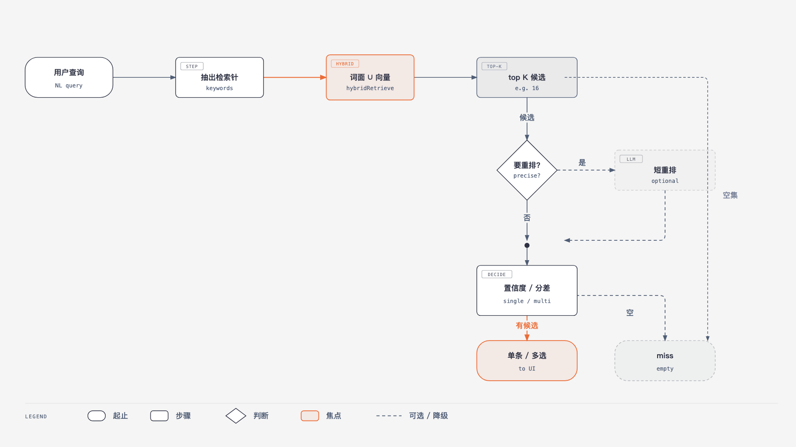
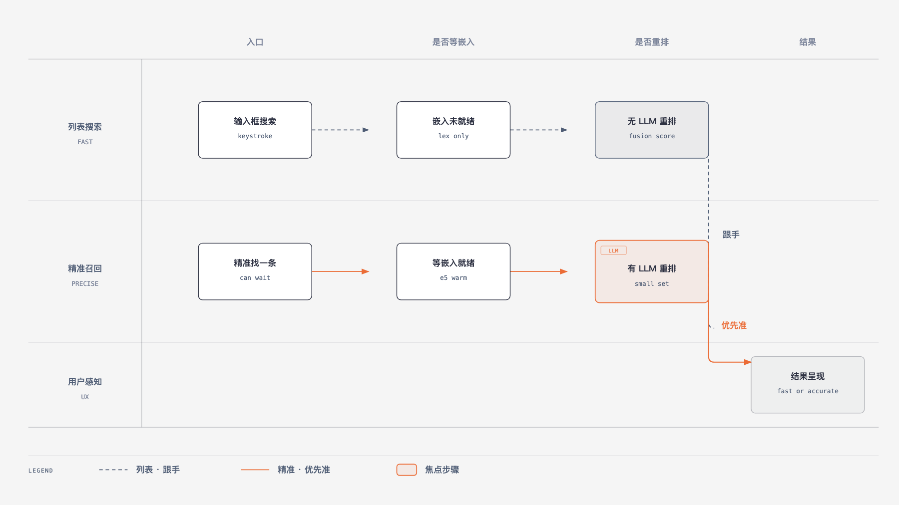
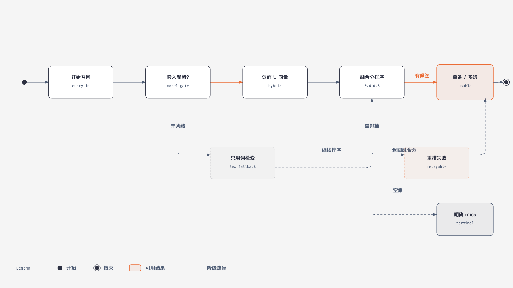

说到本地 RAG，很多人会先想到「选哪个 embedding API」。是的，不过我们这边的设定更窄一点：检索发生在客户端，模型也放在客户端，不上远程 embedding。这篇只想把向量化这一步说清楚——它放哪、什么时候就绪、挂了怎么办。

浏览器里用 ONNX 跑多语嵌入（我们用的是 `multilingual-e5-small` 的 q8，大约 140MB，懒加载）。query / passage 现算。列表搜索可以先不等模型；要精准召回了，再等嵌入。

## 向量化卡在链路的哪一节



词检索管得住「字对得上」和「模型还没来」；向量管的是同义。同一套混检，按入口分流就够了：列表按键要跟手，可以先不走嵌入；点开精准召回，才等模型。



这不是「谁更强」。只是在问：这一次点按，要不要被向量化挡住。

## 「同义」总得有人算向量

同义召回离不开向量。远程 embedding 当然能算——不过每条查询多一跳，正文为了建索引还得反复上传。我们改成客户端里现算：小型多语检索嵌入，和检索同进程。

加载没有什么玄妙：启动后后台 `warm`，别挡首屏；全局一个 Promise，成了就复用，败了打个标，别死磕；e5 要照顾前缀，查询写 `query:`，文档写 `passage:`；文档截断后嵌入，按 docId 存起来，免得每次全量重算；缺的旧文档启动后限并发补，删文档时把向量一起清掉。

代价很直接：第一次走精准召回，可能要等模型下来。所以列表不等，精准路径才等。

融合时各自归一化再加权就行：

```ts
// 示意：0.4 词面 + 0.6 向量
score = 0.4 * (lex / lexMax) + 0.6 * (vec / vecMax)
```

有个坑值得单独说。若「是否多选」原先按绝对词分写——比如 `b.score >= a.score - 2`——融合分落到 0～1 之后，这条几乎永远成立。混检要用相对间隙：第二名 ≥ 第一名的 85%，或者分差小于某个小数。两套分数别共用同一套阈值。

## 模型还没好，检索还能不能用

本地模型要下载。如果检索硬等它就绪，首次打开或嵌入失败时，整条链路就停了。所以词面不是「向量化上线前的临时方案」，是向量化失败时还能用的那条路。



我不会弹「正在下载 140MB 模型」。用户在意的是结果准不准，不是管道有几节。

## 对话模型别去干嵌入的活

有个想法看起来很顺：让对话模型直接在全库里找。试过之后你会发现延迟难看，幻觉也难控。翻过来想——它擅长的是小集合里消歧，不是代替嵌入模型做全库向量化。所以边界很简单：混检先给小候选集，再把 query 和截断摘要交给项目里已经在用的对话模型重排；只许用给定 id，按相关度排，带上置信度。重排失败就退回融合分。向量化交给本地 ONNX，消歧交给 LLM。

## 打包时别把嵌入链拖进服务端

本地嵌入跑在浏览器里，依赖 ONNX 运行时，还有一堆 Node 向的 polyfill。服务端打包要是也去解析它，构建阶段就容易炸，或者把上百兆权重路径卷进服务端产物。所以这件事要先钉死：动态 import，而且只在客户端加载。SSR、预渲染路径里不要 `import` 这条链。

上层交互契约可以不动——还是「展示单条 / 多选 / miss」。你换的是候选从哪来、怎么排序。这样可以先只上词面，再挂向量，最后再接重排，不用改一圈 UI。

打包器的坑更容易绑在具体脚手架上。我们当时用的是 Next.js：从 16 起默认走 Turbopack。若你在 `next.config` 里只写了 `webpack` 的 `resolveAlias`（常见是给 `onnxruntime` 一类包指空模块或浏览器替代），Turbopack 不一定认同一套配置，build 可能直接失败。需要同时给一份空的 `turbopack: {}`，或按文档把等价的 resolve 规则写进 Turbopack 侧。换成 Vite 也一样——别只修了旧打包器那一支。

对我来说，本地 RAG 里最先要钉死的就是向量化：端侧现算、按需就绪、坏了能退回词面。分流和降级，都是围着这一步转的。

## 延伸阅读

- [intfloat/multilingual-e5-small](https://huggingface.co/intfloat/multilingual-e5-small) — 多语检索嵌入
- [Transformers.js](https://huggingface.co/docs/transformers.js) — 浏览器侧 ONNX 推理
