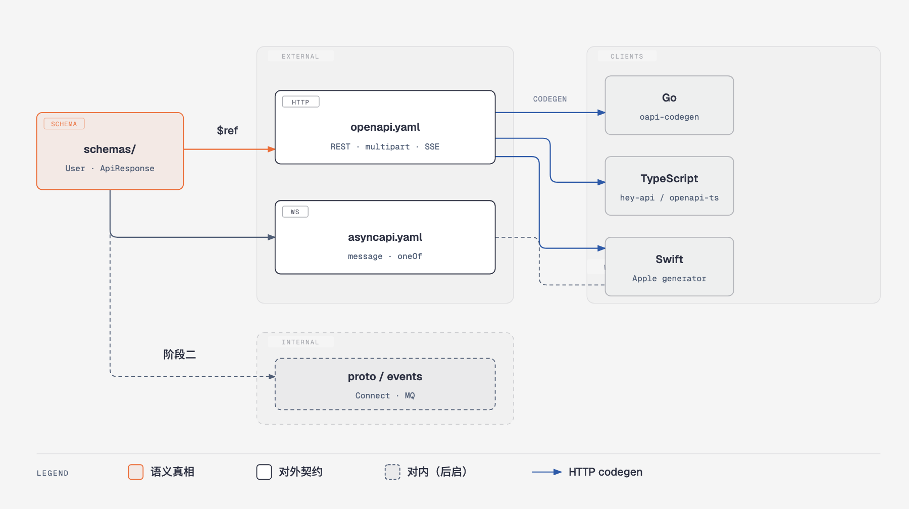
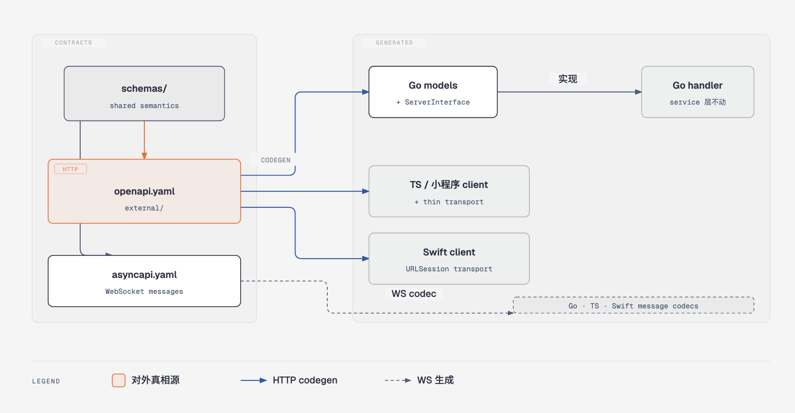
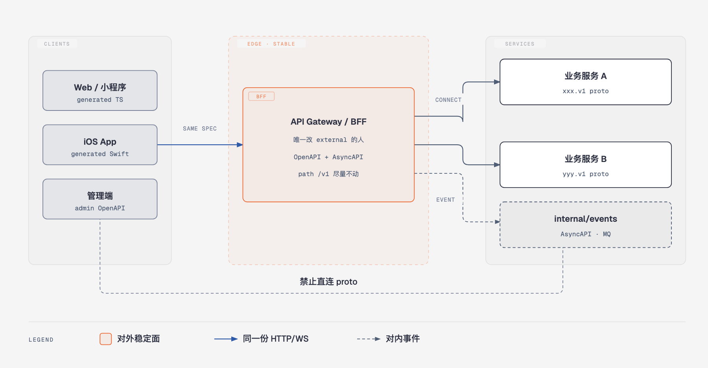

[上一篇](/2026/thrift-idl-type-safety)写过：把 Thrift IDL 当唯一真相，再生成前端类型、后端路由和 OpenAPI。那条路能解决「三处手写漂移」。不过后来接上 Web、小程序、原生 App，再叠 WebSocket、上传、流式接口，问题会换一种长出来——**你在用 RPC IDL 描述 HTTP 世界**。路径、multipart、SSE、文档生态，全靠自定义注解硬拧。

这篇换一条决策：**对外契约以 OpenAPI（外加 AsyncAPI）为中心**；共享 JSON Schema 做语义层；服务间 RPC 另开 Protobuf。不绑具体业务，只谈分层、各端怎么接、CI 怎么卡。

## 先说清楚否定的是什么

不是否定「单一契约源 + codegen」——那一层仍然成立。否定的是两件事：

1. 用 Thrift 当 HTTP 契约的书写格式  
2. 指望从 Thrift「翻译」出一份真正好用的 OpenAPI，再给三端用

Thrift 擅长的是结构化 RPC 与跨语言 struct。HTTP 要的是 method、path、query、header、status、media type、multipart、SSE。把后者塞进 `api.get("/user/:id")` 一类注解，等于自建一套 OpenAPI 方言，还少了 Spectral、oasdiff、Prism、各语言生成器那一整圈生态。

翻过来想：若真相源已经是 OpenAPI，文档、Mock、breaking 检测、Go / TS / Swift codegen 都站在同一份 spec 上。Thrift 那条「先 IDL 再导出 OpenAPI」，反而是绕路。

## 分层：语义、对外、对内

契约不要揉成一个文件。更稳的是三层：



```text
packages/contracts/
├── schemas/              # 语义：User、ApiResponse、ErrorCode…
├── external/             # 客户端可见
│   ├── openapi.yaml
│   ├── openapi.paths/
│   └── asyncapi.yaml
└── internal/             # 微服务阶段再启用
    ├── proto/
    └── events/
```

原则很短：

- `schemas/` 定义跨协议共享的业务语义。OpenAPI、AsyncAPI、以后的 Protobuf 都 `$ref` 或生成对齐它，别三份 `User` 各写各的。  
- 客户端只依赖 `external/`。内部服务边界对 App / 小程序不可见。  
- 生成物要么提交到 `packages/clients/`，要么只在 CI 生成——全仓选一种，别混。

两阶段共用这套分层：阶段一只把 `external/` 做实；阶段二拆服务时，**对外 spec 尽量不动**，再开 `internal/`。

## 技术选型（按契约类型）

| 契约类型 | 推荐描述 | 主要 codegen |
|----------|----------|--------------|
| HTTP REST + JSON | OpenAPI 3.0.3 / 目标 3.1 | Go: oapi-codegen；TS: hey-api/openapi-ts；Swift: apple/swift-openapi-generator |
| multipart 上传 | 写在 OpenAPI | 同上 |
| SSE | OpenAPI `text/event-stream` | 生成类型 + 手写 stream handler |
| WebSocket | AsyncAPI 3.x | 各端生成器；或先手写 codec，spec 仍为真相 |
| 服务间同步 RPC | Protobuf + Connect（阶段二） | buf + connect-go |
| 服务间事件 | AsyncAPI 或 Protobuf event | 随 MQ |
| Breaking | oasdiff + Spectral；（proto）buf breaking | CI |
| Mock / 文档 | Prism / Swagger UI / Scalar | 附加收益 |

工具链若对 3.1 支持不齐，可以先钉 **OpenAPI 3.0.3**（比如 oapi-codegen 的兼容面），目标仍对齐 3.1。版本钉死在 `tools.go` / mise / `package.json`，别让本地和 CI 各跑各的。

## 为什么不该以 Thrift 为契约中心

把常见理由摊开：

**协议错位。** Thrift 的一等公民是 service method 与 struct；OpenAPI 的一等公民是 HTTP 操作与 media type。上传、SSE、状态码、content negotiation 在 OpenAPI 里是原生字段，在 Thrift 里是注解玩具。注解一多，就等于维护第二份语言。

**客户端矩阵。** 小程序、iOS、Web 要的是「对这份 HTTP/JSON（和 WS JSON）生成 client」。OpenAPI / AsyncAPI 生成器按这个场景长；Thrift 生成器按 RPC 场景长。硬用 Thrift 服务三端 HTTP，最后往往还要再导出 OpenAPI——真相源和消费源分裂。

**生态与门禁。** Spectral 管风格，oasdiff 管 breaking，Prism 管 Mock，文档站直接吃 OpenAPI。Thrift 中心方案里这些都得二次映射，门禁容易变成「脚本绿了，spec 语义却歪」。

**演进时的内外边界。** 拆微服务后，对外仍应是稳定的 HTTP/WS 面；对内才是 Protobuf。OpenAPI 对外、Protobuf 对内，边界清楚。若对外也是 Thrift，要么让 App 吃 RPC，要么继续翻译——两头不讨好。

**「生成 OpenAPI」洗不白书写格式。** 从 Thrift 生成 OpenAPI，文档和 Mock 是赚到了，但人改的还是注解方言，review 和 diff 也不如直接看 YAML path。契约评审时，产品 / 前端 / 客户端更熟悉「这条 GET 返回什么」，而不是「这个 service 方法挂了哪些 api.*」。

对我来说，Thrift 仍适合「本来就是 RPC、且没有厚 HTTP 语义」的内部调用。一旦契约面是浏览器与 App 的 HTTP API，书写格式就该是 OpenAPI。

## 阶段一：单体（或单一 API 进程）怎么落地

### 架构关系



服务端推荐先降风险，再谈彻底：

- oapi-codegen **先生成 models**；路由注册可继续手写。  
- 或生成 `ServerInterface`，现有 handler 实现该接口——**第一阶段别用生成代码替换全部路由表**。  
- WebSocket：AsyncAPI 描述 message；用生成 struct / codec 替换 `interface{}` / 无类型 payload。

### 对外契约建议覆盖

OpenAPI：

- Base path 与现有客户端一致（如 `/api`）  
- 认证与公共头写进 parameters（如 `Authorization`、`platform`、`appVersion`）  
- 统一响应与错误码进 `components/schemas`，与后端错误码源对齐，变更必须同步  
- 路径版本化（如 `/v1/*`）  
- **按域拆 path 文件**，主 `openapi.yaml` 只做组装与 `$ref`

AsyncAPI：

- WS endpoint、鉴权方式（query token 或 header）写进 spec  
- 信封字段固定（version、message_id、timestamp、type、payload）  
- `payload` 用 `oneOf` + 判别字段，编译期区分消息类型  
- 内嵌业务字段 `$ref` 回 `schemas/`

SSE：在 OpenAPI 里为流式接口预留 `text/event-stream`。阶段一可以只要求 **spec 与生成类型就绪**，运行时 handler 后补。

### 目录与命令

```text
packages/contracts/
├── spectral.yaml
├── schemas/
│   ├── ApiResponse.yaml
│   ├── ErrorCode.yaml
│   └── User.yaml
├── external/
│   ├── openapi.yaml
│   ├── openapi.paths/
│   └── asyncapi.yaml
└── scripts/
    ├── codegen.sh
    └── validate.sh

packages/clients/          # 若选择提交生成物
├── go/
├── ts/
└── swift/
```

根目录统一入口（just / make 均可）：`codegen`、`contract-lint`、`contract-diff`。

### 开发流程

1. **Spec-first**：对外 API 先改 `packages/contracts/`，再改 handler / 客户端。  
2. **Codegen**：本地与 CI 同一命令。  
3. **同 PR 闭环**：改 spec → 实现 interface / handler → 切换生成 client → 写清怎么测。  
4. **Breaking**：对外不允许静默删字段或改类型；oasdiff 不过，PR 必须说明豁免与客户端同步证据。  
5. **禁止**：客户端单方面「整理」JSON 字段名；多端共用接口时以 spec 为准。

### 各端怎么接

**Go 后端**

```bash
# 示意：oapi-codegen 生成 models（或 ServerInterface）
oapi-codegen -generate types,skip-prune \
  -package api \
  -o internal/api/gen/types.gen.go \
  packages/contracts/external/openapi.yaml
```

Handler 用生成类型做绑定与响应；业务仍在 service 层。和 Gin / Hertz / Echo 的差异，用「只生成 interface + models」消化，避免一次性重写路由。

**TypeScript / 小程序 / Web**

```bash
npx openapi-ts \
  -i packages/contracts/external/openapi.yaml \
  -o packages/clients/ts/src
```

小程序若不是标准 `fetch`，做一层薄 adapter（比如包 `uni.request`），token refresh 留在中间件；**不要把宿主 API 写进 OpenAPI**。Web 同理：生成 client + 自有 transport。

**Swift / iOS**

用 Apple 的 Swift OpenAPI Generator（SPM 插件）在构建时生成；`URLSession` transport。存量若是 HandyJSON 一类手写模型，按模块替换，别 Big Bang。WS 消息优先生成 `Codable`，往往比先换所有 REST 更划算。

**管理端**

若管理 API 与 C 端生命周期不同，单独一份 `contracts/admin/` OpenAPI，别混进对外 `external/`。工具链可以复用。

### 迁移：绞杀者，禁止 Big Bang

| 步骤 | 内容 | 完成标准 |
|------|------|----------|
| 0 | 脚手架 + CI + 共享 ApiResponse/ErrorCode | lint 绿 |
| 1 | 一个 REST 接口端到端 PoC | 至少一端客户端吃生成类型 |
| 2 | P0 域（鉴权、上传等）spec 化 | 登录 / 上传走 generated types |
| 3 | AsyncAPI：WS 消息类型化 | 三端 payload 可判别 |
| 4 | 其余域分批 PR | 每域删掉对应手写 DTO 镜像 |
| 5 | 存量扫尾 | 覆盖率目标自定（如 ≥95%） |

从现有 Go dto / 注解生成 OpenAPI 初稿可以（如 swag），但只能当 bootstrap。校对迁入 contracts 之后，注解生成器就不要再当真相源了。

### 阶段一常见坑

| 风险 | 对策 |
|------|------|
| 路由量大 | 分批；新接口强制 spec；旧接口逐步替换 |
| 小程序请求 API ≠ fetch | 薄 adapter，不污染 spec |
| 原生 App 手写模型存量 | 按模块替换；WS 可优先 |
| 生成器与现有路由风格不合 | 只生成 interface + models |
| 双写 dto 与 spec | 每域迁完即删手写镜像 |

## 阶段二：拆服务后，对外不变、对内 Protobuf



客户端仍只吃 `external/openapi.yaml` + `asyncapi.yaml`。新增的是 BFF 后面的事：

- **对外路径与响应包络尽量稳定**，拆分对 App 透明。  
- BFF 维护唯一对外 OpenAPI；**业务服务不得直接改 external**。  
- 对内同步：Protobuf + Connect（可用 HTTP/JSON 兼容模式便于调试）。  
- 事件：AsyncAPI 或 proto event，与 WS 共享 `schemas/` 语义。  
- **禁止**小程序 / iOS 直接生成 proto client。

版本策略：对外 URL `/v1` + spec `info.version`；对内 `package xxx.v1` + `buf breaking`；BFF 负责内部 v2 到对外 v1 的映射。

过渡顺序：对外不动 → 首个域加 proto → BFF 该域改为 Connect client → 抽事件 spec → 重复，直到单体瘦成 BFF。

## 跨阶段共用约定

- JSON 字段命名与现有后端 tag 一致（常见 `snake_case`）。  
- 时间戳：与 WS 对齐用 Unix 秒，或在 spec 里显式 `format: date-time`，全仓统一。  
- 可空：OpenAPI 3.1 的 union null 或 `nullable`，工具链定一种。  
- 枚举：优先 string enum；若历史是整型，在 spec 里写清映射。

CI 最小集：

```bash
contract-lint    # Spectral
contract-diff    # oasdiff vs main
codegen
git diff --exit-code   # 若选择提交生成物

# 阶段二追加
buf lint && buf breaking --against '.git#branch=main'
```

PR 勾选：是否改对外 API/WS → 是否更新 contracts → 是否 codegen → 是否更新各端调用 → breaking 是否通过或已说明豁免。

## 和「Thrift 中心」对照着看

| 维度 | Thrift 为中心 | OpenAPI（+ AsyncAPI）为中心 |
|------|----------------|-----------------------------|
| 书写对象 | RPC method + 注解模拟 HTTP | HTTP 操作与 media type 原生 |
| 多端 client | 弱，常再导出 OpenAPI | Go / TS / Swift 生成器成熟 |
| WS / SSE / multipart | 注解或旁路 | OpenAPI / AsyncAPI 直接描述 |
| Lint / breaking / Mock | 自建或二次映射 | Spectral / oasdiff / Prism |
| 拆服务后 | 对外仍别扭 | 对外稳定，对内 Protobuf |
| 文档 | 生成物 | 真相源即文档 |

「单一真相 + codegen」两边都对。差在**真相用什么语言写**。写给浏览器和 App 的 HTTP API，OpenAPI 更省事；写给服务间的 RPC，Protobuf 更省事。Thrift 卡在中间——对 HTTP 太重注解，对多端生态又不如 OpenAPI。

## 落地时我会先定的五件事

1. `schemas/` 与 `external/` 目录是否分开。  
2. Go 侧先 models-only 还是直接 ServerInterface。  
3. 生成物提交还是 CI 生成。  
4. 小程序 / iOS 的 transport adapter 谁维护。  
5. oasdiff 失败时的豁免流程（谁批、客户端证据是什么）。

这五件不定，工具链装得再齐，也会在 PR 上吵成「先改代码还是先改 YAML」。

对我来说，把契约中心从 Thrift 挪到 OpenAPI，不是换一套口号，而是承认：**对外 API 的一等公民本来就是 HTTP（和 WS），描述语言就该长得像它。** 对内 RPC 另说。分层清楚之后，单体和微服务可以共用同一份对外 spec——这才是这条路线真正想买的演进空间。
