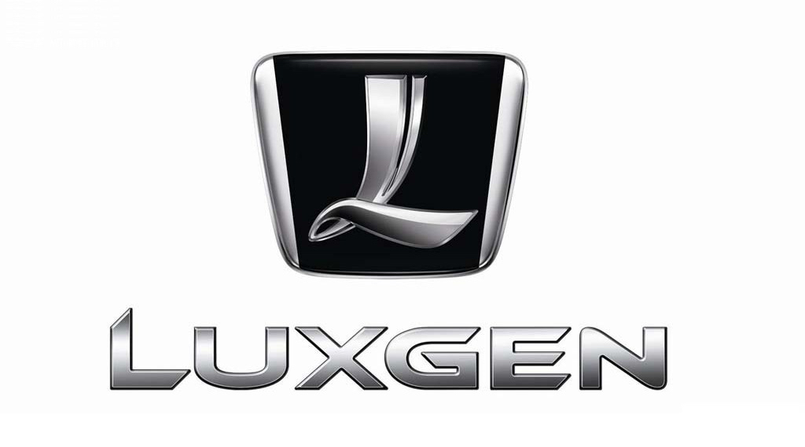

分享一则趣事。

几年前，我有一个台湾同事，一天我跟她聊到了汽车。

我问她：“台湾街头什么品牌的车比较流行？”

她显然不太懂车，回答说：“经常看到车标像一个有点弯曲的‘L’形状的品牌。”

我想到了纳智捷的 logo。当年偶尔还是能看到这个品牌的汽车的，特别是在小城市，我一直把它当成国产的低端车，特别是网上流传了很多它油耗特别大的传说，所以印象深刻。于是我就调侃：“这个形状像大陆常见到的一个牌子，叫纳智捷，这个车油耗特别厉害，开起来跟油箱漏油一样。”然后话题终结。

事后这几年，每次想起这件事我都很惶恐：为啥要提纳智捷呀，这种上海都不太见到的小品牌，她怎么可能听说过。估计她在台湾见到的是雷克萨斯吧。

直到最近，佩洛西窜访台湾时的一张新闻照引起了我的注意。仔细辨认，左下角这辆车的 logo 似乎就是纳智捷！我一下子懵了，这破车也能出现在这种场合？上网一查，果然，纳智捷结结实实的是台湾的品牌，甚至是台湾本土最大的车企旗下品牌。再一想当时的对话，仿佛更尴尬了。
