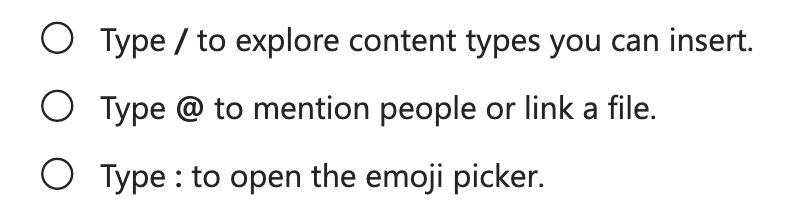

试用了几分钟的 [loop](https://www.microsoft.com/en-us/microsoft-loop)，目前的版本没什么意思，编辑器功能太弱。唯一的差异化功能是把块转化成 loop 组件，可以在其他微软的软件生态里插入，并同步更新。没有预期中的 office 嵌入 loop 的功能，没有自动化流程的影子。

不过 / 和 @ 甚至 : 快捷指令隐隐然成为文档产品的一种约定俗成的交互标准：

- / 指令：快速唤起 block 插入面板，飞书、notion 都支持
- @ 指令：快速搜索人、文档等关联信息，插入到当前行内，飞书主要搜人、文档，notion 还加入了当前日期的快速插入，wolai 更进一步，在 notion 的基础上加入了日程提醒的创建插入
- : 指令：快速插入表情，还不多见，只在 notion 和 loop 中看到。

除此之外，近期主打 ai 的 notion 增加了一个空行行首空格的指令，快速唤起 ai 面板。
