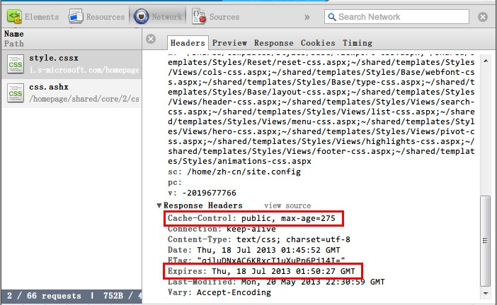
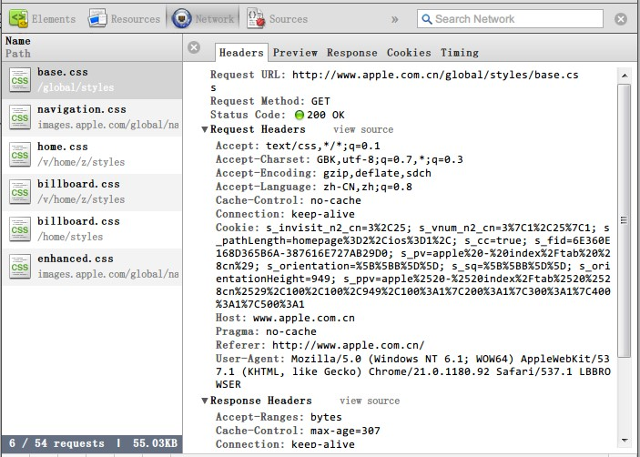

无论是一位前端开发人员，还是一位产品设计人员，永远需要把用户体验放在第一位。只有良好的用户体验才会带来用户的持续关注和产品使用。那么，对于网站的设计来说，良好的用户体验又是如何建立的呢？因素很多，例如快速响应、良好交互、配色和谐、高易用性、风格统一等等，不过我认为有以下几个方面是在进行CSS开发时尤其需要关注的：

* 响应速度。毫无疑问，这是用户体验的第一道关卡。网站没有理由要求用户每次花费10秒的时间用在网页载入上，太多的等待或许让网站的精彩内容来不及呈现在用户面前。

* 高可用性。网站很难限制用户使用何种设备、使用何种浏览器进行访问。如果用户不能够以他最熟悉的方式访问一个网站，也就意味着网站将要失去这个用户。

《CSS性能优化》系列文章针对提升响应速度，对CSS的性能优化做一些研究，并给出一些优化建议。俗话说，磨刀不误砍柴工。今天我们先要聊的不是具体的优化建议，而是CSS的加载过程。

回想一下前后端的交互过程，可以总结出网页上一个文件的传输过程，从URL请求开始，大致经历了以下步骤：

图1：网页HTTP请求过程

下面就一起来详细了解一下这几个步骤。

## 1. 缓存读取（Cache Read）

缓存是技术人员经常会听到的一个词，这里的缓存指的是浏览器缓存。图片、CSS 文件、JS 文件，甚至是每一次的 AJAX 请求数据，浏览器获得这些数据后通常都会临时保存在缓存里。一段时间内，当需要再次使用这些数据时，不必重新向服务器请求，直接从本地缓存中获得这些数据，从而加快网页的加载速度。

具体到 CSS 文件，当浏览器要请求一个 CSS 文件之前，它会先根据这个 CSS 文件的 URL 在缓存中查找，如果缓存查找成功，则直接进入渲染环节；否则，需要从服务器上获取此文件后，再进入渲染环节。不过，缓存可不是一直存在于用户浏览器中的，任何缓存数据都可能会失效。一旦缓存失效了，浏览器请求这个 CSS 的时候，就必须向服务器获取了。下图是对微软首页一个 CSS 文件的请求信息分析，可以看到，在响应消息头字段中，有一个 `Expires` 策略（ HTTP 1.0 规范，标记该文件在缓存中失效的时间）和 `Cache-Control` 策略的 `max-age` 属性（ HTTP 1.1 规范，标记该文件在缓存中的生存期，现代浏览器均优先采用此策略）。

图2：缓存有效期分析

## 2. 连接等待（Blocked）

当浏览器需要请求一个 URL 时，有时候并不能立即执行。那是因为浏览器对同一个主机名下的连接数量有限制。例如打开微软首页的时候，会有很多的文件需要下载，像 CSS、图片之类的文件是可以并行下载的。然而，对于并发连接数不同的浏览器有不同的限制，一旦一个请求超出了当前并发数目的限制，则不能立刻开始，而是进入等待队列，这段时间就是 “Blocked”。列举几个浏览器默认的并发连接数如下表。（注意：浏览器的并发连接数往往是可以修改的，所以此数据仅供参考，不可作为开发依据。）

| 浏览器 | HTTP 1.1 并发连接数 |
|:-----:|:-----------------:|
| IE 6，IE 7 | 2 |
| IE 8，IE 9 | 6 |
| Firefox 2 | 2 |
| Firefox 3 | 6 |
| Safari 3，Safari 4 | 4 |
| Chrome 1，Chrome 2 | 6 |
| Chrome 3 | 4 |
| Chrome 4及以上版本 | 6 |
| Opera 9.63，Opera 10.00 alpha | 4 |
| Opera 10.51及以上版本 | 8 |
| Android 2-4（默认） | 4 |

表1：浏览器默认并发连接数

## 3. DNS查找（DNS Lookup）

浏览器与服务器的交互是基于 `TCP/IP 协议`的，即必须知道服务器的IP地址才能对其进行访问。但是人们打开一个网站，通常在浏览器中输入 URL 是主机名+域名的形式，如 “www.baidu.com” 中，“www” 是主机名，“baidu.com” 是域名。浏览器要访问这个网址之前，必须要先解析出域名所对应的 IP 地址， 这个过程就是 DNS 查找的过程。以 windows 系统为例，浏览器先从浏览器 DNS 缓存中查找；如果找不到，则到系统 DNS 缓存中查找；如果找不到则查询 hosts 文件中的匹配规则；如果依然找不到，则开始发起 DNS 查询请求，从路由器 DNS 缓存开始，经过运营商 DNS 服务器等，直到根 DNS 服务器，层层往上递归查找，如果找到则停止查找，获得 IP 地址，如果到最后也找不到，则意味着这个网址无法访问。这部分的时间开销就是 “DNS Lookup”。

## 4. 连接（Connect）

查询到了服务器的 IP 就可以与服务器进行通信的。由于 HTTP 协议是架构于 TCP/IP 协议上的，因而需要与服务器建立 TCP 连接。建立 TCP 连接时，双方需要经过三次握手通信，才能完成连接步骤。这部分的时间开销就是 “Connect”。

## 5. 发送请求（Send）

建立连接之后，浏览器就会向服务器发送请求报文。如图3所示就是浏览器向服务器请求 CSS 文件的报头字段。

图3：CSS文件请求报头示例

通常网页在加载的过程中，诸如 CSS 文件、JS 文件、图片等资源都是以 `GET` 方法获取的，请求报文中只包含报头信息。尽管如此，请求报文中包含的内容还是比较丰富的。从上图中可以看到，有接受数据类型、当前网站的 Cookie、请求发起页面、服务器域名、用户浏览器信息等等。这一步骤中，传送完成这些数据的时间开销就是 “Send”。

## 6. 等待（Wait）

服务器接收到浏览器请求后需要对请求进行处理。这段时间取决于服务器的处理速度。

## 7. 接收请求（Receive）

当服务器把数据准备好了，就可以把数据传输回客户端，这部分的时间取决于网络条件和数据大小。这一个步骤往往是初学者误认为是下载数据的全部开销，其实这一个步骤只是其中的一步而已。

CSS 文件传输方面的优化就是要让文件传输时间尽可能地小，上面讲解的七个步骤，其实每个步骤都有可能是性能的瓶颈，每个步骤也可能可以被优化。下一篇文章将会给出一些优化建议，这些优化建议可能不是最全面的，但希望读者朋友深入理解这些优化手段背后的原理，这样才能举一反三，触类旁通。
