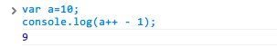
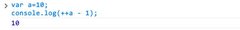
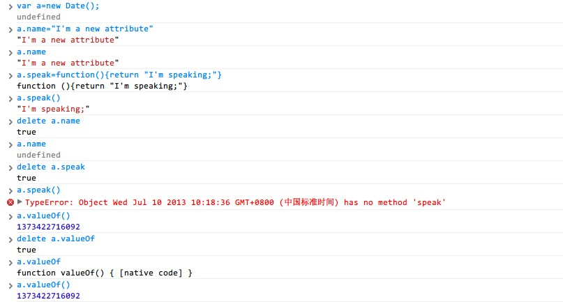

在偶然打开 [d3](http://d3js.org)  的源代码的时候，我看到了这样一段代码。

```js
if (!Date.now) Date.now = function() {
    return +new Date;
};
```

大体上可以看出这是在 `Date` 对象中加入一个 `now` 方法以获得当前时间。但是 `return +new Date;` 似乎是一种很不合常规的写法，这个 `+` 是干什么用的呢？其实这里并没有用到很高级的 javascript 技巧，相反，只是用到了一个极其简单的一元操作符，只不过这样的用法比较少见，用法与其他编程语言太不一样，所以让人们有一种陌生的感觉。

翻开 _ECMAScript_ 的规范，如果不算 **NOT** 运算的 `~` 操作符，一共有8个一元操作符。让我们逐一了解下。

## +操作符

我们从开篇的 `+` 操作符开始介绍。使用方法上，这个操作符与各位从初中数学中见过的“正号”类似，放在一个变量或表达式的前面。对数字类型的变量而言，`+` 操作符对结果没有影响，对于其他类型的变量则是转化成数字类型的变量，如果转化失败，则为特殊数字类型常量 `NaN`。那么运算 `+a`——假设 `a` 为一个非数字类型的对象——究竟对 `a` 执行了怎样的操作呢？一种说法是默认调用 `valueOf` 方法，相当于 `a.valueOf()`；不过经过我的具体实验，似乎另一种说法更可信，即 `+a=Number(a)`。

## -操作符

与 `+` 操作符类似，`-` 操作符就像是数学里的负号，所以我们可以知道 `-a=0-(+a)`，以上两个符号为一组。

## ++操作符

这个段落里其实会包含两种操作符，分别是类似 `a++` 和类似 `++a`。熟悉 C 语言或者 Java 的读者都很了解 `++` 的含义。的确，这两操作符是 EmacScript 直接借鉴 Java 的自增操作符，表示将操作数加上1，即 `a++` 等价于 `++a` 等价于 `a+1`。然而数值上运算结果的等价不代表这两种操作符是相同的，其实它们之间还是有明显差异的，相信了解 C 语言或 Java 的读者听说过它们之间“先赋值再运算”和“先运算再赋值”的差异。

那它们的差异具体是什么样的呢？还是以具体的实验结果来说明吧。

```js
var a = 10;
console.log(a++ - 1);
```


<p class="captain">图1：<code>a++</code> 运算结果</p>

```js
var a = 10;
console.log(++a - 1);
```


<p class="captain">图2：<code>++a</code> 运算结果</p>

从以上实验结果我们知道，`a++ - 1` 先执行出 `a - 1` 的结果，再执行 `a = a + 1`，所以相当于“先运算再赋值”；而 `++a - 1` 则不同，它是先执行 `a = a + 1`，再用新的 `a` 来参与运算 `a - 1`，因而这是“先赋值再运算”。

## --操作符

同样，这里也是 `a--` 和 `--a` 两个操作符，具体含义与 `++` 操作符相反，表示操作数减1，具体特点与上段相同，不再赘述。

## delete操作符

这里的 `delete` 与 C++ 中的 `delete` 关键字不同，这不是用来释放一个对象的内存空间，而是释放对象内部的一个自定义属性和方法的引用。对于 `delete` 的用法，我用一张图片来说明。


<p class="captain">图3</p>

我们定义了一个 `Date` 类型的对象 `a`，并给它定义一个属性 `name` 和一个方法 `speak`，然后我们用 `delete` 操作符将自定义的属性和方法删除。同时我们也发现，对于 Javascript 内置的属性和方法是不可以通过 `delete` 操作符删除的，这里我们测试的是 `Date` 对象的 `valueOf` 方法。

我再抛出一个简单的问题，如果我们定义一个变量或函数，是否可以用 `delete` 操作符来删除这个变量或函数？为什么？

## void操作符

`void` 操作符的用途是对所有的表达式返回 `undefined`，这个功能似乎很奇怪，或许在防止产生意外计算结果的时候会有用吧……看到比较多的应用，一个是作为死链接，一个是打开新窗口。

### void操作符制作死链接

```html
<a href="javascript:void(0)">我是一个死链接</a>
```

<a href="javascript:void(0)">我是一个死链接</a>

### 打开新窗口

要打开一个新窗口，我们可以用这个代码：

```html
<a href="javascript:window.open('about:blank')">打开新窗口</a>
```

我不建议读者点这个<a href="javascript:window.open('about:blank')">链接</a>，不过我测试下来，chrome 浏览器是对这个问题做了处理，如果你是想故意测试这个 bug，请换 IE 浏览器来点击前面的链接。这个时候 `void` 操作符就能够发挥作用了，我们把代码改为：

```html
<a href="javascript:void(window.open('about:blank'))">打开新窗口</a>
```

读者再点击<a href="javascript:void(window.open('about:blank'))">链接</a>，就不会再有上面的bug了。
