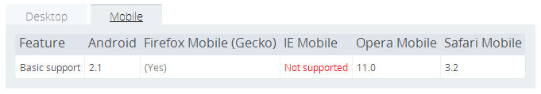

_Application Cache_ 是HTML5为web应用离线使用而增加的api，虽然都是有关存储，但与LocalStorage、 Cookie、SessionStorage有相当大的不同。Application Cache存储的是一系列的请求资源，允许浏览器在请求这些资源的时候，不必通过网络。如果设计良好的话，使用Application Cache能达到离线状态下，web应用仍能带来友好的用户体验。

## 使用方法

### 过程与原理

Application Cache的使用要做两个方面的工作，浏览器端和服务器端。在服务器端需要维护一个缓存清单_manifest_文件，这个文件里面记录了需要缓存的请求、不需要加入缓存的请求等内容。具体的manifest文件的语法及示例参见[http://www.w3school.com.cn/html5/html_5_app_cache.asp](http://www.w3school.com.cn/html5/html_5_app_cache.asp)。浏览器通过请求这个manifest文件来判断是否可以使用application cache，以及application cache是否需要更新等。浏览器对于manifest文件的新旧判断依据很简单，就是是否一样，只要有一点区别，浏览器就认为manifest文件有更新，需要重新缓存所有数据。所以我们常常通过更改manifest注释的方式来提醒浏览器要更新缓存。需要注意的是，manifest文件的文件名及路径没有特别要求，但对于它的_MIME-type_必须设置为`text/cache-manifest`。

在浏览器端的设置很容易，只需要在HTML标签上添加manifest属性即可，类似：

```html
<html manifest="cache.appcache">
```

仅仅这样做就完成了Application Cache的配置，关于cache的检查、更新、读取都是浏览器自动完成。


图1：manifest的解析过程

浏览器解析manifest的过程如上图所示。HTML5定义了Application Cache的几种事件，并允许JS捕获这些事件。事实上JS对application cache很难主动地进行操作，也没有读写接口，绝大部分情况下，application cache的使用是不必借助JS的。还有一点需要补充，以上是网络连接正常时的流程，当网络连接不正常时，浏览器请求manifest文件时连接失败，则进入离线模式，直接从application cache中加载页面，同时application cache会触发`error`事件。

需要注意的是，下载manifest清单里的内容是与页面载入同时进行的，也就是说，如果本次载入需要更新缓存，则本次页面载入时无法使用最新版本的缓存。

### 可用性

Application Cache被支持情况见下图：


图2：桌面浏览器的支持情况


图3：移动浏览器的支持情况

参考：[https://developer.mozilla.org/en-US/docs/HTML/Using_the_application_cache](https://developer.mozilla.org/en-US/docs/HTML/Using_the_application_cache)。

整体上，Application Cache的受支持情况比较理想。即使对于不支持的浏览器而言，通常情况下也不会产生不一致的表现，所以兼容性问题不是应用Application Cache的拦路虎。

在测试的过程中，我对浏览器允许manifest列表长度及允许的cache空间比较感兴趣。网上传言各浏览器对这两点会有限制。但在我不完备的测试中，没有发现具体的限制。在桌面版的Chrome中，缓存1000+条请求，1G+的数据均未出错；安卓手机中也尝试缓存过1000+条请求，100M+的数据，同样正常。我觉得这样的测试很极限，实际应用不可能出现这样的场景。当缓存请求数过多，数据量太大，那么在页面载入的时候会进行漫长的下载过程，对用户体验、流量和服务器来说都不合适。反过来说呢，我推测在我们正常应用范围内，不需要对cache空间和请求数目太过担心，唯一需要担心的是考虑把什么样的数据缓存起来才最合适。

## 优点

使用Application Cache的优点主要体现在网络性能的提升上。把一些http的请求转为从本地存储中读取，有效降低网络延迟，提升请求加载速度。这点从下面测试截图中可以看出。同时，cache的使用减少了用户网络请求的次数，从而节约了用户流量。并且能够在一定程度上降低web应用对网络的依赖性。

除此之外，我觉得Application Cache的使用足够简单，向开发人员屏蔽了实现细节，只需要很小的工作量就可以使用。不仅如此，在成熟项目中使用此功能，对原有逻辑几乎没有影响，即使设备不支持也不会产生副作用。  


图4：本地搭建环境测试结果

### 问题点

在测试过程中，我也发现了一些值得注意的问题：

1. 新版本缓存不立刻生效问题

    受制于Application Cache的实现机制，当检测到Manifest新版本，并更新缓存时，页面加载过程已经开始，甚至页面加载完成时，cache更新还没有完成。于是浏览器的策略是当manifest有更新时，此次加载不会使用新版数据。不仅如此，直到下次检查manifest更新之前的所有请求的缓存均为旧版本缓存。这意味着如果页面一直不刷新，那么通过application cache请求到的都是旧版本数据。

    Application Cache提供了`update()`方法来手动发起manifest版本的检测；提供了`swapCache()`方法手动启用新版数据。如果应用对数据版本新旧不敏感，则可以使用这两个方法来保持cache最新数据。

2.  Manifest中的请求路径相对于manifest文件，而非当面加载页面

    如果在_www.a.com/index.html_页面上指定了manifest地址为：_www.a.com/manifest/app.cache_，那么在manifest中定义的一条请求地址如果是a.jpg，那么它代表的URL为_www.a.com/mainifest/a.jpg_。

3.  被缓存的不仅仅是manifest清单的内容  

    
    图5：浏览器cache情况

    如上图所示，被缓存的数据还包含manifest本身，其类型为Manifest，以及启用application cache的页面，其类型为Master。至于application中缓存Master类型的机制我还不是十分清楚，这里无法详谈。

4.  卸载application cache问题

    Application cache的卸载略微麻烦。文档上说只要当manifest请求返回4xx即可卸载application cache，但实际操作下来发现，需要给**所有**类型为Master的页面指定一个不存在有manifest，才可以卸载cache，而且这个过程也不是实时的，往往有一定的延迟，可能与浏览器的实现有关。

5.  “回滚悖论”

     这个问题很少被人提到，名字我自己取的，但在我的测试中，这个问题相当典型。目前浏览器在解析manifest的策略有这样两个：

    * 如果处理manifest清单过程中触发`error`事件，则为保证内容一致性，废弃此次所有下载的内容，使用旧版本数据；
    * 如果下载文件失败，则触发`error`事件。

    假设现在manifest清单上有一个文件的访问出现异常，例如restful服务调整、图片名称变更等等，哪怕这个文件根本用不到，它也会导致整个application cache更新失败。浏览器执行这样策略的出发点是为了保证application cache中的内容保持同一版本，但似乎矫枉过正。实际应用中我们无法改变这个策略，但需要知道这里的风险，当清单中有文件无法下载，则会导致缓存永远无法更新，直到manifest文件修复。在此期间，浏览器每次都加执行manifest的解析、下载、失败、回滚这样的循环，造成服务器和网络的浪费。

6.  “更新悖论”

    其实上一个问题称之为“悖论”有点夸张，但这个问题却不一定。考虑这样一个问题，如果我们将index.html的manifest的指向从a.cache改为b.cache会发生什么。答案是如果不更新或删除a.cache的内容，缓存将不更新。原因是index.html被浏览器缓存了，每次解析的时候仍然是检查a.cache的更新情况，即使我们在更新资源的同时，记得更新b.cache，结果每次检查的结果也全是`noupdate`。

7.  多页面多manifest与多页面单manifest

    首先需要留意application cache是由manifest管理的。例如 _a.html_ 的manifest为 _a.cache_，_b.html_ 的manifest为 _b.cache_，两个manifest都加入了_common.js_的缓存。现在更新了 _common.js_ 的内容，并修改了两个manifest的版本号，如果加载 _a.html_，则 _common.js_ 会更新到application cache中，那么再加载_b.html_时，从application cache中读出的是新版本的common.js还是旧版本的呢？是旧版本的，因为每个manifest独立管理自己的application cache内容，虽然在同一个站点下，虽然请求内容完全一样，但 _common.js_却是被缓存在两处，彼此独立。

     类似的，_a.html_ 和 _b.html_ 的manifest都是 _a.cache_，现在更新了 _common.js_ 和 _a.cache_，如果加载了 _a.html_，_common.js_ 更新到了application cache中，那么此时加载 _b.html_ 会加载新版本还是旧版本的 _common.js_ 呢？是新版本，因为两个页面的 _common.js_ 由同一个manifest管理。

8.  受制于HTTP报头的`Cache-control`字段

    若此字段设置为`no-cache`，则不通过application cache获取数据。但检查manifest的流程并没有变，依然会更新最新的manifest，并下载manifest内规定的文件。
    所以通过ajax请求数据，且希望使用到application cache时，注意配置（如有必要）：

    ```js
    $.ajaxSetup({
        cache: true
    });
    ```

9.  Application cache更新进度的问题

    如果需要追踪Application cache的更新进度，理论上可以通过监听application cache的`progress`事件来完成，每个文件下载时会触发`progress`事件。但由于manifest解析流程和页面加载流程同时进行，所以在处理`progress`事件时极有可能do
    m或js库尚未加载，可能很难在页面上做呈现。不过如果手动触发`update()`方法，并监听`progress`事件，相对会可控得多。

## 总结

我认为使用application cache从技术上和可用性上而言，实现成本比较低，开发量比较少，副作用比较小，适用性比较广。但怎么用，用多少是需要考虑的点。由于原理上，application cache是把manifest上的资源一起下载下来，所以manifest里的内容不宜过多，数据量不宜过大；由于manifest的解析通常以页面刷新为触发点，且更新的缓存不会立即被使用，所以缓存的资源应以静态资源、更新频率比较低的资源为主。另外要做好对manifest文件的管理，避免上面所提的由于清单内文件不可访问或manifest更新不及时造成的一些问题。
