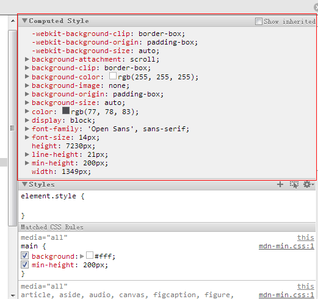

## 技能get$\checkmark$

先说一个需求，我想给一个元素应用另外一个指定元素的样式，应该怎么做？对于一个特定的项目，我想通常做法是规范代码风格，直接把 class 复制过来就可以了。但现实情况可能并不会如此简单。比如我们假定这个指定元素是不可预测的，它的样式可能由 class 控制，也可能由更复杂的选择器控制，甚至可能写在 style 属性里。这该怎么办呢？

过程就懒得说了，直接说结论吧。上代码：

```js
if (!window.getComputedStyle) {
  window.getComputedStyle = function (node) {
    return node.currentStyle;
  };
}
var a = document.getElementById('A'); // source node
var b = document.getElementById('B'); // target node
$(b).css(window.getComputedStyle(a));
```

代码很短，先看最后一句，我们用 `javascript±window.getComputedStyle()` 方法来获取一个节点的最终样式。OK，也许你没有用过这个方法，但作为一个 FE，你一定见过下面这个画面：



<p class="captain">图1： Computed Style 截图</p>

这是在 chrome 的开发者工具中，通过 element 选项卡可以查看 dom 节点样式的截图，红框中的就是这个节点最终样式的计算结果。而 `javascript±window.getComputedStyle()` 就是 BOM 提供给大家得到这样一个计算结果的接口。那么剩下的就好理解的，通过 `javascript±window.getComputedStyle()` 方法拿到指定元素的最终样式集，这个结果呢又正好是一个 `javascript±$.css()` 方法能接受的对象（这个对象下面会讲）。于是上述代码中，我们通过 `javascript±$.css()` 方法直接将样式覆盖给了目标元素。当然，如果不想用 jquery，我们也可以通过遍历这个对象，并操作目标元素的 style 属性达到目的，代码就不贴了。

## `javascript±window.getComputedStyle()`

知道了这种做法，我们再来好好研究一下 `javascript±window.getComputedStyle()` 这个方法。

> The `javascript±Window.getComputedStyle()` method gives the values of all the CSS properties of an element after applying the active stylesheets and resolving any basic computation those values may contain.

`javascript±window.getComputedStyle(element [, pseudoElt])` 最多接受两个参数，第一个参数 `element` 是我们想要获取样式的 dom 节点，这个参数是必须的，仅有这一个参数呢是这个方法的基本用法。但 css3 中添加了[伪元素](http://dev.w3.org/csswg/css-content/#pseudo-elements)的支持，第二个参数正是用来指定伪元素的。我们可以传递像 ”:before”、”:after” 之类的值。

> 有些技术文章把第二个参数解读成伪类，经我验证，这是不对的，伪类的样式是无法通过这种方式获取的。

至于这种做法的兼容性，相信你也能猜到：IE6-8 是不支持的。对伪元素的支持情况会更糟一些。

|           特性 | Chrome | FireFox |  IE  | Opera  | Safari |
| -------------: | :----: | :-----: | :--: | :----: | :----: |
|   **基本支持** |  支持  |  支持   | >=9  |  支持  |  支持  |
| **伪元素支持** |  支持  |  支持   | >=11 | 不支持 |  支持  |

<p class="captain">表1：浏览器对 `window.getComputedStyle()` 的支持情况</p>

又是苦逼的 IE。不过这次问题不算大。不知道你还记不记得代码最上面几行？回过头去看一眼：对于 IE，我们用了 `javascript±element.currentStyle` 属性，同样可以满足我们的需求。所以如果不涉及伪元素，配合示例代码里的 shim，我们应该可以没有顾虑地使用 `javascript±window.getComputedStyle()`。

很多地方（例如以前的 Jquery）在使用 `javascript±window.getComputedStyle()` 时并没有直接在 `window` 上调用，而是使用的 `javascript±window.defaultView.getComputedStyle()`。事实上现在我们可以认为 `javascript±window.defaultView` 就是 `window`。Jquery 也将这部分代码修改了，见 [jquery #10373](https://github.com/jquery/jquery/pull/524)。可能会在 IE 的弹出窗口和低版本 Firefox 的 frames 中使用会有一些异常。Jquery 认为在IE弹出窗口中使用必须加 `defaultView`，而 Firefox 的情况则不可以加 `defailtView`，于是做了一个 shim，可以排除两种异常。可以参考下：

```js
define(function () {
  return function (elem) {
    // Support: IE less than 11+, Firefox less than 30+ (#15098, #14150)
    // IE throws on elements created in popups
    // FF meanwhile throws on frame elements through "defaultView.getComputedStyle"
    if (elem.ownerDocument.defaultView.opener) {
      return elem.ownerDocument.defaultView.getComputedStyle(elem, null);
    }
    return window.getComputedStyle(elem, null);
  };
});
```

更详细的内容有兴趣的朋友可以参考：

- [jquery #14150](http://bugs.jquery.com/ticket/14150)
- [jquery #15098](http://bugs.jquery.com/ticket/15098)

## CSSStyleDeclaration

再来说说 `javascript±window.getComputedStyle()` 的返回值。`javascript±window.getComputedStyle()` 会返回一个 `CSSStyleDeclaration` 对象。这个对象是只读的，意味着我们只能取其值，不能为其赋值。所以上面的示例代码中我们采用 `javascript±$.css()` 方法来设置 css 样式。这个对象应该如何用，这篇文章里面我不想赘述，有兴趣的可以参考 [MDN 的文档](https://developer.mozilla.org/en-US/docs/Web/API/CSSStyleDeclaration)。<del>想直观了解这个对象长什么样子的同学请点击 F12 键，我在浏览器的 console 里输出了一个 `CSSStyleDeclaration` 对象</del>。

<script>
    if(!window.getComputedStyle){
        window.getComputedStyle = function(node){
            return node.currentStyle;
        }
    }
    console.info("CSSStyleDeclaration对象的示例：");
    console.dir(window.getComputedStyle(document.body));
</script>

最后提醒下不同浏览器下，css 的属性名可能有差异，如比较突出的 cssFloat/styleFloat/float，jquery 可以屏蔽掉浏览器这方面的差异，推荐之。
