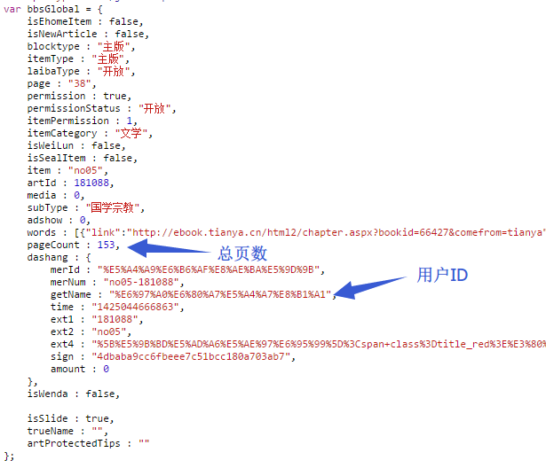
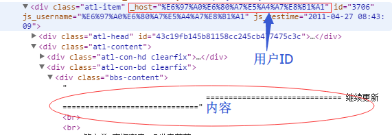

## 前言

kindle 看书挺舒服的，网页上看到大段文字就想搬到 kindle 里去。以前会用一些转寄的服务，网页上随手点个 send to kindle，倒也方便。嗯……还是不要自欺欺人了，read it later === read it never。

后来固定用多看了，多看的推送和 amazon 的是一样的，只是没有转寄服务了，也就懒得推送网页了。其实不喜欢推送网页的最主要的原因还是体验差，阅读本来就应该是一页一页地读下去，而不是看个几分钟，退出，删除，选下一本。但……如果内容多一点的话，比如天涯上的长帖、小说，嗯，它们本来就应该在kindle上看。联上wifi用浏览器看？不适合我……原因：移动性弱，浏览器弱，支持wifi加密方式少，没买3G的，耗电惨。那怎么办？把帖子扒下来慢慢看！

***

## 准备

如今的码农动不动就写个爬虫，爬这个爬那个。那我们……不行，前端从业者应该用一些“前端特色”的方式来解决这个问题。

### 武器一：phantomjs

无头浏览器，功能强大，绝对让你以最熟悉的方式分析网页。想知道怎么用，移步到 [phantomjs使用说明](/2014/phantomjs "phantomjs使用说明")

### 武器二：kindlegen

Amazon 出品的电子书制作、转换工具，它能把 HTML、XML、XHTML、ePub 等格式的文档转换成 mobi 格式，功能强悍、使用简单。amazon 不知何故禁止中国地区用户下载，不过通过下面这个链接还是可以下载到的：[https://kdp.amazon.com/help?topicId=A3IWA2TQYMZ5J6](https://kdp.amazon.com/help?topicId=A3IWA2TQYMZ5J6) 。

***

## 动手

思路其实不复杂，就是把一个帖子分析一下，从第一页到最后一页，把每一页楼主发表的内容都抓出来，存放到一个 html 文件中。最后使用 kindlegen 把这个 html 转成 mobi，大功告成。

建立一个 mobi.js 文件，开始这次的 phantomjs 脚本之旅。

### 解析 url


<p class="captain">天涯帖子url示意</p>

一个普通的天涯帖子 url 长这个样式。标红的数字表示当前页码，如果样跳转到这个帖子的第5页，只需要把这个数字换成5就可以了。

脚本开始之前，先要获取要采集的网址。假设我们执行：

```bash
phantomjs mobi.js [url]
```

那么如何在脚本中得到这个 `url` 呢？

```javascript
var system = require('system');
var args = system.args;

if (args.length === 1) {
    console.log('请输入要采集的网址！');
    phantom.exit(-1);
}
var url = args[1];
```
<p class="captain">获取参数</p>

对于这个 url，我们关注的焦点应该在页码处。关于这一点，我们很容易把 url 的后面一部分抽象成 `-{Number}.shtml`，写成正则表达式：`/^(.+)-([0-9]+)\.shtml$/`。好了，验证 url 的代码可以像这样：

```javascript
var scope = {
    content: '', // 提取内容
    page: 1, // 当前页码
    counts: 0 // 总页码
};

var r = /^(.+)-([0-9]+)\.shtml$/;
var matches = url.match(r);
if (matches.length === 3) {
    spider(scope); // 后面讲
}
else {
    console.log('无法解析url');
    phantom.exit(-1);
}
```

多说一句，这个正则有两个子模式，前一个会匹配出这个帖子特有的url信息，那么我们想跳转到第n页的话，可以这样拼出url：

```javascript
var url = matches[1] + '-' + n + '.shtml';
```

### 页面分析

上面的代码已经看到 `spider()` 方法，这是个递归方法，从第一页递归到最后一页，每一层递归间通过 `scope` 这个全局变量传递参数。下面看看到底怎么实现的。

```javascript
var webPage = require('webpage');
var page = webPage.create();

function spider(scope) {
    var url = matches[1] + '-' + scope.page + '.shtml';

    page.open(url, function (status) {
        if (status === 'success') {
            page.injectJs('jq.js');
            scope = page.evaluate(function (scope) {
                // 提取文章内容
                return scope;
            }, scope);

            if (scope.page === scope.counts) {
                writer(scope);
            }
            else {
                scope.page++;
                spider(scope);
            }
        }
        else {
            console.log('无法打开' + url);
            phantom.exit(-1);
        }
    });
}
```

上面这段代码流程是根据当前页码，生成要采集的 url（上文已经解释过）。用 phantomjs 打开这个 url。如果打开成功，则提取文章内容（具体做法下文再阐述）。提取完成后，如果现在已经是最后一页，则抓取工作结束，把提取的内容输出出来，否则当前页数加上1，重新执行 `spider` 方法重复上述流程。

这段代码逻辑并不复杂，但是用到 phantomjs webPage 模块的一些 api，如果不熟悉，可以参考[phantomjs使用](/2014/phantomjs "phantomjs使用说明")。下面来说说具体如何提取需要的内容。

```javascript
scope = page.evaluate(function (scope) {
    var $ = jQuery;
    if (!scope.counts) {
        scope.counts = bbsGlobal.pageCount;
        scope.hostName = bbsGlobal.dashang.getName;
        scope.title=$('title').text();
    }

    var posts = $('[_host="' + scope.hostName + '"]');
    posts.each(function () {
        var $this = $(this);
        scope.content += '<div class="post-content">' + $this.find('.bbs-content').html() +
            '</div><br/><hr/>';
    });
    return scope;
}, scope);
```

使用phantomjs的 `evaluate` 方法来给打开的网页插入一段我们自定义的 javascript 脚本，之前我们已经用 js 注入的方法把 jquery 引入了，当然，你需要的一切库都可以自由引入。所以现在天涯的网页就像我们自己开发的网页一样，可以自由使用 javascript 来操作。这里呢，我继续把 `scope` 这个变量作为 page 对象内注入脚本和外部 phantomjs 环境间通信的信使。注意，这个 `scope` 一定要是一个可以序列化成 JSON 字符串的对象。

OK，至此现在该分析网页本身的结构了。首先我在代码中发现一个全局变量 `bbsGlobal`，可以从中得到总页数和作者ID。



于是，嗯，我就直接拿来用了。再看帖子结构，如下：



我们可以直接用 `$('[_host="' + scope.hostName + '"] .bbs-content')` 把正文节点都找出来，然后拼合在一起，完成！

### 输出 HTML

上面在 `spider` 方法内可以看到我调用了一个 `writer` 方法，现在就看看这个方法是怎么实现的吧：

```javascript
var fs = require('fs');
var outputPath = 'output';

function writer(scope) {
    var html='<!DOCTYPE html><html><head lang="en"><title>'+
        scope.title+
        '</title></head><body>'+
        scope.content.replace(/<br\/>$/, '')+
        '</body></html>';
    var path=outputPath+'/'+scope.title.replace(/[ \\\/:,，\?？\-\.\+]/g,'')+'.html';
    fs.write(path,html,{
        charset:'gb18030'
    });
    // HTML转modi下文讲
}
```

用一个很简单的 html 把提取出来的内容包好，写到一个 html 文件中。两个注意点：一是这里是允许加入排版的，css 是支持的，这部分我略过，有兴趣的可以自己摸索；另一点是如果出现乱码，请在保存 html 文件时就指定好文件编码，在 html 文件中指定 `<mate charset >` 被验证是无效的，转换时不起作用。文件写入完成后，就进入转换格式的流程了。

### 转换mobi

```javascript
var process = require("child_process");
var child = process.spawn("./kindlegen.exe", [path]);

child.stderr.on("data", function (data) {
    console.log("spawnSTDERR:", JSON.stringify(data))
});

child.on("exit", function (code) {
    console.log('finish!');
    phantom.exit(-1);
});
```

使用 phantomjs 的 child_process 模块调用 kindlegen 来转换，并捕获产生的错误信息。完成后，phantomjs 脚本也完成。

至此，大功告成。把生成的 mobi 文档拷到 kindle 里，enjoy 吧。

## 补充

主要内容都说完了，还有一些不主要的。首先是样式和编码，这两个特别实用，是允许自定义的，前文已经有所提及，我不展开了。

下面要说一点没提及的东西了。你如果真的按我前面说的去做，你会被这抓取速度逼疯——实在太慢了！于是你需要掌握新技能：只下载需要的，中断一切无关的请求。什么是无关请求呢？css、js、图片、广告、站长统计等等。怎么解？so easy:

```javascript
page.onResourceRequested = function(requestData, request) {
    if ((/http:\/\/.+?\.css/gi).test(requestData['url'])) {
        request.abort();
    }
    if ((/http:\/\/.*baidu/gi).test(requestData['url'])) {
        request.abort();
    }
    if ((/http:\/\/.*jd/gi).test(requestData['url'])) {
        request.abort();
    }
    if ((/http:\/\/.+?\.jpg/gi).test(requestData['url'])) {
        request.abort();
    }
    if ((/http:\/\/.+?\.png/gi).test(requestData['url'])) {
        request.abort();
    }
    if ((/http:\/\/.+?\.js/gi).test(requestData['url'])) {
        request.abort();
    }
};
```

把无关请求的特征找出来，直接在请求发起时，中断好了。

等等……好像漏了什么。对，图片呢？mobi 格式是访问不了天涯的图片的，我们不仅没有把图片下载下来，还把下载图片的请求给中止了。这……这只能留给感兴趣的同学自己完成了，我只能提示你注意天涯图片使用了懒加载，另外调用 open 方法时可能使得之前所有的 request 全部中断，不想每一页都等到图片下载完成才能处理下一页的话，建议另开线程处理图片下载。当然我是没兴趣研究这个，因为……不会。不过考虑抓取速度和 kindle 图片显示效果，这图片就算了。

最后，放上[下载链接](/mobi.zip)。
