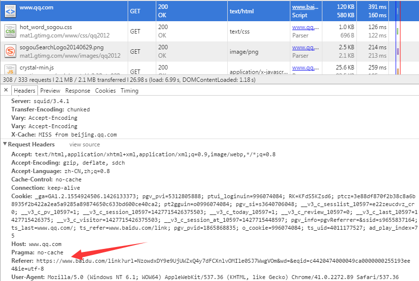
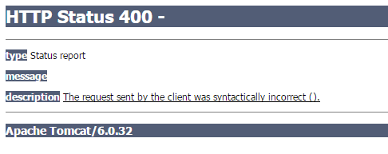

## 背景

<style>
  .scale {
    font-size: 2em;
  }
</style>

在一个页面 A 中，点击一个链接，浏览器会跳转到页面 B。那么如何描述 A 和 B 的关系呢？我们把 A 定义为 B 的 refer/referrer/referer（由于历史的原因，你看到上面这几个词都可以认为是同一个意思，下面统一描述为 referrer）。通俗地说，A 是 B 的来源页面/引荐页面。从技术实现上，你从浏览器起发出的任何请求（不准确，先这么理解吧），例如打开新页面、请求静态资源、ajax、请求后端 api 等等，都会在请求头部添加 `Referer` 字段。也许你会发现这个词拼错了，少了个 r，但你不可以把它当成错误，虽然最初确实是个错误，但由于在它成为 http 事实标准前，没有人去纠正这个错误，于是就形成了现在局面。看看具体的例子，在百度上搜索 QQ，然后打开腾讯的页面，我们看看它的请求头是什么样的：

</p>

也可以通过 `javascript±document.referrer` 来获取当前页面的 referrer 地址。

这个 referrer 常常被人忽视，但其实用处还是很大的。比如通过 referer，我们能知道网站的流量从何而来，从而可以更有针对性的做 SEO；我们能知道后端提供的 api 是否被自己站点以外的页面调用（referrer 可以伪造，这种判断方式并不安全）；我们能够知道静态资源是否被他们盗用（图片防盗链的原理）等等。

其实 referrer 这个东西，我们从来都不用担心不会用它，因为浏览器已经帮你实现得好好的。那我们今天要聊什么呢？聊如何干掉这个玩意儿。

## 起因

有这个需求是因为工作中有一些页面需要跳转到某网站（新开页面），但这个网站链接链过去会报 400 错误，如下图。从浏览器输入地址，则没有问题。



如果链接链过去的时候不带 referrer 信息，则网页能够正常打开。

那该如何是好呢？

## 思路

到网上搜索了一下，打开网页而不带 referrer 信息，大概有以下几种方式：

<dl>
<dt>从 https 跳转到 http 页面</dt>
<dd><span style="color: indianred;">受浏览器实现制约，不确定因素很大</span></dd>
<dt>直接在浏览器中输入 url</dt>
<dd><span style="color: indianred;">浏览器行为，不可控</span></dd>
<dt>点击浏览器“主页”或者从收藏夹访问</dt>
<dd><span style="color: indianred;">浏览器行为，不可控</span></dd>
<dt>使用 location.replace() 或修改 location.href</dt>
<dd><span style="color: cornflowerblue;">待验证</span></dd>
<dt>使用 window.open() 打开页面</dt>
<dd><span style="color: cornflowerblue;">不靠谱</span></dd>
<dt>使用服务器中转一下，302 到目标页面</dt>
<dd><span style="color: limegreen;">可行，但麻烦</span></dd>
<dt>使用<mete http-equiv="refresh">转向</dt>
<dd><span style="color: cornflowerblue;">待验证</span></dd>
</dl>
</div>

上面标红字的方式直接放弃了。由于我的首要需求是在新窗口打开页面，所以其他的方式也没给我什么启示。不过打开新窗口还是给我一些启发。我们可以打开一个空页面，再由这个空页面跳转到目标页面。由于空页面没有 url，所以目标页面也就不存在 referrer。于是方法一到方法四诞生了：

## 方法一：

使用 window.open 新开页面，并插入一段 javascript，用来重定向到目标页面：

```javascript
var url = 'http://www.baidu.com/';
window.open('javascript:window.name;', '<script>location.replace("' + url + '")</script>');
```

<table>
<tbody>
<tr>
<td style="text-align: center; vertical-align: middle;"><strong>chrome</strong></td>
<td style="text-align: center; vertical-align: middle;"><strong>firefox</strong></td>
<td style="text-align: center; vertical-align: middle;"><strong>≥ IE10</strong></td>
<td style="text-align: center; vertical-align: middle;"><strong>≤ IE9</strong></td>
</tr>
<tr>
<td style="text-align: center; vertical-align: middle;"><span class="scale">✅</span></td>
<td style="text-align: center; vertical-align: middle;"><span class="scale">？</span></td>
<td style="text-align: center; vertical-align: middle;"><span class="scale">？</span></td>
<td style="text-align: center; vertical-align: middle;"><span class="scale">❌</span></td>
</tr>
</tbody>
</table>

chrome 中一切正常；firefox 和 IE10、11 能跳转，但 referrer 还是传递过去了；IE9 及更低版本 IE 则无法跳转。

## 方法二：

通过指定 data:text/html 来强制浏览器打开一个指定空页面：

```javascript
var url = 'http://www.baidu.com/';
window.open(
  'data:text/html,<html><body><script>location.replace("' + url + '")</script></body></html>'
);
```

当然也可以直接写在 a 标签的 href 属性里。

<table>
<tbody>
<tr>
<td style="text-align: center; vertical-align: middle;"><strong>chrome</strong></td>
<td style="text-align: center; vertical-align: middle;"><strong>firefox</strong></td>
<td style="text-align: center; vertical-align: middle;"><strong>IE</strong></td>
</tr>
<tr>
<td style="text-align: center; vertical-align: middle;"><span class="scale">✅</span></td>
<td style="text-align: center; vertical-align: middle;"><span class="scale">？</span></td>
<td style="text-align: center; vertical-align: middle;"><span class="scale">❌</span></td>
</tr>
</tbody>
</table>

chrome 中一切正常；firefox 能跳转，但 referrer 还是传递过去了；IE9 则无法跳转。

## 方法三：

类似于 `href="javascript:void(0);"`，一段 javascript 也是能够当成页面打开的。于是有：

```javascript
var url = 'http://www.baidu.com/';
window.open('javascript:location.replace("' + url + '")');
```

<table>
<tbody>
<tr>
<td style="text-align: center; vertical-align: middle;"><strong>chrome</strong></td>
<td style="text-align: center; vertical-align: middle;"><strong>firefox</strong></td>
<td style="text-align: center; vertical-align: middle;"><strong>IE</strong></td>
</tr>
<tr>
<td style="text-align: center; vertical-align: middle;"><span class="scale">✅</span></td>
<td style="text-align: center; vertical-align: middle;"><span class="scale">？</span></td>
<td style="text-align: center; vertical-align: middle;"><span class="scale">？</span></td>
</tr>
</tbody>
</table>

chrome 中一切正常；firefox 和 IE 能跳转，但 referrer 还是传递过去了。

## 方法四：

类似方法二，也是新打开一个页面，不过不是通过 javascript 跳转，而是通过 `html±<mete http-equiv="refresh">` 跳转：

```javascript
var url = 'http://www.baidu.com/';
window.open(
  'data:text/html,<html><head><meta http-equiv="Refresh" content="0;' +
    url +
    '"/></head><body></body></html>'
);
```

<table>
<tbody>
<tr>
<td style="text-align: center; vertical-align: middle;"><strong>chrome</strong></td>
<td style="text-align: center; vertical-align: middle;"><strong>firefox</strong></td>
<td style="text-align: center; vertical-align: middle;"><strong>IE</strong></td>
</tr>
<tr>
<td style="text-align: center; vertical-align: middle;"><span class="scale">✅</span></td>
<td style="text-align: center; vertical-align: middle;"><span class="scale">✅</span></td>
<td style="text-align: center; vertical-align: middle;"><span class="scale">❌</span></td>
</tr>
</tbody>
</table>

chrome 和 firefox 中一切正常；IE 不能跳转。

目前为止，所有方法在 IE 面前都跪了。不过参照 firefox 唯一成功过的那次，我们不妨对方法一和方法四来个合体：

## 方法五：

综合方法一和方法四，用 `javascript±window.open()` 新打开一个页面，不过不是通过 javascript 跳转，而是通过 `html±<mete http-equiv="refresh">` 跳转：

```javascript
var url = 'http://www.baidu.com/';
var win = window.open(null, '_blank');
var doc = win.document;
doc.clear();
doc.write(
  '<html><head><meta http-equiv="Refresh" content="0; URL=' + url + '"/></head><body></body></html>'
);
doc.close();
```

<table>
<tbody>
<tr>
<td style="text-align: center; vertical-align: middle;"><strong>chrome</strong></td>
<td style="text-align: center; vertical-align: middle;"><strong>firefox</strong></td>
<td style="text-align: center; vertical-align: middle;"><strong>IE</strong></td>
</tr>
<tr>
<td style="text-align: center; vertical-align: middle;"><span class="scale">？</span></td>
<td style="text-align: center; vertical-align: middle;"><span class="scale">✅</span></td>
<td style="text-align: center; vertical-align: middle;"><span class="scale">✅</span></td>
</tr>
</tbody>
</table>

这次 chrome 跳转是依然携带 referrer 信息，而 firefox 和 IE 中一切正常。

这五种方式都是试图通过 javascript 构造一个假的空页面，然后再改变页面 url 实现的。但兼容性却不怎么好。其实呢，兼容性的问题主要出在构建一个假页面的时候，各个浏览器的实现差异太大。那如果不构建假页面，而是真的有这么一个空页面呢（谢谢国耀的思路和实现）？我们再来试试：

## 方法六：

先来创建一个空页面，假设是 bridge.html：

```html
<!doctype html>
<html>
  <head lang="en">
    <meta charset="UTF-8" />
    <title></title>
  </head>
  <body>
    <script>
      var url = location.search.replace('?url=', '');
      location.replace(decodeURI(url));
    </script>
  </body>
</html>
```

要跳转到目标页面，先跳转到 bridge.html：

```javascript
var url = 'http://baidu.com';
window.open('bridge.html?url=' + encodeUri(url));
```

<table>
<tbody>
<tr>
<td style="text-align: center; vertical-align: middle;"><strong>chrome</strong></td>
<td style="text-align: center; vertical-align: middle;"><strong>firefox</strong></td>
<td style="text-align: center; vertical-align: middle;"><strong>IE</strong></td>
</tr>
<tr>
<td style="text-align: center; vertical-align: middle;"><span class="scale">✅</span></td>
<td style="text-align: center; vertical-align: middle;"><span class="scale">✅</span></td>
<td style="text-align: center; vertical-align: middle;"><span class="scale">✅</span></td>
</tr>
</tbody>
</table>

这个方法在几个浏览器中都有不错的表现。不足的是它需要额外添加一个文件，跟服务器的路由、rewrite 规则相关，有一定的潜在额外工作需要做。

说了这么多，其实我们要做的事情，html5 中已经规定过了，那就是使用 rel="noreferrer"。

## 方法七：

这是最简易直观的实现方式，如果一个 a 标签设置了 rel="noreferrer"，那么就表示点击这个链接时不要传递 referrer 信息。（注意，这个 html5 标准中的 referrer 是正确的拼法）

```html
<a href="http://baidu.com" target="_blank" rel="noreferrer">跳转</a>
```

<table>
<tbody>
<tr>
<td style="text-align: center; vertical-align: middle;"><strong>chrome</strong></td>
<td style="text-align: center; vertical-align: middle;"><strong>firefox</strong></td>
<td style="text-align: center; vertical-align: middle;"><strong>IE</strong></td>
</tr>
<tr>
<td style="text-align: center; vertical-align: middle;"><span class="scale">✅</span></td>
<td style="text-align: center; vertical-align: middle;"><span class="scale">✅</span></td>
<td style="text-align: center; vertical-align: middle;"><span class="scale">❌</span></td>
</tr>
</tbody>
</table>

chrome 和 firefox 中一切正常；IE 不理会 rel 属性。既然是 h5 的属性值，存在兼容性问题也是意料之中，不过 IE11 还不支持我也是醉了。

## 方法八：

上面我们曾提及可以通过后端服务转发请求，实现 referrer 的隐藏。实现原理很简单，服务器是能够控制请求 header 字段的。当然，最好的情况是不需要我们自己写这样一个中转服务。

有两个公共的页面可以帮助我们完成这一工作：

1. google

```javascript
var url = 'http://www.baidu.com';
window.open('http://www.google.com/url?q=' + encodeURIComponent(url));
```

2. http://www.no-referer.de

```javascript
var url = 'http://www.baidu.com';
window.open('http://www.no-referer.de/' + url);
```

国内 google 不能正常访问，可以试试下面那个服务。

## 总结

如果我们想不添加其他辅助页面，实现不带 referrer 的跳转，可以选择的方式很多，很多方法有着兼容性的问题。对于特定浏览器，有多种方法可选时，我们也应该保证以性能最好的方式跳转。不过不要担心，已经有人封装了这个兼容问题：[noreferrer.js](https://github.com/knu/noreferrer)。使用这个 jquery 库，你只需要给 a 标签使用 rel="noreferrer" 就可以了，兼容问题全交给它了。当然，其内部实现离不开上文我们探讨的几种方法。

但是这个类库存在几个问题：

1. 不支持 jquery 1.8+ 版本（依赖 `javascript±$.browser` 的缘故）；
2. 不支持 IE 11（IE 11 由于 userAgent 发生变化，老版本 jquery 不会把它认为是 msie）；
3. google 的跳转在国内无法使用；
4. 不支持动态创建的 a 标签，或者 ajax 请求回来的 html 片断中的 a 标签

针对这几个问题，我做了小修改，需要的可以下载使用。[下载新的 noreferrer.js](/noreferrer.js)

这个版本无脑地把 `$.browser` 的代码重新跑了一遍，添加了对 IE 11 的识别。把 google 的地址替换成 no-referer.de。最重要的是添加 $.noreferrerReg() 方法，动态创建 a 标签后可以运行一下。
