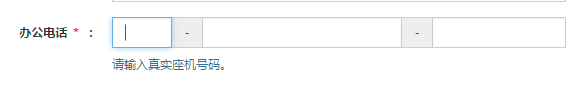
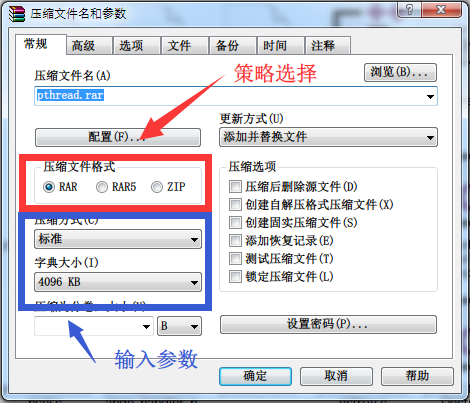

表单验证的需求简直太常见了。“**<span style="color: indianred;">所有用户的输入都是不可信的</span>**”这个思想指导我们在设计表单的时候，一定要进行用户输入的验证。对于用户体验而言，越早的反馈则越佳，所以表单验证的工作应该尽可能地在前端就进行（当然，前端对于后端而言也是输入端，所以后端仍然需要进行检验）。简单的表单验证完全可以给 input 绑定几个 change 事件来进行。但表单一复杂，或者相似验证规则一多，这种编码的方式就很难管理事件了。这时候，我们通常需要使用一些库来帮助我们处理表单验证的工作。前端表单验证的库太多了，随便一搜：[表单验证-百度搜索](https://www.baidu.com/s?ie=UTF-8&wd=%E8%A1%A8%E5%8D%95%E9%AA%8C%E8%AF%81)。

那……为什么还要自己实现一个呢？因为去年工作中遇到了比较复杂的验证逻辑，选一个别人的库一是要学习 api，二是维护起来困难，要符合自己的页面风格也不是那么轻松；再加上表单验证器并不复杂，于是就打算自己写一个。所以这个表单验证器并不算那么地通用，不过我觉得传播思路和方法更重要，要想修修改改变成一个通用的库也很容易，只是没那么重要罢了（其实是懒……）。

## 依赖

jquery + bootstrap。jquery 看来是缺不了，bootstrap 没那么重要，对代码稍做修改就可以取消依赖。

## 能做什么

我期望这个表单验证器直接在 html 代码中指定好需要采用什么样的规则，不需要用 javascript 进行多余的配置；允许暂时跳过验证；允许扩展验证规则；提供验证难过、验证失败、警告三种验证结果；允许手动触发验证等等。

一个典型的 bootstrap 风格的表单项应该长这个样子：

```html{8,9}
<div class="form-group">
  <label class="col-xs-2 control-label">手机号码
    <span class="request">*</span>：
  </label>
  <div class="col-xs-6">
    <input class="form-control"
      name="mobile"
      type="text"
      data-validate-disable="true"
      data-validate="request:notrim mobile"
    />
    <p class="text-info">请输入真实手机号码。</p>
    </div>
    <div class="help-block col-xs-4">&nbsp;</div>
</div>
```

重点看第 5 行，对于一个普通的 input 组件，我加了两个属性，`data-validate-disable` 有值表示表单验证时，会跳过这个 input 组件；`data-validate` 则存放如果要验证的话，将采用什么样的验证规则。这个例子中表示要验证这个 input 组件是否为空、是否为手机号码这两个规则。注意，在 `request` 的后面我还加了一点内容，这是我想传递给验证规则的参数，比如这里我期望告诉验证器，如果 input 值只有空格，也认为是有值的。相似的，我们可以定义一个规则 `min` 来处理最少几个字符，并在 html 中把这个设定值传递进来，就像这样：`data-validate="min:10"`。我也期望一个验证规则允许多个参数传递，参数与参数之间用逗号隔开。

看起来很有意思，那就开始动手吧。

## 先写个 jquery 插件吧

```javascript
(function ($) {
  $.fn.validation = function () {
    return this.each(function () {
      var $this = $(this);
      if (!$this.is(':input')) {
        $this = $this.find(':input');
      }
      $this
        .off('blur.zh select.zh focus.zh')
        .on('blur.zh select.zh', validate)
        .on('focus.zh', clear);
    });
  };
})(jQuery);
```

给 jquery 对象添加一个 `validation` 方法，用法很简单：`$(<Selector>).validation()`。支持链式调用。`Selector` 比较自由，如果是 `:input` 元素，则直接给这些元素初始化验证器；否则找出它们所有的 `:input` 子元素，给这些子元素初始化验证器。什么意思呢？就以上面的 html 片断为例，你可以任性地使用如下任意一种方式初始化验证器：

- `javascript±$('[name=mobile]').validation(); // 选择 :input`
- `javascript±$('.form-group').validation(); // 选择普通节点，对所有 :input 子元素生效`
- `javascript±$('body').validation(); // 对页面中所有的 :input 元素生效`

再说说所谓的初始化，其实就是绑定事件。那么要绑定什么事件呢？主观上，对于一个输入框，当我们输入好了，焦点离开时，应该就进行输入内容的验证，并给出验证结果。如果验证失败，会有提示信息，但这些提示信息应该在重新获得焦点时清除，否则当用户在修正输入的时候还一直提示上次的错误信息，会让用户无所适从。那么针对以上的情况，我们需要在失去焦点（`blur`）和获得焦点（`focus`）时分别绑定验证的方法（`validate`）和清除错误信息的方法（`clear`）。另外针对 checkbox、radiobox、select 等控件，最好也给 `select` 事件绑定验证方法。

> 为什么不使用更通用 `change` 事件来绑定验证方法呢？原因有二：
>
> 1. 我觉得有些场景需要用 javascript 载入默认值或历史输入。这些内容应该延后验证（不是不验证），不然刚打开页面就是表单验证错误让人很难受。所以 `change` 事件不合适。
> 2. 由于获得焦点会清空错误消息，如果没有修改内容，直接失去焦点，这时不会触发 `change` 事件，导致不会再验证，表现为错误信息丢失。

那下面就来具体看看 `validate` 和 `clear` 两个方法。

## 清除错误消息及验证状态设置

```javascript
function clear() {
  var $this = $(this);
  var $parent = $this.closest('.form-group');
  if (!$parent.attr('data-for') || $parent.attr('data-for') === $this.prop('name')) {
    $parent
      .attr('data-for', null)
      .removeClass('has-error waiting has-warning')
      .find('.help-block')
      .text('');
  }
}

function successHandler() {
  var $parent = this.closest('.form-group');
  if (!$parent.is('.has-warning')) {
    clear.call(this);
  }
}

function failHandler(msg) {
  var $parent = this.closest('.form-group');
  $parent
    .removeClass('has-warning waiting')
    .addClass('has-error')
    .attr('data-for', this.prop('name'))
    .find('.help-block')
    .text(msg);
}

function warningHandler(msg) {
  var $parent = this.closest('.form-group');
  $parent
    .removeClass('waiting')
    .addClass('has-warning')
    .attr('data-for', this.prop('name'))
    .find('.help-block')
    .text(msg);
}
```

这一段一起说，因为这部分内容是 dom 操作相关的，与 bootstrap 强相关，如果你不用 bootstrap，那就尽情地替换掉吧（估计改几个类名就行了）。这几个函数的用途从名字上就可以看出。`clear` 上面已经提到过，清空验证信息；另外三个分别处理验证通过、验证失败和警告时的信息展示。简单是简单，但这里有两个问题需要额外考虑一下。

第一个是验证信息优先级的问题：

一个输入项可能同时有多个验证规则要匹配，可能有些验证规则通过，有些失败，有些警告。在具体处理时，我觉得比较合理的流程是：如果出现验证失败，则立刻停止后续验证，直接提示错误信息；如果警告，则提示警告信息，并继续后续规则验证；如果验证成功，理论上不需要做任何处理，直接进行下一步验证，但谨慎起见，还是做一下清空错误信息的工作，但要注意不可以清空掉警告信息（错误信息不用管，因为一产生错误信息，验证也就停止了，不会再触发验证成功了）。

另一个问题是同一个表单单元中有多个输入控件的问题，就像这样：



几个控件共用了一个错误信息展示文本，我觉得如果某一个控件输入内容有误，必须再次修改这个控件内容才能清空错误信息，修改别的控件时，这个错误信息应该保留。所以在清除错误信息时，我们额外需要知道这个错误信息是由哪个控件引起的。在上面的示例中，我们在处理验证错误和警告时，把引起问题的控件的 `name` 记录到表单单元的 `data-for` 属性中了。到需要清空的时候再比对一下 `data-for` 和当前控件的 `name` 是不是一致，不一致就不清空错误信息。

## 处理验证流程

我们给输入控件的 `blur` 和 `select` 事件绑定了 `validate` 方法，那么这个 `validate` 方法如何实现呢？

```javascript{3-5,17,20-29}
function validate() {
    var $this = $(this);
    var success = new $.Callbacks();
    var fail = new $.Callbacks();
    var warning = new $.Callbacks();
    var $parent = $this.closest('.form-group');
    success.add(function (value) {
        successHandler.call($this, value);
    });
    fail.add(function (value) {
        failHandler.call($this, value);
    });
    warning.add(function (value) {
        warningHandler.call($this, value);
    });
    clear.call($this);
    if ($this.is(':disabled') || $this.is('[data-validate-disable]')) {
        return;
    }
    if ($this.attr('data-validate')) {
        var conditions = ($this.attr('data-validate') || '').split(/\s+/g);
        for (var i in conditions) {
            var condition = conditions[i];
            $parent.addClass('waiting');
            if (!pickStrategy(condition.split(/[:,]/g), $this, success, fail, warning)) {
                break;
            }
        }
    }
}
```

先看这段代码的前一部分，我定义了三个 `$.Callbacks` 对象，分别用以处理不同验证结果的响应。从效果上，不用 `$.Callbacks` 对象，直接传递函数引用也是可行的，我是想把 dom 操作和验证逻辑分离开，用类似事件触发的异步形式来处理验证逻辑。

再看第 17 行，它规定了两种情形不执行验证，一种是控件被禁用，另一种是控件中存在`data-validate-disable`属性。这个不用多解释了。

重点看 20~29 行，这段是关键。第 21 行中，我们把 `data-validate` 中的内容按空白（空格、tab、换行）切割到一个数组 `conditions` 中，`conditions`中的每一项都是一条需要验证的规则。那么很自然地，遍历这个数组。再看第 25 行，引入了一个新的方法 `pickStrategy`，很明显它是对这条规则进行验证。先别管它的实现，看看它接收的参数。还记得前面我们说要允许用 `rule:param1,param2` 的形式给验证规则传入参数吗？`pickStrategy` 拿到的第一个参数就是 `[rule, param1, param2]`，通过 `condition.spit(/[:,]/g)` 解析出。第二个参数是当前处理的控件的 jquery 对象，后面三个分别是验证成功、失败、警告三种情形的回调对象。如果验证失败，`pickStrategy`应该返回 `false`，同时中止验证，否则验证下一条规则。

## 策略模式

下面就要来说 `pickStrategy` 方法了，不过先要补充一点背景知识——策略模式。策略模式是一种设计模式。

设计模式是搞软件工程的人常常挂在嘴边的词汇，表示对设计的复用。当然前端开发在工程化的进程上每家公司情况各异，我估计绝大多数公司的前端开发并不考虑工程上的问题，只考虑完成需求。因而对于没有 OO 编程开发背景的前端开发而言，设计模式可能是陌生的，甚至程序设计（别紧张，没有在说程序编写）本身就是陌生的。由于工程化的忽略和 javascript 语言本身的优点（很多模式没必要实现）和缺点（很多模式无法实现），前端开发中很少提设计模式。那么前端开发者怎么理解设计模式呢？设计模式就是一系统问题（场景）的通用解决思路。比如有人觉得 jquery 的链式调用很好用，能很大程度降低工作量，于是在别的地方也用函数 `return this;` 的方式构造支持链式调用的函数，这就可以认为是一个模式（谈不上设计模式）。

那策略模式是为了解决什么问题，或应对什么场景的呢？如果干一件事、完成一个任务可以有不同的策略，不同的算法来完成，这些策略、算法应该具有相同的输入和输出，但可以使用不同的资源（即不 care 中间实现差异）。具体要采用什么策略和方法则在程序运行时依据条件选择。举个例子？



压缩文件时，你可以选择不同的算法，但它们拥有相同的输入和输出。

那么我们做表单验证跟策略模式有什么关系呢？我们完全可以把每个验证规则看作是一个策略，我们支持的所有的策略放在一起，取个高大上的名字叫“策略池”。当我们想验证一个规则的时候，只需要去策略池中取出这个策略跑一下，不需要在一个很大的函数里面跑一堆 if...else，或者 switch...case。另外如果有新的规则加进来，只要把它塞到策略池中，无需更改已有的代码，**实现验证规则和验证流程解耦**。

先实现一个策略池吧：

```javascript
$.validation.strategy = {};
```

太棒了，一句代码就完事了，爱死 javascript 了！

再回到 `pickStrategy` 方法，看看怎么从这个策略池中拿到我们需要的验证规则：

```javascript
function pickStrategy(tokens, scope, success, fail, warning) {
  var name = tokens.shift();
  var strategy = $.validation.strategy[name];
  if (strategy) {
    return strategy.call(scope, tokens, success, fail, warning);
  } else {
    success.fire();
    return true;
  }
}
```

先说这个 `token`，还记得它是什么吗？如果要验证的规则是 “min:5”，那么 `token` 就是 `['min', '5']` 这个数组。第 2 行取出这个数组的第一项 `'min'`，再从策略池中取出这个验证规则。如果没有这个规则，则跳过这次验证，认为此次通过；如果有这个规则，则执行这个规则（见第 5 行），需要注意一下第 5 行的 `token` 已经发生变化了，除去规则名称，只剩下参数了，延续前面的例子，这里 `token` 应该是 `['5']`。

现在我们的策略池是空的，那可不行，先试着写一个验证 “min” 规则的方法吧：

```javascript{9,10,13,14}
$.validation.strategy.min = function (condition, success, fail) {
    if (this.val() === '') {
        success.fire();
        return true;
    }
    var length = +(condition && condition[0]);
    if (length) {
        if (this.val().length >= length) {
            success.fire();
            return true;
        }
        else {
            fail.fire('请至少输入' + length + '个字！');
            return false;
        }
    }
    else {
        success.fire();
        return true;
    }
}
```

这个方法内，`this` 指向当前验证的控件的 jquery 对象，第 1 个参数是额外带给验证规则的参数；第 2 个参数是验证成功的回调，使用时需要配合 `return true;`（见 9、10 行）；第 3 个参数是验证失败的回调，使用是需要配合 `return false;`（见 13、14 行）；第 4 个参数是警告的回调，需要配合 `return true;`，这个验证中没用到。

起始的几个验证方法也可以直接写在策略池中，我写了几个，供大家参考（代码比较长，包含身份证验证、邮箱验证、url 验证等一堆干货！）：

```javascript
$.validation.constants = {
  request: /./,
  trimLeft: /^\s+/,
  trimRight: /\s+$/,
  trim: /(^\s+)|(\s+$)/g,
  number: /^-?\d+(,\d{3,4})*(\.\d+)?$/,
  purenumber: /^\d+$/,
  shenfenzheng: /^\d{17}[\dx]$/i,
  taibaozheng: /^\d{8}(\d{2})?$/,
  zhizhao: /^\d{15}$/,
  mobile: /^1[345789]\d{9}$/,
  telephone: /^\d{7,8}([ +-]\d+)?$/,
  email: /^[a-z0-9.\-_+]+@[a-z0-9\-_]+(.[a-z0-9\-_]+)+$/i,
  url: /^(https?:\/\/)?(([\d]{1,3}\.){3}[\d]{1,3}|([\d\w_!~*\\'()-]+\.)*([\d\w][\d\w-]{0,61})?[\d\w]\.[\w]{2,6})(:[\d]{1,4})?((\/?)|(\/[\d\w_!~*\\'().;?:@&=+$,%#-]+)+\/?)$/
};

$.validation.strategy = {
  request: function (condition, success, fail) {
    if (this.is('[type=checkbox]') || this.is('[type=radio]')) {
      var name = this.attr('name');
      if (name) {
        if ($('[name=' + name + ']:checked').length) {
          success.fire();
          return true;
        } else {
          fail.fire('不能为空！');
          return false;
        }
      } else {
        success.fire();
        return true;
      }
    } else {
      if (condition && condition[0]) {
        switch (condition[0].toLowerCase()) {
          case 'notrim':
            break;
          case 'trimleft':
            this.val(this.val().replace($.validation.constants.trimLeft, ''));
            break;
          case 'trimright':
            this.val(this.val().replace($.validation.constants.trimRight, ''));
            break;
          default:
            this.val(this.val().replace($.validation.constants.trim, ''));
            break;
        }
      }
      if ($.validation.constants.request.test(this.val())) {
        success.fire();
        return true;
      }
      fail.fire('不能为空！');
      return false;
    }
  },
  min: function (condition, success, fail) {
    if (this.val() === '') {
      success.fire();
      return true;
    }
    var length = +(condition && condition[0]);
    if (length) {
      if (this.val().length >= length) {
        success.fire();
        return true;
      } else {
        fail.fire('请至少输入' + length + '个字！');
        return false;
      }
    } else {
      success.fire();
      return true;
    }
  },
  max: function (condition, success, fail) {
    var length = +(condition && condition[0]);
    if (length) {
      if (this.val().length <= length) {
        success.fire();
        return true;
      } else {
        fail.fire('不能超过' + length + '个字！');
        return false;
      }
    } else {
      success.fire();
      return true;
    }
  },
  number: function (condition, success, fail) {
    var value = this.val();
    if (value === '') {
      success.fire();
      return true;
    }
    condition = condition || [];
    if (!$.validation.constants.number.test(value)) {
      fail.fire('请输入数字！');
      return false;
    }
    for (var i in condition) {
      var c = condition[i].toLowerCase();
      if (c === 'pure') {
        if (!$.validation.constants.purenumber.test(value)) {
          fail.fire('请输入 0~9 组成的数字！');
          return false;
        }
      } else if (/^\d+[~-]\d+$/.test(c)) {
        var match = c.match(/\d+/g);
        var length = value.length;
        if (length < +match[0]) {
          fail.fire('请至少输入' + match[0] + '位数字！');
          return false;
        }
        if (length > +match[1]) {
          fail.fire('最多只能输入' + match[1] + '位数字！');
          return false;
        }
      } else if (/^\d+$/.test(c)) {
        if (+c !== value.length) {
          fail.fire('请输入' + c + '位数字！');
          return false;
        }
      }
      success.fire();
      return true;
    }
  },
  mobile: function (condition, success, fail) {
    var value = this.val();
    if (value === '') {
      success.fire();
      return true;
    }
    if (!$.validation.constants.mobile.test(value)) {
      fail.fire('手机号码输入有误，请检查后重新输入！');
      return false;
    }
    success.fire();
    return true;
  },
  url: function (condition, success, fail) {
    var value = this.val();
    if (value === '') {
      success.fire();
      return true;
    }
    if (!$.validation.constants.url.test(value.toLowerCase())) {
      fail.fire('请输入正确的网址！如 http://www.baidu.com');
      return false;
    }
    success.fire();
    return true;
  },
  email: function (condition, success, fail) {
    var value = this.val();
    if (value === '') {
      success.fire();
      return true;
    }
    if (!$.validation.constants.email.test(value)) {
      fail.fire('电子邮箱格式错误，请检查后重新输入！');
      return false;
    }
    success.fire();
    return true;
  },
  telephone: function (condition, success, fail) {
    var value = this.val();
    if (value === '') {
      success.fire();
      return true;
    }
    if (!$.validation.constants.telephone.test(value)) {
      fail.fire('电话号码输入有误，请检查后重新输入！！');
      return false;
    }
    success.fire();
    return true;
  },
  shenfenzheng: function (condition, success, fail) {
    var value = this.val();
    if (value === '') {
      success.fire();
      return true;
    }
    value = value.toLowerCase();
    if ($.validation.constants.shenfenzheng.test(value)) {
      var numbers = value.toLowerCase().split('');
      // 验证地区
      var aCity = {
        11: '北京',
        12: '天津',
        13: '河北',
        14: '山西',
        15: '内蒙古',
        21: '辽宁',
        22: '吉林',
        23: '黑龙江',
        31: '上海',
        32: '江苏',
        33: '浙江',
        34: '安徽',
        35: '福建',
        36: '江西',
        37: '山东',
        41: '河南',
        42: '湖北',
        43: '湖南',
        44: '广东',
        45: '广西',
        46: '海南',
        50: '重庆',
        51: '四川',
        52: '贵州',
        53: '云南',
        54: '西藏',
        61: '陕西',
        62: '甘肃',
        63: '青海',
        64: '宁夏',
        65: '新疆',
        71: '台湾',
        81: '香港',
        82: '澳门',
        91: '国外'
      };
      if (!aCity[numbers[0] + numbers[1]]) {
        fail.fire('身份证格式有误，请检查后重新输入！');
        return false;
      }
      var wi = [7, 9, 10, 5, 8, 4, 2, 1, 6, 3, 7, 9, 10, 5, 8, 4, 2];
      var check = ['1', '0', 'x', '9', '8', '7', '6', '5', '4', '3', '2'];
      var _sum = 0;
      for (var i = 0; i < 17; i++) {
        _sum += +numbers[i] * +wi[i];
      }
      if (numbers[17] != check[_sum % 11]) {
        fail.fire('身份证格式有误，请检查后重新输入！');
        return false;
      }
      success.fire();
      return true;
    } else {
      fail.fire('请输入 18 位身份证！');
      return false;
    }
  },
  taibaozheng: function (condition, success, fail) {
    var value = this.val();
    if (value === '') {
      success.fire();
      return true;
    }
    if (!$.validation.constants.taibaozheng.test(value)) {
      fail.fire('台胞证格式有误，请检查后重新输入！');
      return false;
    }
    success.fire();
    return true;
  },
  zhizhao: function (condition, success, fail) {
    var value = this.val();
    if (value === '') {
      success.fire();
      return true;
    }
    if ($.validation.constants.zhizhao.test(value)) {
      var p = 10;
      var s;
      var a;
      var numbers = value.split('');
      for (var i = 0; i < 15; i++) {
        a = +numbers[i];
        s = (p % 11) + a;
        p = (s % 10) * 2;
        if (p === 0) {
          p = 20;
        }
      }
      if (s % 10 !== 1) {
        fail.fire('工商营业执照输入有误，请检查后重新输入！');
        return false;
      }
      success.fire();
      return true;
    } else {
      fail.fire('请输入 15 位工商营业执照！');
      return false;
    }
  }
};
```

## 添加验证规则

说好的支持自定义验证规则呢？放心，不会少的，而且超简单：

```javascript
$.validation = function (condition, process) {
  $.validation.strategy[condition] = process;
};
```

加个静态方法搞定。

## 手动发起验证

有些场景下需要手动 check 一下表单内容才放心吧：

```javascript
$.fn.exec = function () {
  return this.each(function () {
    var $this = $(this);
    if (!$this.is(':input')) {
      $this = $this.find(':input');
    }
    $this.blur();
  });
};
```

原理很简单，对 `:input` 子元素触发一次 `blur` 事件。

## 还有一些是我没有做的

都不是很复杂，因为我的业务场景不关注这些，所以就懒过去了。

1. 没做通用的 ajax 验证

   现在对于 ajax 的验证，可以这样做：

   ```javascript
   $.validation('ajax_xx', function (c, s, f) {
     $.post('some_url', function (data) {
       if (data.success) {
         s.fire();
       } else {
         f.fire('xxxxxxxx');
       }
     });
   });
   ```

   表单提交前，除了检查有没有 `.has-error` 的元素找到填写出错项，还要检查有没有 `.wait` 元素，如果有的话都不能立刻提交。
   如果要有一个通用的 ajax 验证机制，可以自行扩展 `javascript±$.validation` 方法

2. 没做验证失败时表单提交阻断

   正如上一条中说的，表单提交前，需要检查 `.has-error` 和 `.wait` 元素，可以自行扩展 `javascript±$.fn.validation` 方法，添加 form 的 `submit` 事件绑定。

3. 没有为 handle 验证状态的 dom 操作提供接口

   不想做，bootstrap 挺好的。

4. 没有测试用例

   不打算给这些代码添加逻辑了，不想写测试用例。
