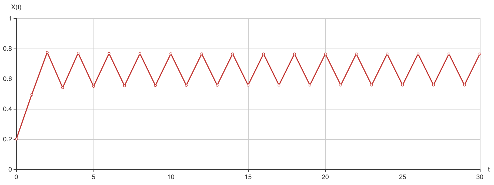
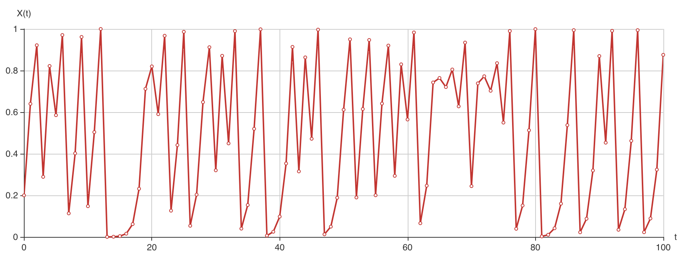
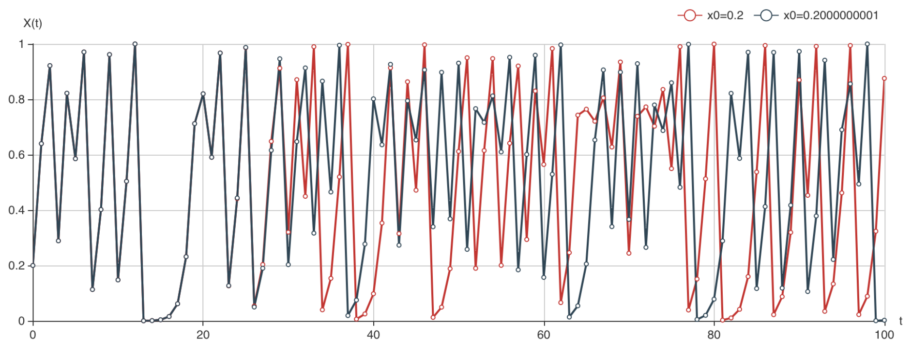

> 阅读[《复杂》](https://book.douban.com/subject/6749832/)一书时的笔记及延伸。
> 本文涉及到的生态学、数学、计算机科学部分都比较肤浅，如有错漏，欢迎斧正。


## 又是兔子
我们多少接触过这样一个[问题](https://zh.wikipedia.org/wiki/%E6%96%90%E6%B3%A2%E9%82%A3%E5%A5%91%E6%95%B0%E5%88%97)：
1. 第一个月初有一对刚诞生的兔子
2. 第二个月之后（第三个月初）它们可以生育
3. 每月每对可生育的兔子会诞生下一对新兔子
4. 兔子永不死去

问：第n月时，一共有多少只兔子？

对，描述兔子数量的数列就是我们熟悉的斐波那契数列，很多人都是通过这个问题了解递归的吧（也许吧，也可能是[Tower of Hanoi](https://en.wikipedia.org/wiki/Tower_of_Hanoi)）？

不过兔子怎么可能“永不死去”呢！那我们现在开始考虑兔子的出生率和死亡率。先从容易的来：每对兔子父母每年生四只小兔，然后死去。如果一开始有两只兔子（第0年），那么第1年会有四只兔子，第二年会有8只兔子……每年兔子的数量会翻一番。记第 *t* 年的兔子数量为 $n_t$ ，那么： $n_t=2 \cdot n_{t-1}$ ，即 $n_t = 2^t\cdot n_0$ 。很显然，如果不受限制，兔子的数量会越来越多，最终撑满这个星球，乃至整个宇宙。

假如我们考虑种群数量增长所受的限制呢？可想而知，如果种群数量越来越多，也许很多小兔子由于太过拥挤，缺少食物和空间，没有繁殖就死去。整个种群的数量就不会呈现上述无限增长的情况了。生物学家用一种叫 *logistic model* 的简化方式来描述这种情况下的群体增长： $n_{t+1} = (r_{born}-r_{die})\cdot(k\cdot n_t-n_t^2)/k$。
其中，$n_t$ 为这一代的种群数量，$r_{born}$ 为出生率，$r_{die}$ 为死亡率，$k$ 为承载能力。

举个例子，如果出生率为2，死亡率为0.4，承载力为32，第1代有20只兔子，套用上面的模型，那么第2代有12只兔子；再把这个结果代入计算，会得出第三代仍然有12只兔子；从此种群数量维持在12。

如果我们改变一些参数，比如把死亡率降到0.1，那么依据模型计算，第2代有14.25只兔子，第三代为15.01816只兔子（不要在意兔子的数量为什么可以是小数）。实际上我们的计算过程是把这一代的计算结果代入模型公式，计算下一代的结果，这个重复不断的过程就是迭代，对模型进行迭代。

## *logistic map*
由 logistic model 进行迭代计算还是有些麻烦，我们可以再进行一点简化：把出生率和死亡率合成一个变量 $R$，种群数量由承载率（当前种群数量与最大可能的种群数量的比率）$x$ 代替，$x = n / k$，由于当前种群数量总是介于0和 $k$ 之间，所以 $x$ 总是介于0和1之间。

那么我们就可以把上面的logistic model的公式改写一下，于是我们有： $x_{t+1}=R \cdot x_t \cdot (1-x_t)$。这个方程称为logistic map，是动力系统理论和混沌研究中的一个重要方程。

如果我们让 $R$ 值变化，那么logistic map就很有趣了。

不妨先假定 $R=2$，我们发现，不管 $x$ 的初始值是什么（先用0.2试试吧），最后总会达到同一个固定的值：

$$
\begin{gathered}
x_0=0.2 \\ x_1=0.32 \\ x_2=4352 \\ x_3=0.4916019 \\ x_4=0.4998589 \\ x_5=0.5 \\ x_6=0.5 \\ ...
\end{gathered}
$$

不同的初始值只会让到达0.5的速度有快有慢，但经过若干步骤后，都会到达0.5。那么这个0.5就称为不动点（fixed point）。

我们把 $R$ 的值调大，也许这样的不动点依然后存在，但到达不动点的速度会越来越慢。假如 $R=3.1$ ，我们再来看看，会发现情况似乎不太一样了：



<p class="captain">R=3.1，x<sub>0</sub>=0.2</p>

$x$ 的值最终会在0.5580141和0.7645665之间振荡。我们称之为吸引子。

随着 $R$ 值的变化，情形会更加复杂。我从[wikipedia](https://zh.wikipedia.org/wiki/%E5%96%AE%E5%B3%B0%E6%98%A0%E8%B1%A1)上把结论摘录如下：
1. 0和1之间：不论初始值数值为何，$x$ 会越来越少，最后趋近于0。
2. 1和2之间：不论初始值数值为何，$x$ 会快速的趋近 $(R-1)/R$。
3. 2和3之间：经过几次迭代，$x$ 也会越来越接近 $(R-1)/R$，但一开始会在这个值左右振动，而收敛速率是线性的。
4. 3：$x$ 仍然会越来越接近 $(R-1)/R$，但收敛速率极为缓慢，不是线性的。
5. 3和$1+\sqrt{6}$（约3.45）之间：针对几乎所有的初始值，$x$ 最后会在2个值之间持续的震荡，即 *x* 最后会是a,b,a,b...的变化，其数值和 $R$ 有关。
6. 3.45和大约3.54之间，针对几乎所有的初始值，$x$ 最后会在4个值之间持续的震荡。
7. 约大于3.54：$x$ 最后会在8个、16个、32个值……之间持续的震荡，至于 $R$ 何时会令 $x$ 的值由 n 个到 2n 个，则和[费根鲍姆常数](https://zh.wikipedia.org/wiki/%E8%B2%BB%E6%A0%B9%E9%AE%91%E5%A7%86%E5%B8%B8%E6%95%B8) $\delta = 4.669...$ 有关。
8. 约为3.5699：这样的振动消失，整个系统开始在[混沌](https://zh.wikipedia.org/wiki/%E6%B7%B7%E6%B2%8C%E7%90%86%E8%AE%BA)的状态之中。针对几乎所有的初始值，都不会出现固定周期的震荡，初值再微小的变化，随着时间都会使结果产生明显的差异，这就是典型混沌的特性。
9. 大于3.5699：整个系统在[混沌](https://zh.wikipedia.org/wiki/%E6%B7%B7%E6%B2%8C%E7%90%86%E8%AE%BA)的状态之中。不过，当中有些特定的 $R$ 值还是使系统变成非混沌，有周期性的结果，这些区间称为“稳定岛”。例如当 $R$ 约大于3.82，会出现3个值的周期，再大一点出现6个值及12个值的周期。
10. 当 $R$ 从大约3.5699到大约3.8284之间，系统混沌性质发展的现象有时会称为[Pomeau–Manneville场景](https://zh.wikipedia.org/w/index.php?title=Pomeau%E2%80%93Manneville%E5%A0%B4%E6%99%AF&action=edit&redlink=1)，其特征是周期性的震荡和非周期性的行为会穿插出现。此特征可以应用在半导体元件中。也有其他区域会使系统的周期为5个值，不管任意周期都存在某特定的 $R$，使周期为指定值。
11. 大于4：针对几乎所有的初始值，系统最后都会超过区间[0,1]并且发散。

似乎有点枯燥，不过没关系，我们来画个图吧，通过图形来了解一下这个混沌系统。取一个超过3.5699， 不超过4的 $R$ 值，这里我们不妨取 $R = 4$，还是令 $x$ 初始值是0.2，那么迭代100次：



<p class="captain">R=4，x<sub>0</sub>=0.2</p>

一个感觉，杂乱无章。对于每个 $x$ 的值，虽然它能唯一决定下一个 $x$ 的值是什么，但它们却组合成一个看起来非常随机的轨迹。在计算机中，我们甚至可以用它来生成伪随机数。因此，表面的随机性可能来自非常简单的确定性系统。

不仅如此，对于一个能产生混沌的 $R$ 值，如果初始值有任何的不确定性，那么一定时间后的轨迹就无法预测了。还是刚刚的图，我们考虑稍稍修改一下初始值，比如修改小数点后第10位，假定初始值是0.2000000001会怎么样？这与0.2非常接近，我们把两条轨迹绘制到一起看看：



可以看出，大概在 $t = 30$时，两条轨迹已经分开，$x$ 的值已经无法预测了。实际上只要初始值有不确定性，不管精确到小数点后多少位，最终都会在 $t$ 大于某个值的时候变得无法预测。

## 伪随机算法

接下来，我们就来尝试使用logistic model的混沌特性来实现一种简单的伪随机算法。

```javascript
function* RandomGenerator() {
  let seed = .2;
  function getNext(x) {
    return 4 * x * (1 - x);
  }
  for (let i = 0; i < 30; i++) {
    seed = getNext(seed);
  }
  while (true) {
    seed = getNext(seed);
    yield seed;
  }
}

const randomGenerator = RandomGenerator();

function random () {
  return randomGenerator.next().value;
}
```

实际上一些常见的伪随机数生成算法，例如线性同余法，也是使用了类似的手段，通过迭代产生混沌系统。而这类的算法所追求的，我觉得有三个方面的内容：
1. 统计意义上的随机，即随机数结果分页均匀，不能有所倾向。
2. 更大的循环区间。比如像如上算法，受 $R$ 值和计算机浮点数精度的影响，一定会在某个时刻产生与之前相同的结果，使得迭代进入循环。而用线性同余算法，循环区间则与选取的模数大小相关。
3. 更快的性能。
