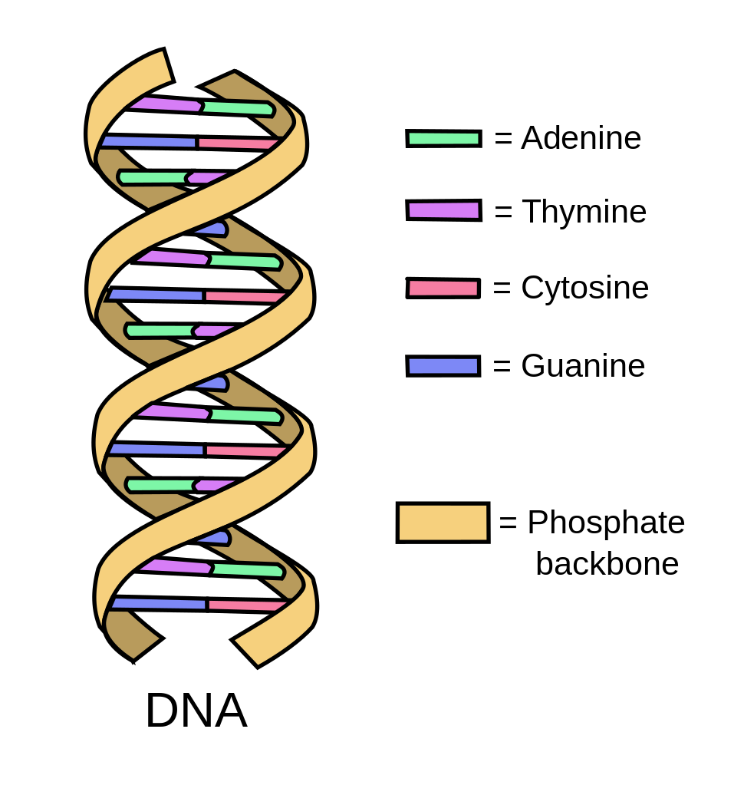

高中时因为竞赛，我额外花了很多时间学习生物。当然并没有学多深，就是基本学完了《普通生物学》。这段经历其实对我影响很大，高考后填报志愿时，曾在选择计算机相关还是生物相关专业纠结了很久，只不过最后计算机相关专业赢了。说回学习生物的事，那段时间有几个瞬间让我有被冲击到的感觉，今天与大家分享一下。

## 第一次冲击：“上帝”选择了四进制。

我并不信奉上帝，但如果生命是设计出来的话，那么造物神的电脑可能是四进制的。

DNA——脱氧核糖核苷酸——是大众熟知的概念，它是遗传物质，负责生命的延续，指导生命的进程。

DNA 是许多核苷酸分子连接组成的两股长链聚合物螺旋缠绕而成，每个核苷酸上都有一个碱基，两条链上的碱基两两配对。DNA 上一共有四种碱基，分别是 A（腺嘌呤）、T（胸腺嘧啶）、C（胞嘧啶）、G（鸟嘌呤），其中 A - T 配对、C - G 配对。那么 DNA 本质上是一种信息载体，而 ATCG 的排列则是一种编码方式。与计算机世界的磁盘做对比，磁盘就是信息的载体，而所有的信息都会被编码成二进制的 01 存储在磁盘中。只是 DNA 的世界不是二进制，而是四进制的 ATCG。

再进一步类比。由于碱基对的配对关系是确定的，所以 DNA 两条链中所携带的信息是等价的，两条链的设计更像是一种安全冗余。这种冗余设计还有一个好处，那就是在 DNA 复制时，只要拆开双链，两条单链分别组装成新的双链就行，大大提升了 DNA 的复制效率。说到这，对计算机稍微敏感一点的朋友可能已经想到了，这与 RAID 1 级的磁盘冗余阵列的思想不能说一模一样，至少也是异曲同工。

不是还有种遗传物质是 RNA 吗？它也是四进制的吗？其实 RNA 与 DNA 还是挺像的，区别在于它一般是单链的，规模很小。另外它的四种碱基与 DNA 的四种碱基稍有不同，把 T（胸腺嘧啶）换成 U（尿嘧啶）即可。基于相似性，我们只讨论 DNA 就行。

为什么 DNA 选择四进制，而我们的计算机选择二进制？先想想四进制有什么好处。进制越高，信息密度越高。比如要表达 156 这个数字，二进制可以表达为：10011100，需要 8 个字位（bit）；而换成四进制，则可以表达为：CTGA，需要 4 个字位。如果 DNA 采用二进制，那么双链的长度会增加一倍，相应地复制、基因表达的效率会降低 50%，消耗的能量增加数倍，同时出错的概率也会增加一倍。既然如此，为什么不采用更高的进制，或者说，为啥计算机要采用二进制呢？二进制，非 0 即 1，极其简单，在硬件制造上，比如门电路实现二进制最容易实现；在信息存储和传输时，每个字节只有两个状态，不容易干扰或误识别。对于 DNA 其实也类似，碱基结构很简单，如果要支持更多的碱基类型，那么核苷酸的分子必然会更大更复杂，那么 DNA 的稳定性必然会下降，体积也会增加。

高中的我深深被 DNA 的精巧设计所震惊，我不信上帝，但当时我满脑袋想的都是“为什么上帝选择四进制”。DNA 类比于计算机世界，充其量是存储程序的磁盘，而生命的过程并不仅仅只要 DNA 就是行了，而是需要对 DNA 的内容进行翻译和表达。类比于计算机就是需要对程序指令进行译码和执行。我实在难以想象这样精密、复杂的机制是自然发生的。

## 第二次冲击：生命的纯粹与不纯粹

你出生时，你拥有的 DNA 都属于你的基因组吗？

假设有一家做贸易的公司，现金流可能是这个公司非常重要的东西，然而这家公司从成立到上市，它的财务部门一直是外包出去的，你会怎么看待这家公司。事实上我们看到的几乎所有的生物都跟这家公司一样。

线粒体和叶绿体就是这样的“外包公司”。在细胞内，线粒体和叶绿体与其说是细胞器，不如是共生的细菌。它们都有自己的膜结构，有自己独立的遗传物质。但它们对于生物特别重要，比如线粒体最主要的功能是参与有氧呼吸，通过氧化反应产生 ATP，ATP 是生物能量通货，所有的生命活动都要靠 ATP 驱动的。叶绿体对于植物来说也是非常重要的，通过光合作用为植物生产 ATP 和葡萄糖。

如此重要的线粒体和叶绿体是怎么形成的呢？一种主流的看法是“内共生假说”，在真核生物早期，一些真核生物吞噬捕获了线粒体或叶绿体的祖先——某种细菌，然后产生了共生关系，线粒体或叶绿体寄生于细胞中。

这个假说对我来说很有冲击力的地方在于：“生命纯粹得那么不纯粹”。一个生物演进的过程中，有可能有别的生物的基因进入自己的基因组，也可能像线粒体和叶绿体这样永久的侵入与共生，这种感觉很奇怪，很难接受，很不纯粹。然而生命纯粹的地方就在于一切为了生存，能用就行，只要能生存，再不寻常也是寻常。

关于线粒体还有一个非常有趣的研究——人类基因迁徙图（也有基于 Y 染色体做的），以后有空可以聊聊这个，有种系统留了一个后门的感觉。
