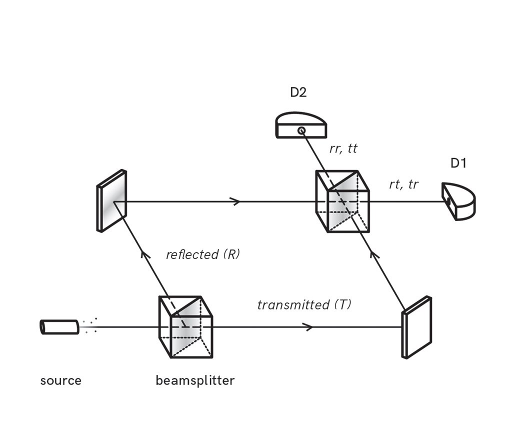

遇到问题我们会问『为什么』，一条条因果链条构成了基本逻辑。探索大千世界背后的逻辑，是人类孜孜以求的目标。然而事实上我们掌握规律比掌握底层逻辑要容易得多，看得到的现象距离看不到的机制可能相隔无比遥远。《三体》里讲过两个很有意思的『寓言』，一则是『射手假说』：

> 有一名神枪手，在一个靶子上每隔十厘米打一个洞。设想这个靶子的平面上生活着一种二维智能生物，它们中的科学家在对自己的宇宙进行观察后，发现了一个伟大的定律： “宇宙每隔十厘米，必然会有一个洞。”它们把这个神枪手一时兴起的随意行为，看成了自己宇宙中的铁律。

另一则是『农场主假说』：

> 一个农场里有一群火鸡，农场主每天中午十一点来给它们喂食。火鸡中的一名科学家观察这个现象，一直观察了近一年都没有例外，于是它也发现了自己宇宙中的伟大定律：“每天上午十一点，就有食物降临。”它在感恩节早晨向火鸡们公布了这个定律，但这天上午十一点食物没有降临，农场主进来把它们都捉去杀了。

这两则寓言故事都非常有趣地说明了『规律』之于『本质』的差距，很多显而易见的因果关系并非公理般地理所当然。这几年我经历了三次有关因果关系的世界观冲击，这给我带来了很新的看问题的视角。

### 第一次冲击：惠勒延迟选择实验

几年前我接受一些量子力学的科普，对惠勒延迟选择实验印象深刻。这是约翰·惠勒在 1979 年普林斯顿大学纪念爱因斯坦诞辰 100 周年的会议上提出的一个思想实验，我尝试简单表述一下。如下图，让光子通过一个半透镜，那么它有 50% 的机率通过，有 50% 的机率反射，那么每一个光子都有两条路径可能通行，D1 和 D2 两个探测器分别能检测到这两个路径过来的光子。

如果在两条路径交汇处放上第二块半透镜，通向 D2 的光子相位相反，正好抵消，而通向 D1 的光子相位相同，相互叠加，所以只有 D1 能检测到光子。

第二块半透镜会影响最终的呈现，不放，则光子呈现粒子特性，只会走其中一条路径；放，则光子呈现波动性，会同时走两条路径，产生自干涉。可如果一开始没有放第二个半透镜，直到光子通过了第一个半透镜之后，再放置第二块半透镜，会产生什么结果呢？依然会产生自干涉现象。直观的感觉是当光子通过了第一块半透镜后，它通过的路径已经确定了，当它发现了第二块半透镜后，仿佛又重新回到起点，重新同时走了两个路径。这个实验让因果错乱、时间倒流了，过程决定了起因，从而让很多人对因果论产生了怀疑。

当然，对此依然有其合理的解释，而让人们产生因果错乱的原因则是对这件事的理解不够深入。我对其印象深刻的原因在于其足够反直觉，以至于冲击了我的世界观。现在再回过头来看待这件事，感受又会有不一样：对于一件复杂的事情，如果有一知半解的认知，可能让自己得出顽固的、无益的、错误的结论；而要想充分认识、理解这些事情，甚至认识到『自己其实并不懂』这个事实，却非常非常难。

最近有一件事让我有些感触。有一种疾病叫『甲亢』，即甲状腺亢进，它的发病原因有很多，其中一种情况是与碘的摄入有关。当短期摄入过多的碘时，可能导致甲亢的发生。但以前很多人得甲亢的原因却恰恰相反，一些内陆地区的人们反而是因为长期缺乏碘的摄入而导致甲亢。这其实也能理解，由于缺乏碘，甲状腺分泌激素水平低于正常水平，于是就需要不断工作，导致甲状腺亢奋。你看，一个变量增多或者减少都有可能导致同一个结果 ，它们的因果关系又那么的清晰。但，等等，还有一种疾病叫『甲减』，即甲状腺衰退，它的病因也有很多，但其中一种情况也与碘摄入有关，摄入过多或者过少的碘都有可能引发甲减。那么对于甲状腺疾病，碘的作用到底是什么？在各种正负反馈机制下，原本有可能存在因果性的事情也可能模糊、错乱。

### 第二次冲击：因果颠倒

第二次冲击是罗振宇带给我的，我从罗胖那儿听来了很多有意思的思想。罗胖说因果关系是我们理解世界的基本方式，而世界那么复杂，我们只能进行简化，于是常常陷入因果颠倒的思维误区。比如有人认为游泳能减肥，因为游泳运动员身材都很好。听着很有道理，但更有可能的是正是因为人家本来身材就好，游泳才能游出好成绩，而成为游泳运动员。

我听过最有意思的一个例子是关于『吸烟有害健康』的讨论。一个事实是吸烟的人肺癌的发病率比不吸烟的人高出了 10 倍，那么我们能得出『吸烟有害健康』的结论吗？这有因果关系吗？其实不一定，我们能得到的是相关关系，并不是因果关系，我们需要进一步的证据才能论证因果关系是不是存在。或许有人问，这还需要证明吗？这不是显而易见的常识吗！假设存在一个基因特征，有这个特征的人，容易吸烟上瘾，与此同时，也容易得肺癌。虽然表面上看来，正相关性就是吸烟和肺癌，但是根本的原因，很可能就是基因特征。

类似的事情在我们身边一遍一遍地重复着，我们紧盯着各位数据，仿佛数字的变化一定有一个原因。当股市变化了，我们不会简单认为是市场的正常波动，我们会想是谁谁说了什么话影响了市场的信心；我们看到一个学校升学率高，都想挤进去，但其实不一定是教学水平高，而是生源素质本来就比其他学校好；很多赌徒们费心心机地计算着彩票的规律。

曾经有一个广为流传的都市谣言——可乐杀精，即喝可乐会降低生育能力。是不是听着就觉得是无稽之谈？但与你直觉相反，这个谣言其实是有实验基础的，也是有数据支撑的。2001 年 - 2006 年间，丹麦医生詹森（Tina Kold Jensen）对 2554 名年轻男子的精子质量和咖啡因摄入情况进行了调查。对极少数（3%）“巨量”饮用可乐或咖啡因的年轻人而言，其中一些人确实存在精子质量下降的问题。数据呈现的是相关性，却不是因果性，如果我们结论归因为可乐影响生育能力那是有问题的。其实经过调查，如果一个年轻人常常饮用巨量的可乐或咖啡因，那么他们本身的生活习惯和质量就有很大的问题，一系列的因素才最终导致这个结果。

罗胖还有一期的节目介绍了郑也夫的《文明是副产品》这本书，书里讲到的观点也很有意思。小麦如今是世界上最成功的植物物种，这多亏了人类文明早期驯化它，从而让小麦随着农业文明的发展而越来越重要。但如果我们反过来想呢？有没有可能其实是小麦驯化了人类？小麦的出现其实是改造了人类的文明，从采集狩猎进入了农业文明，同时它也改变了人类的消化系统、生活方式，人类再也回不到没有小麦的文明形态中了。对于小麦来说，它在人类的帮助下成为了最成功的物种，不用担心繁衍、天敌、气候、灾害。而在这个过程，反而人类文明像是小麦进化路上的一个副产物。到底谁是因谁是果，真的那么好分辨吗？

### 第三次冲击：你眼中的问题其实是他人的解决方案

第三次冲击是上海疫情期间听到的一句话：你眼中的问题其实是他人的解决方案。当然在疫情期间，这句话是有特定含义的，即当我们遇到一些问题，想要寻求政府/上级的帮助的时候，有可能在政府/上级看来，这些问题其实是解决更大问题而付出的代价。如果你正为了买不起学区房而闷闷不乐，这可能是你目前遇到的最大的问题，可政府会帮你解决吗？不会，因为学区房政策是他们为了解决优质教育资源分配问题的解决方案，一个解决方案一定会满足一些人的利益，但也很有可能要牺牲另一些人的利益，而在这个语境里，你可能就是被牺牲的群体。如果在公司里你的同事晋升了，而你没能晋升，你觉得很不开心，你的上级能帮你解决这个问题吗？不会，因为可能晋升名额有限，上级不会只从你的角度看问题，他需要综合看团队的稳定性、不同人的贡献、晋升的急迫性、经验能力等等才做出的决策，而你只是这个决策中被牺牲的那个人。

从这个视角想问题，会让我们少钻牛角尖，更能看清这个世界的规律和趋势。

但以上的解释其实还不是这句话的原意。这句话来自《奇葩说》黄执中，他的本意是指当你发现一个人有问题，想去解决时，很有可能这个问题对于他本人而言，并不是真正的问题，而是他对于另一个更难解决的问题的解决方案，或者伪装。说得有点绕，举个例子吧，你劝别人少抽烟，少喝咖啡因，因为这对身体不好。可别人就是不听你的，是你说的不对吗？未必，只是抽烟喝咖啡因这件事，只是他缓解焦虑，或者找寻灵感的方式。只要这个深层次的问题不解决，他是不会在意抽烟这种浅层次的问题的。我们乘坐飞机时，发现各种规定非常多，非常琐碎，可为啥要这么死板不灵活，流程和体验不能优化吗？其实你体验到的问题，很可能以前空难发生后，事故复盘后加入的改进方案。

我们生活中有很多的难以沟通的问题本质都在于此，我关心和谈论的点，并不是另一个人真正核心在意的点。而如果不能建立真正的信任，找出真正深层次的矛盾，仅仅止步于抱怨无法交流，那就浪费了很多解决本质问题的机会。
