> 本文是 2022-01-15 GDG 主题分享内容的文字整理

## 前言

很多人可能不知道字节跳动的教育业务，其实我们在去年正式发布了“大力教育”这个品牌，产品线覆盖了几乎所有的教育相关细分领域。

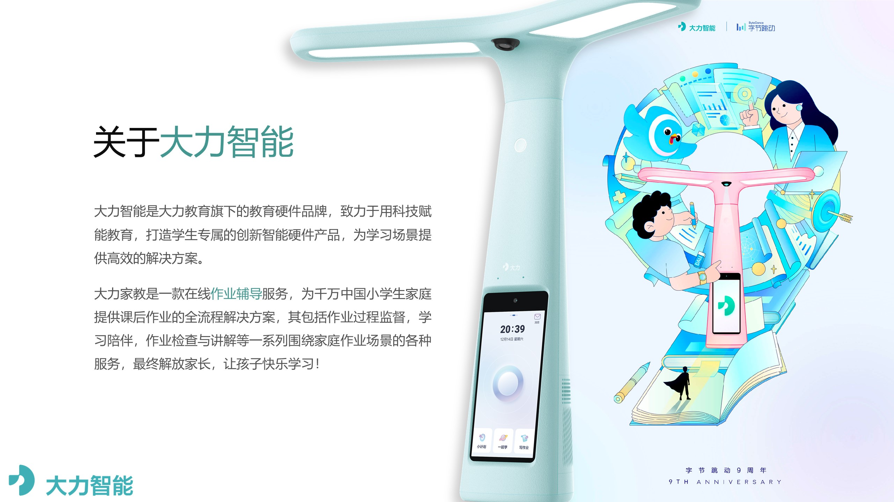

『大力智能』呢是其中的教育硬件品牌。去年，与『大力教育』一同发布的，正是大力智能研发的智能台灯产品，当然今天不介绍台灯的内容，太多了，我只介绍在台灯上开展的大力家教业务。

『大力智能』想解决的问题就是学生作业难的问题。对学生而言，我们想让孩子们自主学习，轻松作业，养成良好的学生习惯和时间管理习惯；对于家长而言，我们希望让家长辅导孩子的更容易，追踪孩子学情更方便。
基于此，大力家教是一款在线作业辅导服务，提供的是课后作业的全流程解决方案。

大力家教服务的核心是作业，围绕作业，我们提供了伴学、实时答疑、作业批改、作业报告等核心功能，围绕这些核心功能，再进一步引申出各种其他的功能和服务。

我们今天的主题是实时音视频，那么后面的时间我会重点介绍与这个主题相关的一些功能和服务。

不过在介绍具体业务之前，我们先聊聊为什么要做这件事。

## 起点

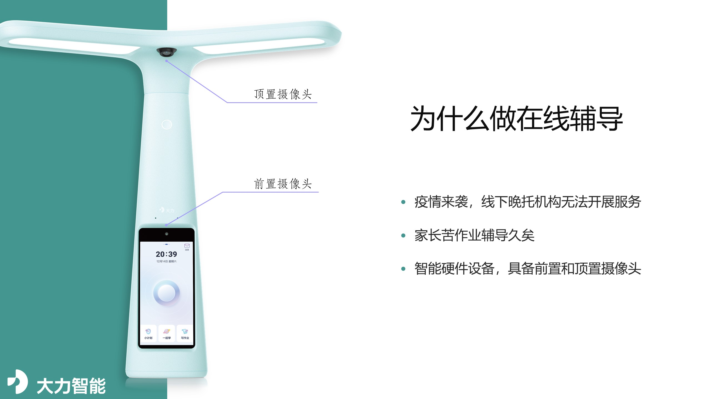

2020 年比较的不平凡，大家都知道，由于疫情的关系，很多行业都受到了冲击，线下晚托机构无法开展服务。关于晚托或者小饭桌这类服务，简单来说，就是放学后，有专门的场地、老师管理许多小朋友一起完成作业，期间提供辅导和作业检查等服务。

如果线下不能提供这样的服务了，家长在家自己辅导行不行呢？不知道诸位是什么感觉，我经常在抖音、朋友圈看到好多因为辅导小朋友而崩溃的家长。我觉得家长辅导作业已经是中国的一个社会问题，所谓不辅导的时候父慈子孝，一辅导的时候鸡飞狗跳。小学题谁都会，可恰当的教学方法不是人人都会的。更何况很多家长平常工作很忙，陪伴的时间都很少，更何谈辅导作业。

看来作业辅导对于很多家庭来说是刚需，那为什么应该由我们来做呢？因为我们的智能硬件——台灯。在我们的台灯上，有前置和顶置摄像头，不仅能查看孩子作业时的状态（是否坐姿良好、是否走神等），也可以看到孩子正在做的作业内容，提供实时的讲解。对比真实的老师辅导场景，借助这两个摄像头，完全可以把线下的辅导场景照搬到线上。

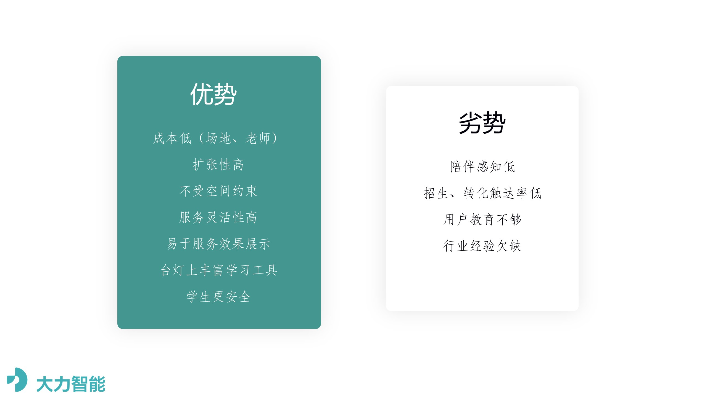

与线下晚托机构（小饭桌）相比，线上的服务形式有一些自己的特点，有一些明显的优势：首先成本低，场地成本很好理解，老师的成本可以从这两个角度考虑：晚托场景服务时间集中，全职老师必然无法覆盖成本，另外是学科匹配的问题，有些学科答疑的需求低，但依然需要有老师能覆盖这部分需求。

扩张性高也很好理解，对于线上的服务，扩张只是招生和招老师，不用考虑场地、配套管理的问题，即使是对于服务形式和学科年级的扩展，也比较容易。另外我们的线上服务以机构的形式进行包装，是可以直接以saas服务的形式提供给线下托班机构直接使用的。

不受空间约束指的是老师和学生没有地理空间的限制，招生不受商圈、城市的限制。

服务灵活性高说的是只要基础功能实现了，业务上层可以方便地包装成各种各样的产品进行销售，比如线上晚托产品、比如作业批改产品、比如专项课等等。

易于服务效果展示是因为所有的服务行为都是在线上进行的，所以可以自动、半自动生成学情、作业、辅导报告，让家长的价值感知更强。

我们的智能台灯本身就是一个非常强大的学习工具，包含了语数外各学科的大量作业辅导工具和学习资源，也会是我们很重要的优势。

相比于线下机构，线上的服务只需要孩子在自己家中就可以进行，没有小朋友在外面的安全问题。另外也不用担心在线下机构中，一个班级中的一些调皮的小朋友会影响到其他小朋友学习。

当然相比线下也有一些劣势，主要是两方面的问题，一是由于不能与老师在一个空间面对面交流，所以对于孩子的陪伴感会弱一点，进而对于我们用户的触达转化可能不够直接；第二个问题是线上晚托的形式比较新，用户教育不够，很难直观理解我们的服务是什么，能提供多少价值，对于我们来说，也需要积累更多的行业经验，打造更专业的服务团队。不过我们觉得，这些问题可以随着服务体验的精进和团队扩充成长得到解决。

想清楚了这些，我们觉得，何不试试！于是一年前，由一个产品、一个前端 、一个后端、一个客户端组成的非常小的敏捷小队启程了。在这一年里，我们迭代了无数版本，业务在不断壮大，团队也在不断壮大。

## 架构

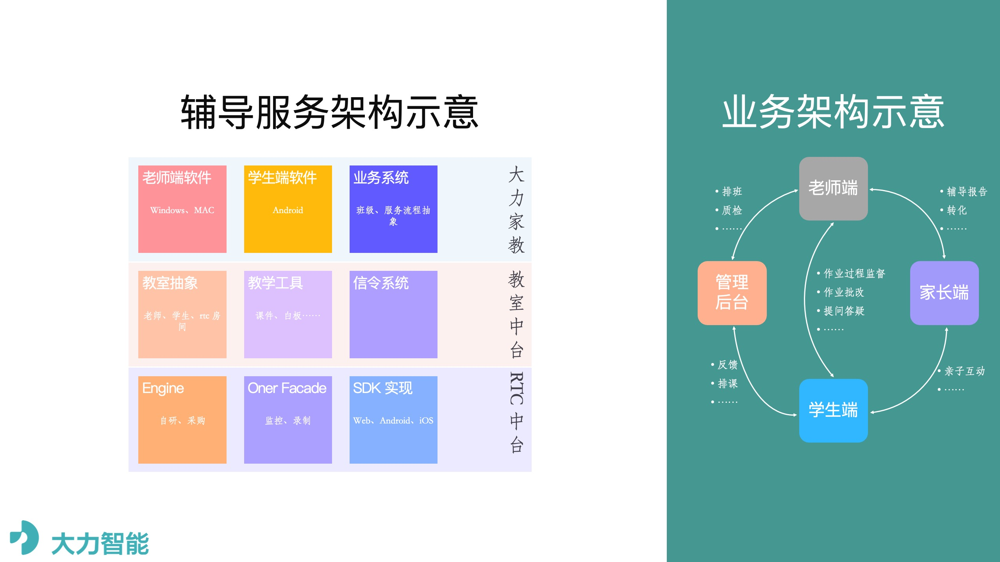

我的整体业务架构大体上分为四块，老师端、学生端、家长端和管理后台。老师端是桌面软件的形式，我们目前采用 electron 技术， 主要是向学生提供作业、辅导相关的服务，并向家长提供辅导报告等内容。学生端就是智能台灯，可以提交作业、与老师实时音视频通话。家长端是我们的大力辅导 app。另外还有提供各类管理能力的管理后台，这块也是我们建设的重点之一。

我们具体聊聊辅导服务的架构设计。实现这样一个 RTC 服务，我们大致分成了三层，最底层是 RTC 中台，它对接了 rtc 的服务商，包含外部采购和自研。同时对这些服务进行统一的 api 包装，抹平不同服务商的差异。最终再对不同平台分别实现 sdk，交给上层业务使用。

RTC 中台上层是教室中台，对教室进行抽象封装，以 rtc 房间为核心，加入老师和学生的角色区分，支持各类课堂行为。另外提供了各类的教学工具，比如课件、白板等等，可以打造更丰富的课中体验。各种教学工具和教室通过信令来打通实时交互体验。

再上层是我们的业务包装，这也是我们团队主要关注的范畴。我们基于教室中台，分别实现老师端和学生端的基础功能，并承接了我们自己的业务形态。

## 场景

接下来我们看看在线辅导服务的一些典型业务场景吧。

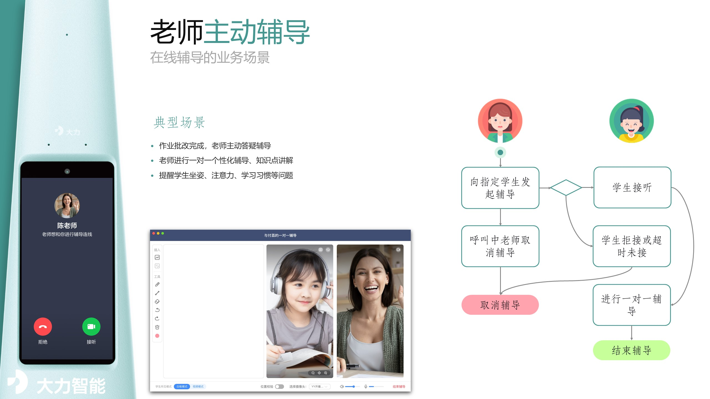

首先，老师可以主动向学生发起视频连线。典型的场景比如当学生作业批改完成，老师主动答疑辅导；或者老师对学生进行一对一个性化辅导、知识点讲解；又或者当老师发现学生坐姿、注意力、学习习惯上有问题，主动去进行提醒等。

流程上是老师在老师端对指定学生发起视频辅导，如果学生拒接、超时未接，或者老师主动取消，那么此次辅导取消；如果觉得接听，那么建立一对一的辅导。

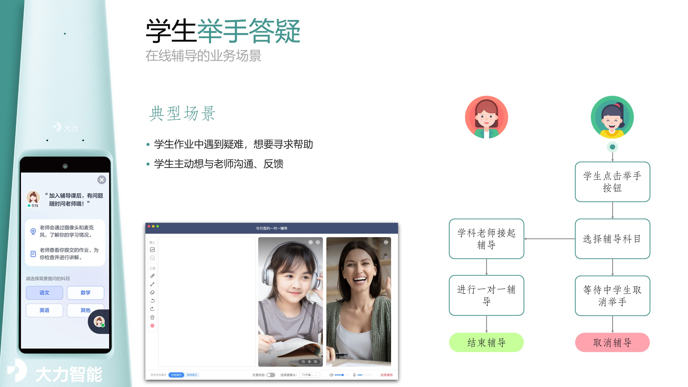

当然，学生也可以通过举手的方式，主动发起视频连线。典型的场景比如学生作业中遇到疑难问题，想寻求老师帮助；或者学生想主动与老师沟通、反馈。

流程是学生点击台灯界面上的举手按钮，并选择需要辅导的科目，然后相应科目的辅导老师会接收到学生举手的信息，如果老师接起举手，那么就建立起一对一的辅导。

## 信令

以上的一对一的辅导场景似乎也挺普通的，还有些什么特色吗？当然有！

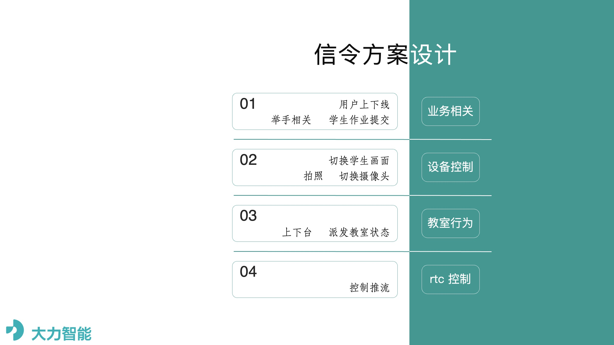

我想从信令方案的设计来切入，聊聊一些课中体验的细节。大体上我把信令分成四个维度，业务相关的是表示与业务流程密切相关的信令设计，比如学生或老师的上下线；学生的举手、取消举手或老师接起学生举手；学生提交作业等等。第二块老师对学生设备的控制能力的实现，稍后具体展开一下。第三部分是对教室行为的行为的实现，维护老师和学生在教室中的状态。最后一块内容是对rtc的控制，比如控制特定学生的音频流或视频流是否推拉。接下来我们就挑几个比较有特点的讲一下。

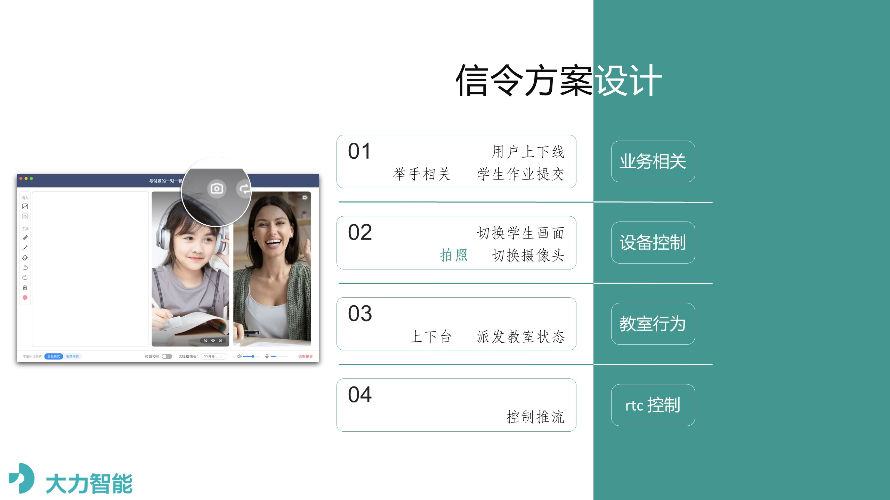

在实际服务中，虽然老师能通过学生视频流看到学生作业内容，但分辨率比较低，想要看清楚题目内容并讲解，几乎不可以能，所以我们设计了一个拍照功能，老师端对指定学生触发拍照后，学生端设备会暂停推流，调用摄像头拍摄一张照片上传。老师端接收到拍照成功的信令后，加载这张照片，裁切后置入白板中，然后可以对学生进行讲解。

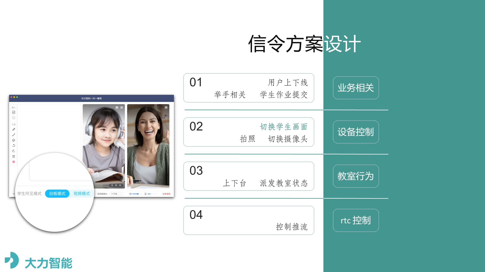

在不同的教学场景里，学生看到的画面可能存在差异，比如如果老师在讲解习题，那么学生应该主要关注白板，而不关心老师的视频画面；又比如老师在讲解英文发音，则需要学生关注老师画面，不用关心白板内容。所以我们提供了切换学生画面的功能，可以让老师方便地根据教授内容去切换学生画面，以达到最好的教学效果。

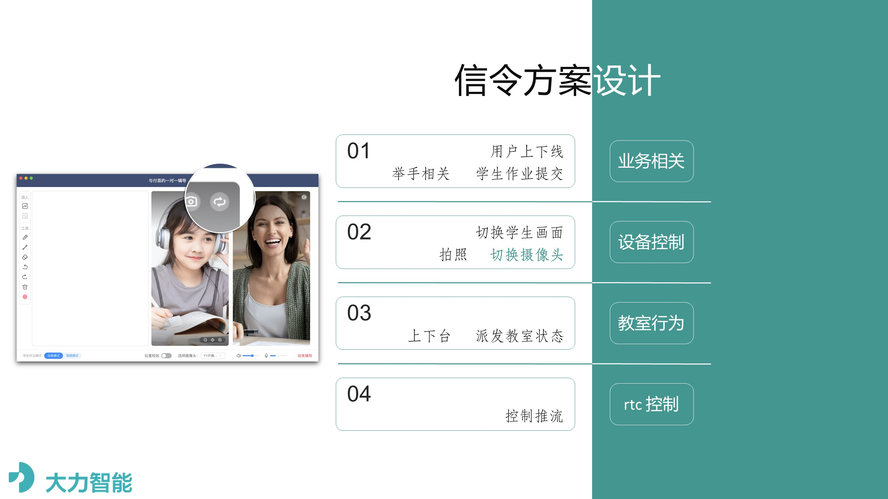

在介绍台灯的时候，还记得我描述过台灯有两个摄像头，可以拍摄学生和桌面画面，那么为了利用好这个特性，我们设计了切换摄像头的信令，老师端可以通过这个功能简单地对特定学生的摄像头进行切换，看不到不同的视频推流。

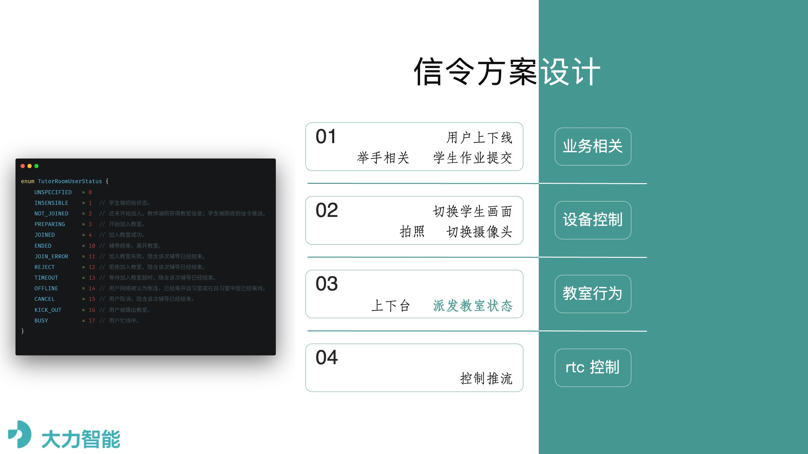

接下来聊聊我们的教室用户状态设计。前面在辅导场景里我们聊了各种从学生发起、老师发起的辅导流程，中间许多流程和状态，都是依靠用户向对方派发自己的状态完成的。比如老师主动向学生连线，老师端先创建教室，向学生派发『joined』，表示自己已经加入的信令。学生端派发『not_joined』表示自己收到了信令，但还未加入，并渲染响铃中的界面。如果在响铃过程中，学生接起辅导，那么向老师端派发『joined』状态，表示自己加入成功。如果一定时间后学生还没有接起，那么向老师端派发『timeout』状态表示呼叫超时。如果呼叫过程中老师主动取消呼叫，那么老师端向学生端派发『cancel』状态表示取消。如果呼叫中学生拒绝接听，那么学生端向老师端派发『reject』状态。老师端和学生端就通过这样一系列的状态派发，从而确定自己的界面展示内容和下一步的动作。

## 扩展

聊了那么多，基本上都集中在1v1在线辅导服务上，是对在线晚托场景的线上包装。除此以外，还有别的有意思的玩法吗？当然有！接下来向大家介绍一下我们的一些其他有意思的尝试。

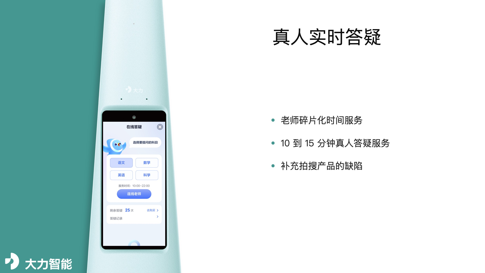

基于一对一视频辅导的基础能力，我们包装了一个真人实时答疑的服务。这项服务利用的是老师碎片化的时候，向学生提供 10 到 15 分钟的答疑服务。这项服务是对拍搜产品的缺陷进行补充。

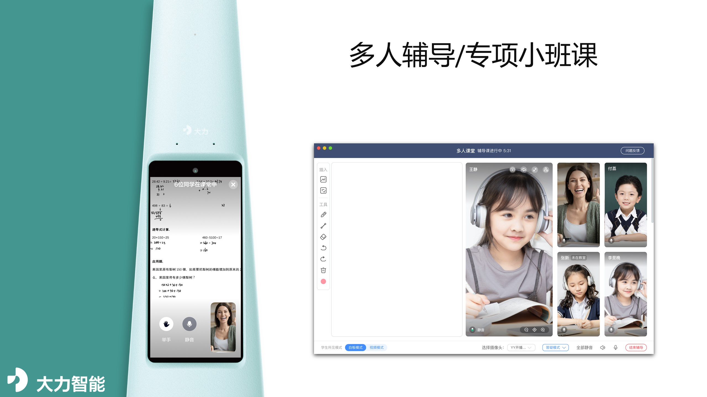

另一个方向是对教室里的学生数量进行扩展，我们做了支持6个学生同时在线的多人辅导的功能，老师可以使用这个功能，对一些共性的问题，或者知识点进行统一讲解，提升老师人效。实现了这个功能后，自然在业务层面上可以对服务形式进行包装，我们寒假期间试行了专项小班课的服务，在家教服务的基础上额外开设增值的小班课，效果还不错。

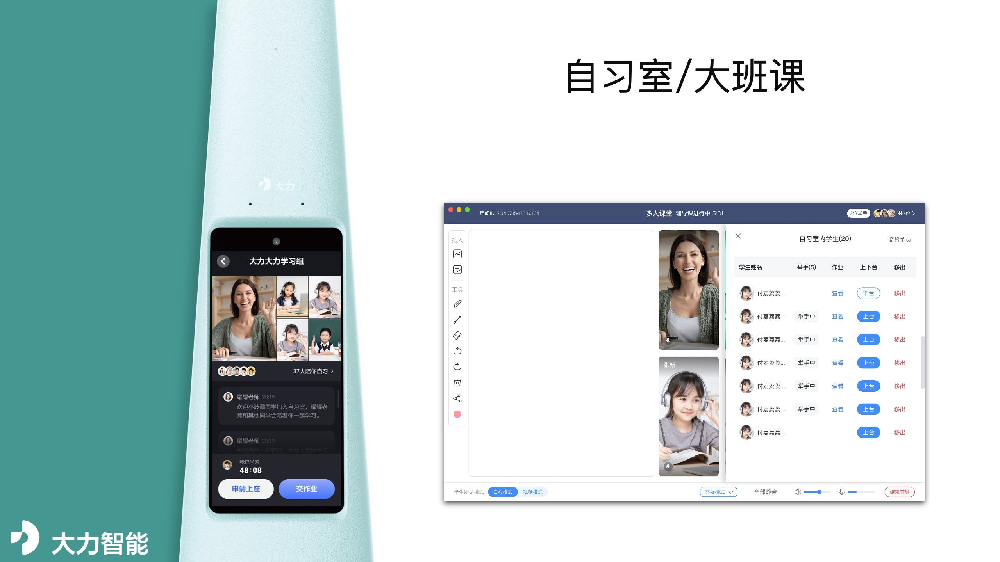

支持6名学生的多人辅导功能可能能适应的场景还是太少了。我们想，教室能不能再大一点？于是我们进一步实现了自习室的功能和大班课的功能，进一步把学生人数提升到70人，我们最新的迭代中正在把这个数字提升到200。之前在信令设计的部分提到过『上下台』的概念，这也是为了服务于自习室场景而实现的。
