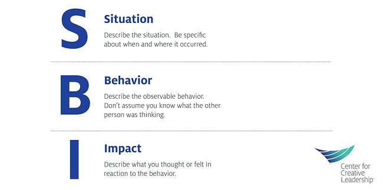
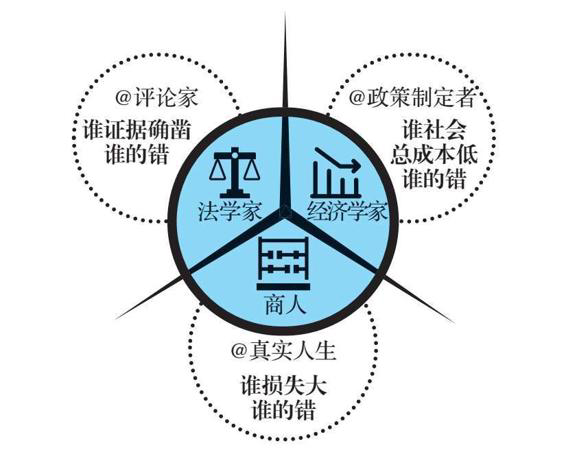
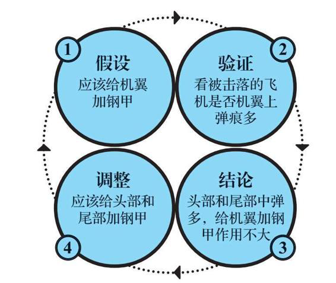
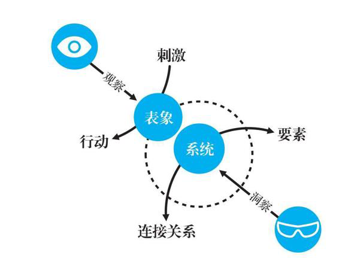
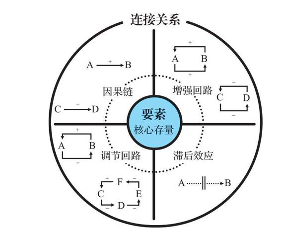
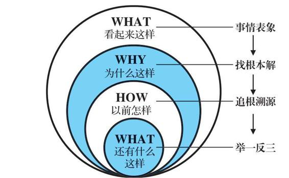

跟大家分享一下最近读到的一些有趣的思想，希望也 带给你启发。当然如果你有更好的见解，或者不同的观点，也欢迎一起讨论。

今天想跟大家谈的是看透本质的逻辑思维，和高效平和的沟通方式，所以我给本文取名为《就事论事的智慧》。

说到就事论事，很多人就会说，这我知道呀，不就是“对事不对人”，客观地去分析事情做得怎么样，不要引入对人的主观印象去评判。是的，不过这里我想先聊聊我们说的“就事论事”的“事”是什么 。

## 事实-观点-立场-信仰

### 事实

我认为这个“事”表示的是“事实”。

什么是事实？

“今天很热”是事实吗？不一定，有可能一些人认同你，一些人认为并不热，所以“今天很热”是观点，而“今天 26 度”才是事实。

所以什么是事实，事实是独立于人的判断的客观存在。所以事实不应该存在争议，但为什么有时候我们看到的事实不一样呢？比如大家都知道的盲人摸象的故事，并不是大家看到的事实不一样，而是事实太复杂，复杂到我们无法理解。所以并不是事实不客观，而是我们对它的了解太片面。

### 观点

我刚刚已经提到了“今天很热”是一个观点，它是你对于“今天 26 度”这个事实的看法。观点的意思就是指你对一个事实的看法。实际上，观点与你的关系比观点与事实的关系要紧密得多。

同样是“今天 26 度”，你觉得热，但有人觉得冷，这不一定是谁对谁错，而是由于不同的人的环境、衣着、生活习惯决定的。所以我们推广一下，观点是由你的知识结构，你掌握的信息，以及你的思维模式决定了你的观点。

想必大家每天都能看到网上有人为各种事情争吵不休，为什么网上容易发生争吵呢？其实是在网上我们更容易发现与我们观点不同的人，而如果大家都以为自己持有的才是事实，对方的意见与我不同，当然不是事实，一定要分个对错，所以冲突在所难免。可实际上，大家持有的都只是观点。

### 立场

一般情况下，我们只要区分事实和观点就可以了，但做进一步的探究，还有两种分类也可以聊一下，立场和信仰。

先说立场，立场是观点，但是是被利益和位置影响的观点，常听人说的“屁股决定脑袋”说的就是立场的问题。如果你是商场物业员工，经理说了今天不让开空调，被顾客问你热不热，就算今天 30 度，你流着汗，你也要说今天不热。

如果我们不能与交流的人拥有相同的位置和利益，那你们是不可能达成共识的。所以什么是立场，立场是“不争对错，只争输赢”，不要和有立场的人争论对错。

立场是普遍存在的，“小孩子才谈对错，成年人只谈利益”。为什么？因为小孩子才没有位置和利益。

### 信仰

信仰比立场更厉害，因为大学都觉得自己没有立场，都觉得自己信的是对的东西。信仰是一套完全自洽的逻辑体系。所谓“逻辑自洽”就是你无法证明它是错的，所以信仰都是对的。这个世界上有大量逻辑自洽却相互矛盾的信仰，信仰内逻辑自洽，信仰间互相矛盾。所以千万不要攻击别人的信仰，因为第一，你无法获胜；第二，你会失去这个朋友。

以上这些概念对我们日常的沟通交流的启示是当一个表达自己的观点的时候，我们要区分这是不是立场，是不是信仰，如果是，就不要与之纠结在这个观点上了。而对于我们自己，也要时刻反省自己，我说的话，到底是事实，是观点，是立场，还是信仰。

## 方法论：SBI™️ 反馈法

当我们想要给别人一些反馈（尤其是负面反馈）时，可以使用 SBI™️ 反馈法，以达到清晰客观给别人反馈的目的。所谓的 SBI 指的是情境（Situation）-行为（Behavior）-影响（Impact）这三段式的反馈模板，这个方法可以帮助我们在向别人反馈时，去除主观评价，即抛弃立场，摒除观点，保留事实，从而让受反馈的人能更容易接受，不容易有防备心。

具体怎么做呢？

首先从行为发生的情境开始，聊聊要反馈的事情发生在什么时间，在什么地点，有哪些人参加。这些内容描述得越具体，受反馈的人会越容易代入。

接下来描述要反馈的具体行为，告诉对方，他们做了什么，或者你看到了什么。千万注意这必须描述事实，而不是你的观点，不要加入你的任何解释。举个例子，『你没有认真听讲』这句话是在评判对方，是你的观点；而『在我讲话时，你经常望向窗外』这句话是不加评判的观察，是对事实的描述。

然后解释对方的行为会产生什么影响，这可以是你的感受、想法，也可以是因此对其他人，甚至是对团队的影响。

进一步地，我们还可以加上第四个环节：询问意图（Intention），比如问”你这么做想实现什么目的？“一些行为的背后可能有一些我们不了解的或者于我们假想不同的合理理由，只有了解了这个我们才能解释意图与实际影响之间的差距是什么，也才能进一步地去讨论如何改进。反馈只有当对方采纳并采取行动时才有用，而 SBII 反馈法可能是一个不错的实践方法。

## 对错观

事实只有真假，立场只有输赢，只有观点才分对错。那么谁对谁错呢？

其实评判对错的角度并不是单一的，而我们心中需要懂得这三种对错观。

我们用一个示例来说明这几种对错观：坏人 A 诱骗好人 B 进入 C 的没有锁好门的工地，结果 B 失足摔死了。请问，这是谁的错？

### 法学家的对错观

”法学家”的对错观，谁的犯错行为证据确凿，那么就是谁的错，显然，这个问题中是 A 的错，这是蓄意谋杀，没什么好讨论的。这听起来是理所当然的，我们的法律体系也是这么运转的，甚至我们可以说这是一种“大快人心”的对错观。

### 经济学家的对错观

经济学家的看法却不相同，如果 C 锁好了工地的门，也许悲剧就不会发生，而对于 C 来说，锁好门是他应该做的，也是举手之劳，但他却没有做，导致了事情的发生，所以这是 C 的错。这样的论断乍一听很不合理，C 也太冤枉了吧，主观上他可能连 A、B 都不认识。那经济学家是怎么考虑的呢？当这件事情发生的时候，惩罚 A 只是手段，避免以后不再发生这样事情才是目的。而要实现这个目的，我们就不得不考虑成本。熟悉经济学的朋友可能听说过科斯其人，他的一个著名的观点就是，谁能避免意外的成本最低，谁的责任就越大。整个社会为了避免 B 被 A 诱骗进 C 的工地要付出的成本，要远高于 C 锁好门的成本，虽然这个事上看起来 C 很冤，但以后所有工地的门都锁好，这样的事情就会大量减少。

这样的思维方式的例子有很多很多，特别是在政策制定领域。比如法律主张保护个人的私有产权，那如果钉子户不肯拆迁怎么办？家门前建了一条铁路，很吵怎么办？要解决这样的争议，就看双方谁规避问题的成本小。如果修改城市规划成本小，那就修改；如果搬家成本小，那就搬家。当然，这个成本该由政府，则由政府出，该由大公司出，则由大公司出。

我想再举一个我们工作中的例子。我们知道公司高峰时段禁止上线，就以 TCS 为例，要教育所有的人都不可以高峰时段上线，并且监督，这个成本是很高的，但在 TCS 层面上收紧功能，相对成本更低。但从行为对错的角度看，如果因为你高峰时段上线造成了事故，这与 TCS 本身又有什么关系呢？

### 商人的对错观

最后一个角度，也是对于我们个人而言，最应该放在心上的一种角度，是从商人的角度来看待：不管是 A 的错还是 C 的错，B 都死了；不管让谁承担责任，B 都无法起死回生——从个体利益最大化的角度看，B 只能怪自己。

举个例子，一个行人在人行道上走，一辆卡车冲过来，他能这么想：“我不让开，卡车不能撞我，撞了他就全责”吗？不能，因为这样想，他自己可能死，他只有这样想：“不让，就是我的错，因为不让开可能会被撞死。”

再举一个例子，我在地铁上被人踩了一脚，这是谁的错？我的错。难道不是对方的错吗？难道不应该是对方道歉吗？我当然可以要求对方道歉，可又有什么用呢？反而要浪费时间，甚至对方还可能耍无赖，又浪费了时间又让心情更糟糕。那怎么办？承认是自己的错，因为我不想在这件事情上浪费更多的时间，我的时间比他的值钱，浪费同样的时间，我的损失就会更大。谁的损失大，就是谁的错。

一件事情出现不好的结果时，责怪、埋怨、后悔都是没有用的，它们改变不了结果。

我们常常会做复盘，面对具体的问题时，我们需要从多个角度来评判对与错，站在法官的角度上看事实看证据，发现执行过程中不到位、有遗漏的地方；站在团队的角度，如果想避免这样的事情，有没有可能找出新的低成本的制度和流程来保障；最后站在损失的角度，有没有可能有其他的事情也导致这样的损失，我们应该预防。

在经济学中，除了科斯的观点，在处理重大损失的责任划分时，还有一个汉德公式，简而言之就是一方是否应该承担责任，就看为避免事故他要付出的成本是否小于事故的损失⨉事故发生的概率，有兴趣的朋友可以自行了解。我认为汉德公式能把经济学家的对错观和商人的对错观两者拉通，一个关注的变量是成本，一个关注的变量是损失，汉德公式将两者结合在一起。

## 从普通到优秀

### 误导与麻痹

短乎上有句名言，叫”先问是不是，再问为什么“，这句话非常有道理。

为什么地球是圆的？

为什么要过春节？

为什么今年樱花没有开？

唉，不对，今年怎么可能不开樱花，这个问题不成立。对于特别明显是对或者是错的问句，我们是能识别的，但所有的问法都这么的”显然“吗？听听这几个问题：

为什么胖的人比较懒？

为什么电子产品越来越便宜，衣服鞋子却越来越贵？

为什么懂了那么多道理，却还过不好这一生？

等等，胖的人真的比较懒吗？电子产品是越来越便宜了吗？衣服鞋子是越来越贵了吗？你其实不确定。但当你为这些”为什么“找原因的时候，你其实已经默认了这些观点是对的。

对”为什么+观点“这种句式的非理性的反应是人类思维模式的一个 bug。当别人用这种句式传播谣言的时候，可别落入到陷阱，当你去问别人，”你说，你说，到底为什么胖的人比较懒呢“时，你已经开始传谣了。提醒一下，下回办公室里听到别人对你说：”为什么张三最近总是针对你？“时，你可要小心了。

我们有时候也会对自己使用这样的句式，比如：为什么我们台灯做得这么好，有些家长还是不买呢？这其实是一种心理暗示，暗示问题不在我这里，一定在外部。但这样的想法并不解决问题，很有可能还是我们的产品做得不够好。

那现在你知道刚才问的”为什么懂了那么多道理，却还过不好这一生“这个问题了吗？我不知道你为什么过不好这一生，但很可能是你懂的道理还不够多，或者你还没有真正地懂得这些道理。

### 方法论：假设——验证——结论——调整

先讲一个大家可能很熟悉的故事：

二战期间，盟军的轰炸机损失很大，少部分返回来的飞机机翼上也布满弹孔。盟军决定在条件有限的情况下增加飞机部分位置的钢甲，保护飞行员的生命，提高战斗力。可是加在哪里呢？凭经验，既然机翼上满是弹孔，那最需要加强的部分应该是机翼。于是，司令决定，用钢甲加强机翼。

这时，一位担任盟军顾问的统计学家说：“司令，你看到机翼中弹还能飞回来，也许正是因为它很坚固。机头和机尾没有中弹，也许正是因为这些部分一旦中弹，飞机就飞不回来了。”

司令大惊，赶紧派军队去战地检查飞机残骸。果然，被击落的飞机，都是机头、机尾中弹。飞回来的飞机，可能并不知道自己为什么没有被击落，只有被击落的飞机才知道。但是，被击落的飞机，已经永远无法开口了。

普通人凭借飞回来的飞机的”经验“，决定加强机翼钢甲；而优秀的人会透过现象看到本质，知道那些被击落的飞机应该是机头或机尾中弹。

这就叫做幸存者偏见，人们过度重视那些幸存的个体，以为他们的特质就代表整个总体的特质。

举例来说，很多创业者总是向某些最成功的企业家学习，比如，比尔盖茨、史蒂夫乔布斯、马克扎克伯格、伊隆马斯克等等。殊不知他们可能只是特例，他们的经验不一定普遍适用。

那么遇到问题时我们应该怎么做呢？我的建议是，大胆假设，小心求证，得出结论，做出调整。以”二战飞机“为例：

假设：应该给机翼增加钢甲。

验证：去看被击落的飞机是不是机翼上弹痕多。

得出结论：被击落的飞机头部和尾部中弹多，机翼不多，给机翼部分增加钢甲作用不大。

根据结论做出调整：增加飞机头部和尾部的钢甲。

这就是“假设—验证—结论—调整”这个方法论的简单应用。这套方法论的本质就是，为了印证假设，而不辞辛苦、不嫌麻烦地去验证假设，然后得出结论，最后做出调整。

回到我们的主题，使用这套方法论时要注意：就事论事，不要被立场所左右。假如我们的产品销量不好，站在研发的立场上，我们不能单纯去指责销售、市场等其他人的问题，而应该充分地去假设，逐一地去验证。

## 透过表象看本质

很多事实足够复杂，我们很难了解完全。通过观察，我们能够了解很多事物的表象，进一步地，我们还能观察到事物的规律。比如我们乘坐电梯，按一个按钮，等一儿，电梯就开门了；我们通过 TLB 配置一个域名，工单执行好，这个域名就可以访问了。这些就是规律，给某个事物一个刺激，它就会有相应的行为。我们观察、总结，甚至口口相传的，大多也就是这些规律。

但这些规律为什么会发生，很可能我们根本不清楚，我们并不理解规律背后的原因。表象的背后都有一个”黑盒“，虽然我们看不见它，但它是所有规律产生的原因。我们在这里把这个”黑盒“称为系统。系统不出问题，规律就不出问题；但如果无法洞察系统，当系统出了问题，规律失效了，你就不能知道问题出在哪里。

### 系统=要素⨉连接关系

类似于规律，我们也给系统下一个定义。什么是系统，系统就是一组相互连接的要素。

这里有两个关键词，要素和连接关系，比如电梯，电梯的各个零件、控制电路、运维人员等等就是它的要素，而这些要素彼此之间如何相互衔接、控制、反馈，则是它们之间的连接关系。

要素是我们很容易看到的，但连接关系是我们常常忽略的。但只要我们了解了系统构成的五个模块，就能够分析任何复杂的系统的。这五种模块是：变量、因果链、增加回路、调节回路和滞后效应。变量就是变化系统的要素，因果链、增加回路、调节回路、滞后效应就是这个系统的连接关系

变量就是系统变化中的要素，会随着时间的变化而变化。比如你的体重、app 的日活等等。在变量上加入时间轴，变量就会呈现出两种状态，一个是存量，一个是流量。想像一下一个打开塞子的浴缸，存量就是在某一个静态的时间点，浴缸里有多少中；而流量是指在一段动态的时间里，浴缸里流入了多少水，流出了多少水。

我们常说”压死骆驼的最后一根稻草“，稻草就是浴缸里的水，一根稻草的流入量当然很轻，但多了之后的存量就很多，最后直到溢出。

接下来我们看第一种连接关系：因果链。因果链是什么非常好理解，它表示要素之前的因果关系，是一种变量之间增强或者减弱的连接关系。增强的因果链就是”你强，我就强“，比如工作时间和疲劳程度，饭量和体重等。减弱的因果链是”你强，我就弱“，比如疲劳程度和工作效率，体重和健康等。

因果链很简单也很容易理解，但却非常重要。我们可以把系统中的变量列出来，拿出两个可能有关系的变量，问自己：它们之前有增强关系吗？有减弱关系吗？许许多多的变量通过因果链串联起来才形了复杂的系统。

如果你仔细看增强回路和调节回路，就能注意到，一个回路其实就是两个因果链的首尾组合，是一个闭环。

什么是增强回路？两条增强或两条减弱的因果链首尾相连，形成的一条回路。当因增强了果，果又增强了因，这是正向增强回路；因减弱了果，果又减弱了因，这是负向增加回路。这种例子有很多，比如你越有知识，学习新知识的能力就越强，就拥有更多的知识；微信的用户量越多，对其他用户就越有价值，那么加入的用户就越多等等。我们听到过的很多名词，比如马太效应、赢家通吃、复利效应、指数型增长，本质上都是这个逻辑。

而调节回路则不同，它是因增强果，果减弱因的回路。增强回路能让世界走向极端，而调节回路则让世界回归平衡。凡是有增强回路的地方，必然有调节回路。

## 逻辑思维

我们发现（网络上）有些人发表观点时，常会出现驴唇不对马嘴的情况，说明这个人逻辑思维不行。那么怎样才算有好的逻辑思维呢？至少要有刨根问底的好奇心，遇到事情不满足于表面的解释，而是不断向下追溯，找到根本原因。

比如我们学习了 async-await，那么我们可以进一步挖掘，为什么要用这个东西，它的机制是怎么样的。然后我们知道了它是对 promise 的一层包装，解决了异步回调的各种麻烦事儿。进一步地，假如没有 async-await，我们以前怎么实现类似的效果呢？很可能你会挖出类似于 node-fiber 这种协程的实现，或者 co 这种基于 generator 的包装。总之随着你的一步步挖掘，出乎意料地你渐渐了解了协程、迭代器等等越来越多的知识。这个过程是一个递归的过程，每当问出 what 的时候，就是一轮新的刨根问底的过程。这样我们获得的知识是立体的，是彼此关联的，而不是孤立的，片面的。

我们只有了解得更多，才能更接近一件事的真相。一个事摆在面前，它的真相是什么，有千万种可能。我们每看到一个事实，就能排除一批假象。但很多人只看到三五个事实，就迫不及待地找一个最符合自己价值观的结论当作真相，这岂不可笑。

那么如何建立我们的基本的逻辑素养呢？有四句准则可以帮助我们。在证明事实的时候，要证有不证无，以偏不概全；在论述观点的时候要证有靠举例，概全靠推理。

### 证有不证无

要证明一件事情有，很容易，举个例子就行。比如我见过白乌鸦、黑天鹅，所以能证明它们存在。但如果要证明”天下乌鸦一般黑“”天鹅都是白色的“，就不能靠举例。

比如中医西医的争论，你说西医是有效的，因为看到了医生救了很多人，这是可以的，但因此反驳中医是无效的，靠举例是不行的。再举一个例子，如果看到了很多为富不仁的人，你就得出赚钱的都不是好人，凭良心赚不到钱。这个结论对吗？不对，只能证明有的坏人能赚钱，而有良心的人赚不赚到钱与他的良心没有关系，更有可能是他有没有经商的头脑。

事物之间的关系并非”非黑即白“，而是存在着博弈和多样性。

网上有的杠精会说：”你就吹吧，我从来没有见过，不可能有这样的东西“，不要成为他，允许更多的可能性，你才能得到更多的机会。

### 以偏不概全

上文讲幸存者偏见的时候其实提到过，经验有时是片面，不可靠的。有的人不读书可以取得成功，他的成功是因为不读书吗？我们就应该不读书吗？其实反过来看，好好读书，最后成功的人其实更多。

我们真正应该学习的人是那些看上去很傻，把正确的（大概率成功的）事重复做的人。

所以，不要跟别人说”我有个朋友，怎么怎么样，所以怎样“，这些特定的例子中，行为和结果中间了也许还隔了很多我们看不到的东西，并不形成因果关系。

### 证有靠举例

证”有“相对简单，只要拿出证据证明一件事存在。所以发表观点时，你认为有，就要举出例子，不要说”我相信就有“。如果举不出例子就是假说，不要用一个假说去强行说服另外一个人必须认可你的观点。

### 概全靠推理

概全就是指得出一般结论。要想得出一般性的结论，只有靠证明，靠推理。比如根据最新的行星的定义，行星需要能清扫自己的轨道上的其他天体，而冥王星不能满足这个条件，所以冥王星不是行星。

所以不要随便说”这难道不是共识吗？所有人都这么认为……“，这么说并不代表你的结论就是真理，不如利用你的逻辑思维来证明它。
