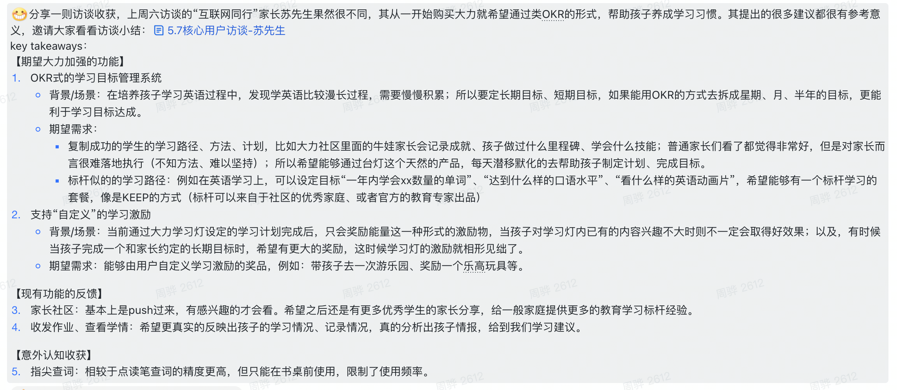

今天跟大家聊聊我的产品观，有许多观点来自其他人的输入，比如《俞军产品方法论》、louis 的产品效用论、黎婷的十倍体验差理论、张前川的一些分享等等。我们通过几个问题来开展我们的话题：

1. 不懂用户，能做产品经理吗？
2. 我们交付给用户的是什么？
3. 产品的本质是什么？
4. 如何理性地做感性的事？

## 不懂用户，能做产品经理吗？

当然不能，所有人应该都会告诉我，产品经理必须要懂用户，不然需求从哪儿来，产品给谁用？！

### AB 实验真香

可是，在一块业务里，所有的产品经理的职责和关注点并不相同，真的有很多产品经理需要端对端（从用户需求到功能交付）的负责产品吗？或者更多的日常工作是对重点模块做日常迭代。日常迭代的好坏是可以依靠数据来衡量的。用户喜欢什么样的产品，我需要去一个个问用户吗？不不不，设计一个 ab 实验就可以了。

AB 测试这种经典科学工具的普及，使产品工作在一定范围和程度上被科学化、标准化了。虽然产品工作不是都适用于 AB 测试，但我们知道，容易衡量的东西都会更高速地发展，直到被过度使用。

标准化能降低门槛，AB 测试也进一步降低了产品经理的入行门槛，不但降低了对产品经理所拥有的经验和技术的要求，甚至降低了对其理解用户能力的要求，只会熟练运用 AB 测试就可以在某些产品工作上做出合格绩效。AB 测试还给了某些产品心弱的产品经理偷懒、少思考的理由，减少了他们在深度思考方面的锻炼和成长。

但其实，快速迭代和 AB 测试都只是降低了产品经理的门槛，产品经理的上限却没降。产品经理的上限——其实非常幸运地——不但没降，还普遍提高了，原因就是用户量大。

当一项服务经常有上千万、上亿用户时，体验每改进一点，其价值就增加千万倍，但如果一个软件只有一万人使用，花同样的成本去提升用户体验，获得的收益就非常有限。在互联网世界，用户量越大，越能放大产品价值和产品经理的作用，你说产品经理能不懂用户吗。

### 用户很难懂

但想搞懂用户，就没那么容易了。我想从宏观和微观层面来聊这个事。

先讲宏观层面，我们有讨论过台灯出海的尝试，然后做了一些尝试，我们发现对于小学生书桌学习场景这件事，不同文化背景会产生很大的差异。比如在日本，可能几乎没有书桌场景，因为小朋友一般在餐桌写作业，不需要台灯，也没有辅导需求，日本有非常多的全职妈妈，她们会负责小朋友的作业辅导工作。像这样的认知，我们还是需要深入了解用户的文化、生活方式、习惯等才能获取。再举一个例子，在台灯售卖之前，我们做了一些价格测试，发现与我们直觉相反的是，像贵州等地的小城市、乡村的家长会倾向于花更多的钱购买台灯。为什么会这样？我们发现这些地方很多家长都在外的打工，孩子留守在家，他们心中其实会对孩子有愧疚，像台灯这样的产品，虽然多花了钱，但如果能对孩子有所补偿，他们会非常乐意购买的。而且台灯的音视频通话功能对于他们来说，需求非常强烈。所以台灯可以成为一种情感表达的工具，这是我们不接触这些用户而无法想象的。

再说微观层面，有些宏观的认知是对的，但在微观层面，不同的用户之间也可能展现出非常大的差异。举一个最近的例子，知识小英雄的微信小程序版本。我们的一个宏观认知是现在很多小朋友每天可以使用手机、有自己的微信号、微信好友里有很多自己的朋友和同学。但实际我们发现从台灯到微信的转化非常不理想。为什么？小朋友是能使用手机，但是在父母的强烈监管下使用的，使用时间和时长都具有不确定性，而我们的活动是定时开始，固定 30 分钟时长，这对于小朋友来说，太难实现了。我们遇到更多的情况是小朋友刚用手机报名，我们马上联系他，这时已经是家长在回复消息了。再讲一个例子，我们都知道中国的家长很重视小朋友的教育，也重视小朋友的视力，那么家长就会关注台灯的质量吗？不一定，他们首先关注的书桌和椅子。我们可以思考一下，在线下售卖场景，单独卖台灯与在卖人体工学学习桌椅的同时搭售台灯，这两种情况的转化率会有什么区别呢？

用户的情况也不是一成不变的，每一年很多宏观的数据都在变化。我常说的一种认知偏误是刻舟求剑，比如上面谈到的小朋友使用微信的问题，我们从中应该得到什么结论？如果我们的结论是，小朋友使用手机的场景非常受限，很难展现我们的产品价值，我们应该专注台灯场景和家长手机场景，忽略学生手机场景。这个结论对吗？我认为是对的，但用户也是在变的，手机必然进一步成为小朋友的学习工具，小朋友使用手机的时长必然越来越长。因此，如果我们以现在情况做出一个决策来面向未来的竞争，这不也是一种新时代的刻舟求剑吗？

### 用户的特点

俞军将给用户归纳出了几个属性：

- 异质性：用户的特点千差万别，几乎很难找到两个完全一样的用户。这代表着我们很难对用户进行统一的画像。
- 情境性：没有情境就没有用户，用户在不同的情境里可能有不同的反应和行为。有可能我们在一些产品思路里见过 user scenario 的设定，只有定义清楚情境，我们才能分析需求是否真实存在，有多大的价值。
- 可塑性：用户的偏好和认知会随着外界信息的刺激而产生变化，换言之，用户是在不断被教育的。比如拍短视频，越来越的人会用短视频来记录生活；再比如社区团购、裂变等等，越来越多的用户会参与到其中了。
- 自利性：用户总是会追求自身的利益最大化。
- 有限理性：用户也许希望自己是理性的，但由于自己的能力有限，其判断经常出错，也经常被骗，只能做到有限理性。

### 用户的反馈我一字不落，用户的建议我一句不听

这是俞军曾说过的一句话，最近看到了（[2017 年 1 月 5 日俞军的一堂产品课 - 知乎](https://zhuanlan.zhihu.com/p/24756932)），不好评判是不是绝对正确，但背后的用意还是值得我们思考的。我写过几篇博客要阐述我对于用户反馈的理解。

我们看一个例子：

最近看到一个用户访谈，很明显，这位用户是一个爱思考的人，提出了很多有意思的想法。面对这些想法，我们应该怎么办？我提两个思考问题的角度。第一，未经验证的产品构想叫做猜想，从猜想到可落地的产品实施方案中间有一个叫验证的过程。对于一个人来说是正确的事情，对于大多数人而言未必依然正确，更何况，即便是对这一个人来说，正确与否也是未经验证的。第二，专业与专业之间差别非常大，我们想让孩子学习好，那么应该采用的是科学的教育方法。互联网的管理方法也许有用，也许没用，但这不是我们说了算，而是应该由专业的人来评估。是不是突然之间，我们获得一份优质的用户建议的兴奋感就消退了不少？

关于用户反馈我有一些更深入的思考，对用户和反馈内容进行分级考量，因为是个人观点，我不在这个文档里展开，有兴趣可以去我的博客阅读。

## 我们交给用户的是什么？

先考虑以下问题：

- 用户体验好的产品一定是好产品吗？
- 产品有价值，用户就一定会用吗？

很明显，从我们日常生活中的体验而言，这两个答案都是否定的。

### 产品效用不等于产品功能

体验也好，功能也好，是我们交付给用户的产品价值，然而它们不是用户感受到的价值，用户真正感受到的是什么呢？我们用一个词描述，叫效用。比方说我买了一双耐克的鞋，鞋的功能都是保护脚的，所以这双鞋带给我的仅仅是这个功能吗？如果是这样，为什么我不买一双便宜的鞋呢？有可能我更喜欢耐克这个品牌，有可能耐克的这双鞋更舒适，有可能耐克的这双鞋非常好看，有可能以上的原因都有。总之鞋这种产品带给用户的不完全是产品功能本身，更是由此产生的种种感受，这些感受才是真正的用户价值，这种感受就是效用。而且很明显，效用是复合的、主观的、因人而异的。当我们说一个产品的用户价值时，其实是用户的各种效用的组合，产品经理在设计产品时，本质上是在挑选效用组合。

效用本身也是多维度的：

- 经济效用：省钱、省时间……
- 物质效用：温饱、欲望、健康、享受……
- 心理效用：娱乐、安全、尊重、友谊、爱情、自我实现……
- 认知效用：真相、信念、共鸣……

关注具体的效用往往比关注用户更有意义。比如一个人到底是拼多多还是京东的用户呢？如果他仅仅是想用低价买点东西，那平时可以用用拼多多，但有时候对一样东西需求很紧急，他可能就用京东下单了，价格就不是首要因素了，物流速度才是。对于拼多多和京东来说，这个人都是他们的用户，但这有意义吗？只有从效用的角度，才可能进一步优化产品。

### 关注收益，更关注成本

为什么我的产品能解决用户的问题，却没人用呢？为什么我的产品能节省用户的时间，却没人用呢？那我感觉可能的原因是：能解决问题，但这个问题并不严重；能节省时间，但想学会太费时间了……

我引用一下黎婷分享中的一段内容。

**问题：下面哪一个产品的用户增速会更快？为什么？**

|          | 产品 A                                                                                                       | 产品 B                                                                         | 产品 C                                                          |
| -------- | ------------------------------------------------------------------------------------------------------------ | ------------------------------------------------------------------------------ | --------------------------------------------------------------- |
| 目标用户 | 公立学校老师                                                                                                 | 公立学校老师                                                                   | 公立学校老师                                                    |
| 价值主张 | 帮助老师们快速且便捷的完成找题、组卷、测评、知识点分析、阅卷等工作，甚至可以针对不同水平的孩子布置不同的作业 | 全国名师工作室的现成 PPT，从此不用自己上网攒题，甚至可以在线组装不同名师的 PPT | 帮助老师布置在线英语听说作业，自动判分，并回收作业结果          |
| 背景     | 老师们每天需要批改 100 多张试卷，尤其是英语题全部是选择题，是非常机械的工作                                  | 每个老师都需要备课，而且要花很多时间找音频、图片等素材，制作 PPT               | 英语听说是中考必考科目，老师们会要求孩子们每天回家朗读/背诵课文 |

大家先自己想一下，看看你们的答案与我的是不是一样。

- 解析

  C 产品就是一起作业，是表现最好的。在没有这个产品之前，老师布置了比较英文课文朗读、背诵的作业后，其实是没有办法检查的，只能让家长检查。而有了这个产品，老师可以很方便地检查这类作业。对于学生而言，这个产品提供的功能相当于一个高级的复读机，不仅能复读，还能纠音，让自己和老师都能更好地了解口语水平。这些体验都是从无到有的，是不可替代的。

  而产品 A 和产品 B 呢，本质上是效率的提升，批改试卷、制作课件这些事情老师日常已经在做了，现在这些产品提供的方案只是换了一种更高效的方法。但这个高效是有前提的，需要老师用电脑操作，有一些学习成本，也不一定能覆盖所有的场景。那么在这个前提下，让老师从他们熟悉的工作方式中切换到新的工作方式时成本就很高，产品的推广就会不理想。

从这个示例中，我们要注意用户使用产品时的成本。对于新产品，或者产品新功能而言，能否真正给用户带来价值，一定要使用前后用户体验差要大于用户付出的成本，我们可以用以下公式要说明：

$$ \text{产品价值}=(\text{新体验}-\text{旧体验})-\text{迁移成本} $$

前面我们说到产品设计的本质是挑选效用组合，那么如何挑选呢？这个公式就是挑选的依据。

当然，不光是产品设计层面，对我们进行技术改进也有参考意义，从开发者的角度，每种技术方案就是产品，我们推进技术方案时要衡量用与不用，对于开发者来说有多大体验提升，同时又带来多大迁移的成本。如果收益不够，或者成本过高，那么这样的技术方案就会很难推。我们身边的例子也有很多，不妨思考一下比如 tunnel 2.0 和 codehub 这两个东西的推动过程。

## 产品的本质是什么？

通过上面的内容，我们已经很清楚了，产品是一种传递价值或者效用的媒介。所以只有发生了价值传递，作为媒介的产品才有意义，而这个价值传递就是交易。

### 一切都是为了促成交易

更进一步地，我们可以说『产品即交易』。这里的交易不一定是一手交线一手交货的那种交易，像我们的卖课、卖灯那样；而是可以更广义的，只要发生了价值交换（用户发生主观行为），就可以认为是交易。比如说刷抖音，虽然用户（大多数时候）没有付出金钱，但他们付出了时间成本，也同时收获了娱乐的心理诉求，这就完成了一次交易。只要用户觉得同样付出半个小时，他们获得的娱乐效用超过了做其他事情 ，那么他们就会愿意使用抖音。等等，假如这个人不知道抖音这个产品呢？并不是效用大于收益，交易就一定会发生，我们还要考虑交易成本。这个例子里，抖音如何触达使用者的问题就属于交易成本。例如台灯上所有的功能都想进首页或者右一屏、在电视上做广告、台灯找渠道商分销等等，这些动作都是为了更好地触达用户，降低交易成本。还有像台灯的先试后买、赠品、618 促销等等，通过一些方式降低用户进行交易的决策负担，这也是在降低交易成本。为了跟交易成本区分开，我们不妨把用户实际付出的金钱、时间、体力、风险，包括放弃的机会成本等统一称为直接成本。于是我们就有了这个公式：

$$\text{相对价格}=\frac{\text{直接成本}+\text{交易成本}}{\text{效用组合}}$$

这其实就是供需定律，当相对价格下降时，需求就会上升，而相对价格下降则要求更高的效用组合和更低的直接成本、交易成本。我们其实一直需要动态地关注各个变量的变化，这个公式可以成为我们做决策和做分析的工具。如何理解动态性呢？我感觉海底捞的例子可以一定程度地说明这个问题。其实餐饮业的营利能力模型可以简单理解成桌数×每桌平均利润×翻台率，海底捞的策略是保持相对低价，提升翻台率，所以它提供了很好的服务，让排队的体验变得很好，从而保证了客户量和翻台率。但时代变了，以前人们排队无事可干，海底捞的服务好，所以选择过来，现在人人都有手机，排队体验的差异化不重要了，那么这种策略的底层逻辑可能就会受到挑战。这种变化可以认为是排队这种事的机会成本下降了，相应地相对价格渐渐变低了。

我们提到了几次『机会成本』，还是对这个名词做个解释吧。在经济学中，『成本』就是『机会成本』，代表的不是我们为了做一件事付出了什么，而是指我们为了做一件事放弃了什么。比如刷半个小时的抖音它的成本是没办法利用这半个小时做学习、休息、聊天、运动、看电影等等其他事情。回到我们做大力家教的时候，当我们选择做大力家教时，成本不是投入了多少人力物力，而是这些人力物力投入到大力问问或者其他项目中，带来的收益；当我们选择做自营时，我们的成本不是建设自营的销售和老师支出，而是放弃 toB 场景可能带来的效益和前景；当我们选择做派单模式时，成本不是建设订单匹配系统，而是班级模式好的用户体验。讨论成本时一定是面向未来的。

聚集到宏观的产品层面，用户先择 A 产品与选择 B 产品必然代表了两种机会成本，中间的差值就是我们熟悉的品牌效应、身份认同、饭圈文化等等。如果你家小朋友同班同学都买了大力智能作业灯，就你们家没买，那么做出不买这个选择时，机会成本是非常巨大的，小朋友不能与同学们在灯上互动，你也会被当成不关心孩子的家长。

##### ❓ 思考

为什么沉默成本不是成本？

## 如何理性地做感性的事？

曾经在一次研发团队内部的会议上，我们讨论如何在业务频繁变动的情况下，提升产研之间的信任和效率，我听到比较多的一种声音是，产品工作是一项感性的工作，有大量需要预测和决策的内容，与研发同学面对的相对理性的工作性质差别非常大，我们应该更多地站在产品经理的角度去看待业务的变更。

OK，也许这个说法是对的。但我想探索的是，我们有没有办法将感性的部分尽量转化成理性的内容。那么，也许就能为设计产品、迭代产品带来更多的确定性和可预测性。

### 该想的事，与不该想的事

我们看两组词，所谓『负能量』不是指负面的情绪表达，而是你只要听到这个词，你就已经受到了损失；而『正能量』也不是积极阳光的情绪表达，而是只要你想到这个词，你已经获到了好处。为什么会有这样的效果呢？我们想一下它们有什么区别。

首先，第一个区别，上面一组词你想到它的时候，你的脑海里出现的是一个句号，即『就是这样的，所以不用再想了』的感觉。比如，xx 公司没有做教育产品的**基因**，一定做不好教育产品。所以我不用再想了，想了也没有用，这些词是让人停止思考的词。

而下面一组词则不一样，它让你产生一个问号，比如：

**ROI**：你天然就会想成本是多少，收益是多少，怎么计算？

**LTV**：如何预测用户的 LT，以及 Arpu？

**最优解**：现在的方案是最优解了吗？有没有更好的解法？

第二个区别是那些负能量的词其实你是没办法讲清楚它的，是半知半解的。你不知道它的确切定义是什么，也不知道它的使用场景是什么。可一旦你弄清楚了它的确切定义是什么，在什么场景下适用，在什么场景下不适用，那么它也可能可以转变成一个正能量的词。比如**大力出奇迹**，双比如**裂变**。

……

### 扩充工具箱

我们常常倾向于用我们会的方式去解决所有的问题。比如 ab 测试，所有的场景都适用 ab 测试吗？比如动力系统，所有的功能都需要设计激励功能吗？比如裂变，有拉新需求就要上裂变吗？如果我们总用一种方法去解决所有的问题，那我们不如什么也不会。我们唯一应该做的是不断地学习更多的工具，充实自己的工具箱。当遇到问题的时候，我们翻看自己的工具箱，有没有什么工具，或者工具的组合可以来解决这个问题。如果都解决不了，那我们要再想想，是这弃这个问题，还是继续学习……

『为什么懂得了那么多道理，可还是过不好这一生？』其实问题答案是你懂得的道理还不够多，还不足以应对生活中所有的不确定，或者你压根就用错了道理。

关于这部分的讨论可以看我另外一篇博客《[优势也是限制](/journal2022-05-13/)》。

### 判断力也是可衡量可提升的

什么是判断力，就是一个人做正确的重要判断的能力。能做出正确的判断，但可能并不加分，因为可能基于常识，所有的人都会得出这样的判断；还有一类是随机的情况，并不能理性判断，只能靠猜，猜对了，也与判断力没什么关系，比如猜硬币正反。但反过来，如果做出了错误的判断，那可能不是不加分，而是扣分。因为很多判断一旦做出，就无法撤销（想想上面讲到的机会成本），或者可能引起严重的后果。基于判断正确性、重要性、非共识度等方面，我们可以对每一次判断做一个衡量：

$$ \text{判断分}=\text{正确性} (-1/1)\cdot \text{重要性} (0\sim3)\cdot \text{非共识度} (0\sim3) $$

我们可以经常来对自己的判断做评估，比如在每次 ab 测试之前 ，我们不妨先自己做个判断，等到测试结果出来了，再给自己打个分，久而久之，我们就会越来越对自己的判断力有所了解，知道自己的哪方面的判断更准确。

判断力的提升依赖于认知的提升，而认知的提升与获得遵循着『观察现象→发现规律→解释原理』的过程。比如对互联网产品而言，我们需要观察用户，观察产品。通过发现用户与用户间相同行为和不同行为的规律，发现产品与产品间相同的趋势和不同的方向的规律，进一步获得新的视角和认知：

- 来自用户的观察
  |  | 横向观察： 不同分类的用户 | 纵向观察： 不同年龄的用户 |
  |---|:---|:---|
  | 相同点 | 普适性需求：<ul><li>横向扩张的机会</li></ul> | 不变性需求：<ul><li>长期战略的落脚点</li></ul> |
  | 不同点 | 差异化需求：<ul><li>泛化</li><li>创新切入点</li></ul> | 改变的需求：<ul><li>变革信号</li></ul> |

- 来自产品的观察
  |  | 横向观察： 行业市场| 纵向观察： 产品发展过程|
  |---|:---|:---|
  | 相同点 | 普适性需求：<ul><li>可借鉴的机制</li></ul> | 不变性需求：<ul><li>产品原则</li></ul> |
  | 不同点 | 差异化需求：<ul><li>壁垒与护城河</li><li>产品特性</li></ul> | 迭代历程：<ul><li>产品演进方向</li></ul> |

### 小心认知偏误

影响我们判断准确性的一个很大的因素，是有很多的认知偏误让我们犯错，我们必须要正视它们的存在。在前文我们已经提到过一个『刻舟求剑』的认知偏误，这个认知偏误是指拿现状为未来做决策，而忽略了发展趋势。[https://bytedance.feishu.cn/wiki/wikcnQKddfzm0T9JoztZqvFTwOb](https://bytedance.feishu.cn/wiki/wikcnQKddfzm0T9JoztZqvFTwOb) 这篇文章非常精彩，十分推荐。

有些认知偏误你可能还没有认识到，下意识地就会犯错，有些可能你已经意识到了，会在思考问题时刻意避免。但我们没有办法完全规避这个问题，只能尽可能地多了解一些思维误区，尽可能地增强自己的逻辑性。[https://pmthinking.notion.site/de837c5a48ba416384e02532fde77693](https://pmthinking.notion.site/de837c5a48ba416384e02532fde77693) 这里列举了很多认知偏差，我们不妨也列一个自己可能受影响的认知偏差清单。

