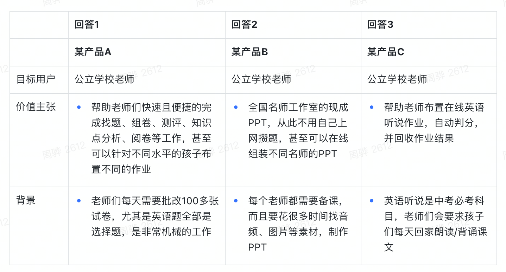

在研发团队里，我们常常碰到技术改进推不动的情况，比如组件规范、代码规范，比如单元测试，比如新的工具链等等。这些东西明明有用啊，为什么有的人就那么被动呢？

有可能问题其实是出在这些技术改进上，从宏观上说，我们必须不断地改进方法，紧跟时代，不断精进我们的研发效率和研发质量，所以不断推进技术改进，引入新的方法和工具，永远都是对的。

然而从微观上，情况并非如此，对于具体的一项技术改进，它有没有用？有用，必然能解决或减轻某个特定的问题。然而这个问题对于每个人来说，痛不痛，有多痛，体会是不一样的。而一项新的技术改进带来的学习成本、迁移成本、培养新的行为习惯的成本、出了问题修复 oncall 的成本却是实实在在地存在的。产品方法论中有一个公式：`用户价值=产品新体验-产品旧体验-成本`，套用一下，我们改成：`研发感受的价值=技改后的效用-技改前的效用-综合成本`，这里的效用包含了开发体验+开发效率+开发质量。而我们觉得一项技术改进有意义，很可能只是看到了它在某一方面的好处，即只看到了技改后的效用，而忽略了技改前后体验差有多大，是否能 cover 综合成本。甚至，我们连技改后的效用也是模糊不清的，因为一个东西的价值体现是各种效用的组合。比如我们推了一种新的 css 实现方式，可以带来最终性能的提升，但同时会带来开发调试的难度提升，降低开发效率，那么技改后真的会带来很大的收益吗？

那技改要怎么做，效用要怎么衡量呢？

第一，我们追求效用最大化，最好能有 10 倍的体验差。这是几天前听了黎婷的教育产品分享后我的收获，她分享了一个例子：

对于产品 B 做的事情，太像我们日常技改要做的事情了。为什么产品 B 不成功，大家可以好好想想。

所以技改关注的应该是如果大家不采用新方法，那么问题就无法解决的场景；或者相比较于旧方案，新方法是能让人不由自主地 wow 出来的场景。在这些场景下，哪怕各个研发需要付出额外的成本，应该也是愿意去接受的。

我们面对的问题有很多，有的问题严重，有的问题不那么严重。我们也面对着各种各样的方法去解决各种各样的问题，有的方法效用大，有的方法效用小，有的方法会在解决一个问题的同时，加重或引入其他问题。我们必须常常检查一下，我们现在解决的问题，到底关键不关键，我们引入的问题，到底严重不严重。

第二，我们追求成本最小化。我们在做技改的时候，都是优先考虑收益，考虑功能，但忽略学习成本、迁移成本，甚至后续的维护成本。所以我们一定要提示评估后续的接入成本（站在开发者角度）和维护成本。怎么降低成本呢？

- 能否减少概念，减小改动边界，让开发者的认知负担最轻。
- 能否提供迁移工具，降低迁移成本。
- 能否提供完善易读的文档，让开发者了解收益和接入方法，降低学习成本。
- 能否保障完善的测试和完整的功能集合，让开发者建立信任。

如果最后发现成本还是很高，收益也没有从 0 到 1，或从 1 到 10 的提升，那可能最好从一开始就不要开始进行这项技改。

总结一下，技术改进的起初，我们就要关注开发者的前后体验差和综合成本。如果前后体验差高于综合成本很多，那么这样的技术改进应该不会难推。如果我们想了很多办法，还是没办法让综合成本小于体验提升，那么这样的技术改进应该是没有必要进行的。
