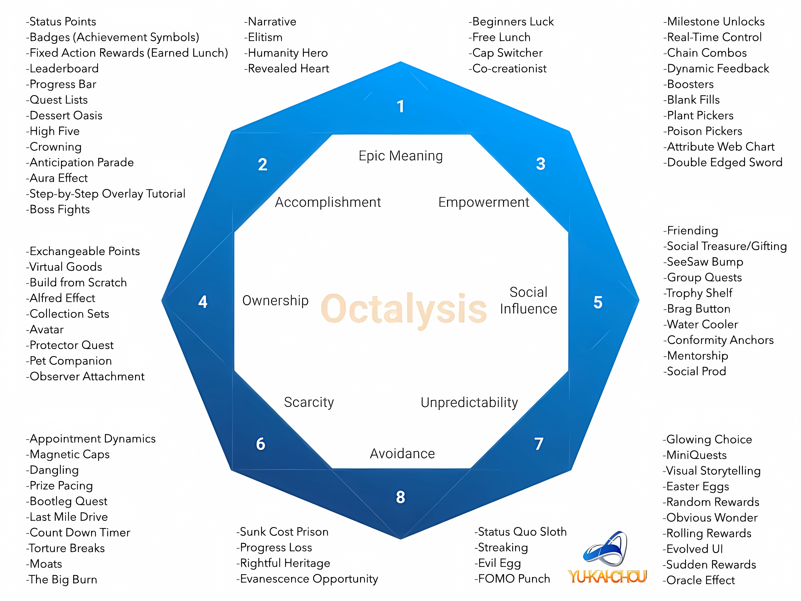
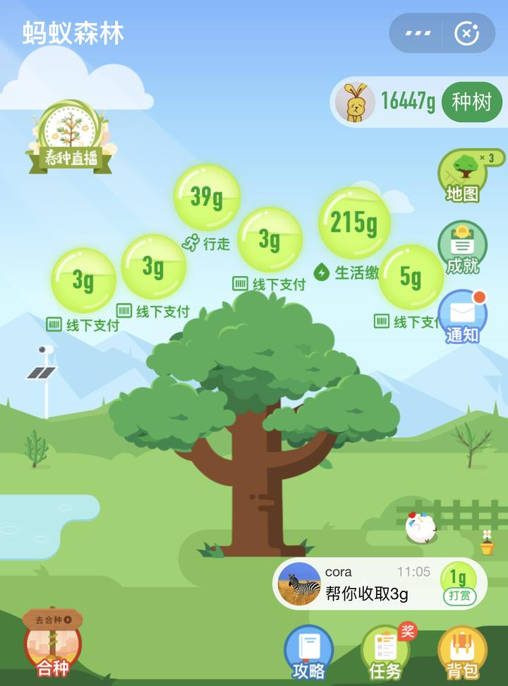
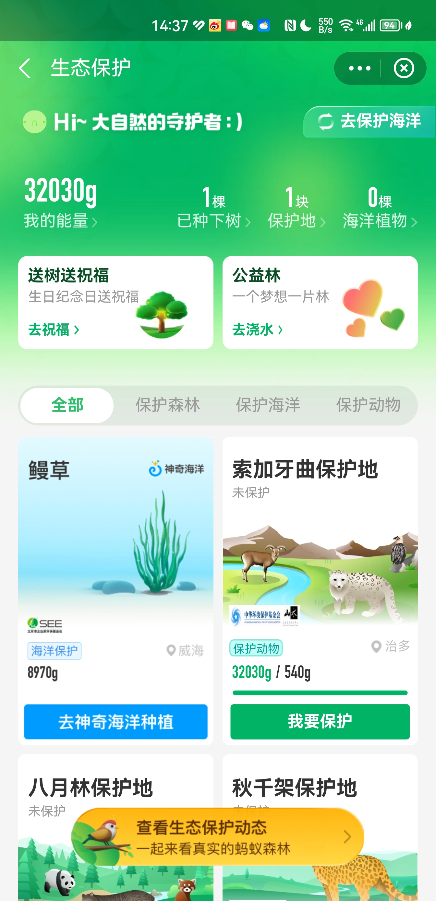
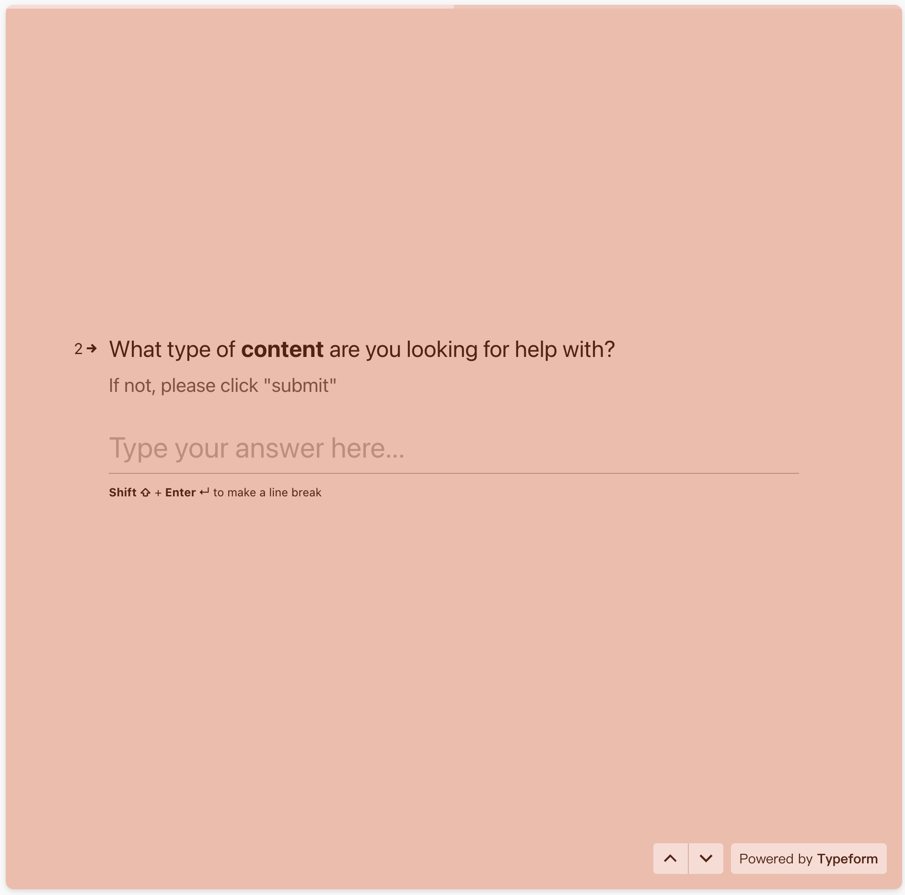
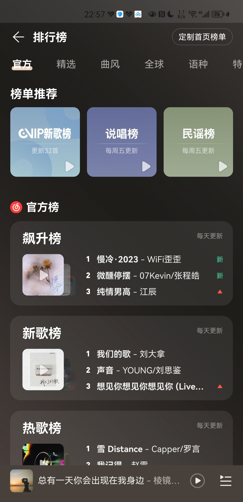
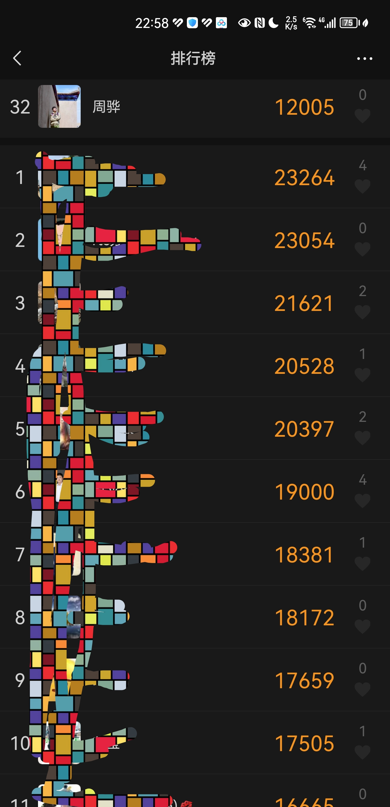
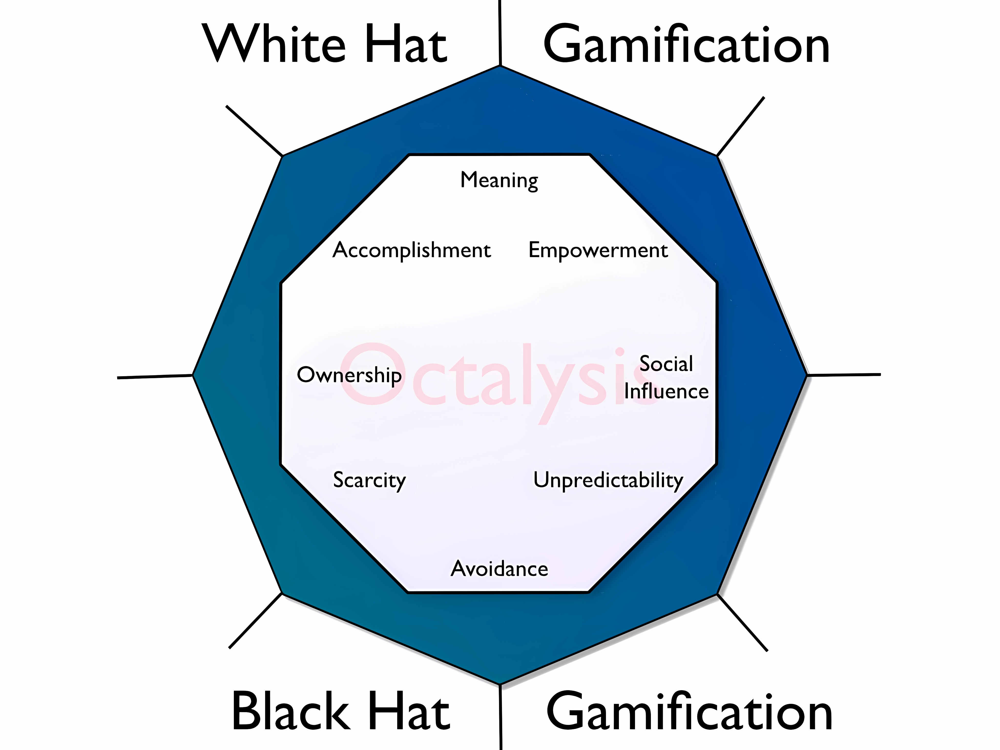

## What is Gamification

Gamification refers to the methodology of extracting engaging and fascinating elements from games and applying them to real-world or product design contexts.

##### 📖Traditional Product Design

- Centered on functionality
- Focuses on user scenarios, emphasizes efficiency

##### 💥Gamified Product Design

- Centers on human behavior
- Focuses on motivation and designs accordingly

> Which miner experience do you prefer?

Games are designed to please players. As such, after decades of development, the gaming industry has become the most adept at adopting a "human-centric" design philosophy, focusing on human behavioral motives, psychological feelings, and engagement levels.

To engage in gamified product design, we must first understand why games are appealing and then explore how to apply these attractive qualities to real-world scenarios.

### Behavioral Model

$$
B=M\cdot A\cdot T \\
B:behavior\quad M:motivation\quad A:ability\quad T:triggers
$$

This is the behavioral model proposed by BJ Fogg, indicating that human behavior is determined by three elements: motivation, ability, and triggers. Only when all three are present, will a behavior occur. Ability is self-explanatory, meaning a person must be capable of performing a certain action. Motivation is the strong desire to do something, an internal force. When discussing gamified product design, we are designing for users' behavioral motivations, hoping that users will spontaneously carry out the actions we anticipate. If there is motivation and ability, then under certain triggering signals, people may carry out specific behaviors, such as suddenly wanting to eat at KFC, being able to afford it, and maybe on a Crazy Thursday noon, being driven to actually go to KFC.

---

## Octalysis

Originally in the education sector, we aimed to increase children's interest in learning and the penetration and activity of various functions by establishing a department dedicated to applying gamification techniques. This included introducing game elements into products or redesigning existing functionalities. It was then that I was introduced to the concept of Octalysis.

Octalysis is a theoretical framework for gamification product design created by [Yu-kai Chou](https://yukaichou.com/gamification-examples/octalysis-complete-gamification-framework/). Many of the concepts and viewpoints in this article are organized from Yu-kai Chou's articles and speeches.

$$
Octagon + Analysis \Rightarrow Octalysis
$$

Returning to the term `Octalysis`, it is a portmanteau word formed from 'Octagon' and 'Analysis'.

Octalysis introduces the concept of "Core Drives" to summarize people's behavioral motivations. As shown in the figure above, eight core drives have been abstracted, forming an octagon shape. Based on these eight core drives, we can further analyze (Analysis) the current state of products, and design gamified experiences.

### Core Drives

#### Epic Meaning & Calling

Virtues, ethics, beliefs, responsibilities, etc., in the face of these themes, an ordinary person 'may seem insignificant. Nothing uplifts the spirit more than feeling part of a grand and glorious cause; this is a sense of mission. Those who are part of it are called by a mission they deeply identify with, and although they might not derive tangible benefits, they indulge in it tirelessly.

This core drive is omnipresent in our lives:

- Maintaining open-source projects
- Participating in charity activities (like Jump Candy)
- Writing Wikipedia entries
- Brand loyalty, buying new releases without hesitation
- Acts of bravery, even sacrificing for one's nation or homeland...

If our products can make users feel they are part of something grand, possibly through our vision or philosophy, thrilling user stories, or vibrant communities, this core drive may be ignited. Users driven by "Epic Meaning & Calling" show increased enthusiasm; they are more likely to promote your product, invest their money and energy without hesitation, sometimes even to an irrational extent.

This drive is applicable throughout a product's lifecycle, but is most often introduced when a user first interacts with the product (discovery & onboarding phase). For instance, ByteDance had the most impact on me in the first few weeks of my joining.

Let's see how we can incorporate this core drive into our products:

- **Storytelling**
  This is the most commonly used method in games. A worldview is created at the beginning of the game - who could refuse to save the world, rescue the princess, defeat the demon king, search for treasure, or help an alligator bathe?
  Outside gaming, in any product design, storytelling is very useful. It can make a dull, uninteresting matter seem different.

- **Humanity's Brilliance**
  Helping strangers and participating in charity is a noble mission for many people.

- **Beginner’s Luck**
  For a person sitting at a Texas Hold'em table for the first time, is it a good hand that makes them want to keep playing, or losing everything? Besides giving players a worldview and a reason for adventure, games also create a feeling of indispensability. In the game, you're not just anyone; you're the chosen one (with superpowers, powerful equipment, etc.). Similarly, in real-life scenarios, concepts like newcomer packages or birthday discounts have been well implemented.

💊 Credibility is key. A meaning too grand with stories too trivial only seem absurd.

#### Development & Accomplishment

People are often driven by a sense of achievement, constantly striving towards a goal.

Kindergarteners care a lot about the number of little stars or red flowers awarded by their teachers, though these are not tangible rewards. Tourists in scenic spots use a "travel passport" to go through attractions, stamping it along the way, which brings a sense of accomplishment. In games, this sense of achievement is designed to be even more comprehensive—points, badges, leaderboards, progress bars, chapters, levels, better equipment, and so on.

In games, players enjoy the process of their character's continuous growth towards victory, which is divided into innumerable phases, milestones, levels, etc., with dense achievement points. Just when beating a tough monster brings excitement, the character also quickly levels up, ready to collect the items needed for the next quest...

##### 🗒️Extreme Contrary Example

1995 - DC - "Desert Bus"

##### 💊The acquisition of a sense of achievement does not solely stem from witnessing progress towards a goal, but more so from the challenges along the process.

Artificial challenges and restrictions are the most interesting aspects of games. Imagine if the rules and restrictions of golf were abolished, making scoring as easy as placing the ball in the hole—would anyone still play it? The excitement does not come from achieving the goal, but from overcoming the challenges to reach that goal, a point worth remembering in product design.

Not only in games, but the core drive of growth and achievement is also among the easiest to design and most commonly applied in product design. Let's expand on some common applications and their issues.

- **Progress Bars**
  Progress bars are widely used, motivating people to complete them.

  

  

The first image is from a survey tool I like, Typeform, where the top of the survey features a progress bar. After completing a mundane survey question, the progress bar updates accordingly, intuitively feeling one step closer to completion. In its early days, LinkedIn increased its user profile completeness by 55% by adding a progress bar prompt on the user information page. Although I cannot trace back to that history, the second image shows that Maimai has introduced a similar design. Progress bars are also extensively applied in membership growth systems, allowing users to visually gauge how far they are from the next level and how they might strive towards it.

- **Badges and Achievement Systems**

  

  

Achievement systems have almost become a standard for Internet products, motivating users to engage with the product through the issuance and upgrading of badges.

How should an achievement system be designed, then? The essence of such a system lies in "achievement," not the "badge" itself. If the designed badges do not represent achievements, they will seem foolish. Going back to the original meaning of badges: they are awarded to soldiers in the army for distinguished service, such as achieving victory in a battle or saving comrades. Soldiers display these badges with immense pride; however, if a soldier received a badge for "the first day of enlistment" or "gathering 5 comrades," they would be ashamed to show it off.

Therefore, badges must symbolize some objectives that users have strived for and achieved, which will breed a sense of accomplishment. Otherwise, it may even feel like an insult. However, be aware that the same objective can feel different to different people. For adult products, making 5 friends might not matter at all, but for children's products, it could mean a lot more.

  

- **Leaderboards**
  The goal of leaderboards is to motivate users to achieve better rankings, but many products have now crafted them with great detail.
  What operational space does a leaderboard have? To answer this, we first need to understand its limitations. When a new user enters an app and finds their points rank them in the 1,000,000th position, are they motivated to improve to the top 100,000? Probably not; such a ranking becomes meaningless to them.

  

  

From screenshotting a few commonly used apps, it's noticeable that abandoning a total leaderboard in favor of breaking it down into mini-leaderboards is trending. Look at how many leaderboards NetEase Cloud Music has, broken down into many dimensions. The same goes for Dazhong Dianping; there's not just a single leaderboard, but many specialized ones for various districts and aspects. If a musician or restaurant wants to improve their ranking, the path to doing so is clear - they need to compete with a limited number of counterparts. Another approach is similar to WeChat Reading and WeChat Sports leaderboards, where users don't need to compare with everyone, just with their friends. Each person sees a different leaderboard, which also accommodates social needs.

#### Empowerment of Creativity & Feedback

The term "playability" is often used when evaluating games. So, where does playability come from? In simple terms, it's the flexibility to play this way or that, akin to comparing checkers with Go. Under the rules and settings of a game, the more a player is given room to explore and create, the more joy and satisfaction the game brings. Games that fulfill this trait tend to have a robust lifespan, enduring through time.

Recall when discussing "Epic Meaning & Calling," it was introduced that this core drive often enters the scene at the moment a user first interacts with a game/product; however, "Empowerment of Creativity & Feedback" differs, emphasizing the "endgame" experience that makes one reluctant to leave or eager to return. Many games lose their charm after a period, but others like building blocks, drawing, poker, basketball, and mahjong continue to stand the test of time.

"Empowerment of Creativity & Feedback" holds a crucial position among the eight core drives, representing long-term positive emotions (to be discussed under white hat core drives), and focusing on intrinsic motivation (as will be mentioned among right-brain core drives). Yet, designing and implementing this drive correctly is among the most challenging tasks.

- **Boosters**
  Many games feature items that can enhance players' abilities or reduce the difficulty of challenges, such as the invincibility star in Mario. These can be seen as boosters, aiding players in achieving victory more easily, though not guaranteed, as player effort is still needed, and the boosting effect is temporary.
  In the DaLi table lamp, we designed a feature offering a unique tracing mechanism, making it easier for kids to draw nice pictures. Essentially, tracing simplifies composition and main line drawing for kids, while the enhancement of details and filling in the drawing still relies on the child's observation and imagination. This product feature makes children more inclined towards drawing. CapCut, relative to TikTok, may have a similar role, simplifying video creation and stimulating users' creative passion.

- **Milestone Unlocks**
  Many games have mechanisms where reaching a certain level unlocks new abilities, like in Plants vs. Zombies, finishing a level might reward a new plant, sparking curiosity about how it works, promoting further play. Similarly, in the context of growth and achievement, when your membership level increases, unlocking new member benefits, wouldn't you want to try them out?

- **(Illusory) Choice**
  Forcing a child to learn an instrument might lead to resistance and lack of cooperation, but offering them a choice upfront — "Which instrument would you prefer to learn?" — tends to have better results, even if they might regret their choice later but wouldn't admit it was wrong. For children, this choice is meaningless as any option meets the parents' expectation: learning an instrument. However, this strategy might not always work in the adult world, as an obviously meaningless choice can feel offensive. Yet often, we might not realize when our choices are being manipulated. A straightforward example is price anchoring; if a single hamburger costs $20, or you can get a deal with the same burger plus fries and a coke for $22, which would you choose? Although the option to order just the burger is given, it's not genuinely expected to be chosen, it's there to highlight the deal's value, steering customers towards making the "better" choice naturally.

#### Ownership & Possession

When you own something, you'll want to improve it, protect it, and acquire more. Based on this psychology, the core drive of Ownership & Possession arises. In games, this is often related to virtual goods, virtual currency, and similar elements. Further, anything you've invested a significant amount of time customizing (like an avatar) or a system that learns and molds to your preferences (like TikTok), generates a sense of ownership. In the workplace, we often refer to the sense of ownership - seeing an abstract task as one's own, hence more willing and proactive in improving it, even at the cost of extra effort and time.

- **Building from Scratch**
  Perhaps only those who've spent dozens of hours assembling a Gundam model truly cherish it. Is IKEA furniture genuinely superior? Maybe people enjoy the sense of belonging that comes from assembling it themselves more.

- **Collection Systems**
  Parallel to achievement systems in games, there's often a collection system (encyclopedia, logs, etc.), which in itself can be considered a collection system. In life, these systems are visible everywhere: furiously consuming Little Raccoon crispy noodles to collect Water Margin cards, buying blind boxes to complete a set, etc. The characteristic of a collection system is that some items are easily obtained, while others are difficult, requiring a lot of time, effort, and even money.

#### Social Influence & Relatedness

This core drive stems from people's universal and unavoidable desire for connection and comparison. Today's products place a heavy emphasis on social relationships, with "sharing", "liking", "inviting friends", and "assisting" features pervading our screens, which we're all familiar with, so I won't delve into them. Some product formats are inherently based on group users or community-building, such as group buying or crowdfunding.

- **Mentorship**
  Likely, when we join a company, a relatively experienced colleague acts as a mentor to introduce us to the company and its business, which can bring many benefits, such as better new hire feelings and the transmission of corporate culture.
  Can the mentor-mentee relationship be applied in product design? Setting aside question-and-answer or sharing communities like Zhihu and Xiaohongshu, there's plenty of application in e-commerce websites:

#### Scarcity & Impatience

Scarcity is an intuitive and irrational core drive, stemming merely because we can't have something or it's hard to get—like things we can't afford, groups we can't join, blind boxes we can't complete, or yet-to-be-released products.

Some temptations are meaningless.

People's brain logic towards behavior has been analyzed as follows:

- Pursuing things that move away from us
- Desiring the unattainable
- Valuing only what is hard to get

Think about it, is a successful price negotiation often walking away, and is successful selling not selling to "someone else"?

- **Creating Scarcity**
  Weibo limits posts to 140 characters, TikTok limits video lengths to several seconds; these restrictions are artificial but haven't hindered user creation. Moments limit content reach and sharing but have defined a social manner. If we wish to increase a particular user behavior, an effective way is to impose limitations on it. In contrast to scarcity is abundance; the more abundant, the more boredom, scarcity creates challenges and motivation. However, likewise, excessive scarcity creates anxiety, steering towards another extreme.
  NetEase Cloud Reading and Weixin Listening Books have similar designs, offering daily free usage time, essentially designing a scarcity of usage time, but I believe such products' active user duration may not necessarily be inferior to completely free products. In a store, you wouldn't think much about no limit on goods purchases, but once it mentions a limit on the number of items, you might consider if it's worth taking advantage of more.

  

  

This is a page I frequently encounter on Weibo, which I find annoying. Not only can each category be swiped left and right, but there are also two to three screens worth of content up and down, seemingly telling me, "I have a lot of information," yet I remain indifferent.

If a person truly cares about a lot of information, then he's probably not truly interested in anything.

Another interesting approach is limiting the user's selection of interest tags to a maximum of 5, but this scarcity doesn't really exist. Perhaps the website researched their users and found 90% chose fewer than 5 tags. Thus, this limitation won't truly impact most people's use but makes users more thoughtful when selecting tags. But what about those who truly need more tags? Maybe those few users are the site's core audience! If we begin thinking in this way, it's likely a membership growth system can gradually be established.

  

  

- **Time Windows**
  After I got a Fresh Hema membership card, I learned the concept of a "Member's Day" for the first time. It's not always beneficial to shop there, but specific discounts are available on a particular day of the week. At first glance, it seems illogical, but in reality, it's ingenious. It creates a scarcity over time, making me constantly think about it and prompting me to consolidate my shopping needs. Similar strategies include shopping festivals like 618 and Double 11.

- **Mandatory Interruptions**
  Contrary to intuitive understanding, many casual mobile games limit playtime for users. For example, playing once consumes 5 energy points, and after 20 points are used up, you must wait two hours to replenish energy to continue playing; or winning a game rewards a chest that takes two hours to open, with a maximum of 4 chests attainable, continuing to play won't yield anymore rewards.
  This design makes sense for various reasons. On one hand, it encourages players to want to enter the game periodically, and on the other hand, since these games' mechanisms are quite simple, playing continuously can lead to boredom and eventual disinterest. Forcibly interrupting the gaming experience helps preserve the most enjoyable memories before boredom sets in, thus extending the game's lifespan.

#### Unpredictability & Curiosity

This is a potent drive, underlying actions like gear farming, lottery purchasing, blind box opening, gambling, and movie watching in games. It is a "black hat" core drive, which, if used alongside other black hat drives like scarcity, can lead to compulsive or addictive behaviors (such as gambling); but when combined with "white hat" drives, its effects can be enhanced.

- **Random Rewards**
  In games, defeating enemies might drop random rewards, potentially different each time. This unpredictability adds fun to the game, even enticing players to repeatedly challenge to get the equipment they want.
  Just like when a child suddenly receives a gift, the greatest joy isn't about what's obtained, but the anticipation before opening it. The blind box economy fully capitalizes on this mindset—I don't want to choose; I want a surprise.

#### Loss Aversion (Loss & Avoidance)

This drive is triggered by the fear of losing something or worry about undesirable outcomes. Many games design death penalties, possibly requiring a restart, or resulting in the loss of coins and experience—outcomes players wish to avoid, hence they take the game more seriously. In real life, we act to avoid losing money, time, energy, etc. Many people are driven to stores by coupons, perhaps not motivated by the discount amount but by the expiration date of the coupon. During e-commerce festivals, some spend a lot of time calculating how to bundle purchases across stores for discounts. They'd rather buy some less useful items or overspend than give up the chance for a discount. Even if they miss this coupon, they might get a similar one next month; even if they miss this discount event, they might still be able to buy what they want at a low price later, but we always feel that if missed, the opportunity is lost forever.

Years ago, a nightmare-like game called "Happy Farm," possibly unheard of by many, was based on planting crops in the game, which would mature after a certain time for harvest. However, if the crops were not harvested in time, friends could "steal" them, leaving the owner with nothing. The disdain for loss is twice as strong as the joy of gain; the happiness from two harvests doesn't compare to the pain of being robbed once. Therefore, many people set multiple alarms at night to remind themselves to harvest crops, and some even set alarms to remind themselves to steal friends' crops.

Alipay's Ant Forest operated similarly in the early days, replacing crops with energy. However, now many other mechanisms have been added to dilute this zero-sum competition, such as being able to collect energy for friends, shifting the drive of loss aversion towards social interactions and ownership.

- **Countdowns**
  Newcomer gift boxes countdown to one day before expiring; product discounts countdown to 48 hours before returning to the original price. We've seen such marketing tactics countless times, yet we fall for them every time.

- **Check-in Systems**
  At first glance, check-in systems might seem influenced by ownership or growth and achievement drives, which I think are correct, but what plays a bigger role is loss aversion. Check-in systems usually follow two patterns: one, rewards are definite; two, the farther along, especially on the last day, the heftier the reward. For users, from the first day of check-in, as long as they don't interrupt, all rewards, especially the last day's, are theirs. Not getting this reward might not be too exciting, but losing a reward in hand triggers a much stronger emotion of loss aversion.

- **Sunk Cost Prison**
  The longer a user invests time in your product, the harder it is to convince them to leave.
  On a smaller scale, if a user writes a post without registering and is prompted to log in upon hitting publish, they've already invested time and are likely to complete registration. If you ask them to register first, they're more likely to refuse because the cost of rejection is much lower.
  Similarly, if someone has invested a significant amount of time in a game/product, even if there are unpleasant aspects, they won't easily migrate to other products.

### Left-Brain and Right-Brain Core Drives

The terms left-brain and right-brain drives mentioned earlier are symbolic rather than literal, used to describe the rational or emotional tendencies of the core drives.

#### Left-Brain Core Drives

Related to logic, ownership, and analytical thinking:

- Development & Accomplishment
- Ownership
- Scarcity

##### ✅Extrinsic Motivation

Originates from goals, purposes, or rewards, while the task itself might not be interesting.

Extrinsic motivation focuses more on outcomes.

#### Right-Brain Core Drives

Related to creativity, sociability, and curiosity:

- Empowerment of Creativity & Feedback
- Social Influence & Relatedness
- Unpredictability

##### ✅Intrinsic Motivation

Derives from enjoying the task, with some activities even warranting a proactive investment of money and time.
Intrinsic motivation focuses more on the process.

Improvements in left-brain core drives can result from introducing external goals, providing short-term incentives; whereas, enhancements in right-brain core drives often have a more lasting motivational effect.

### White Hat and Black Hat Core Drives

#### White Hat Core Drives

Make us feel powerful, satisfied, and in control of our lives:

- Epic Meaning & Calling
- Development & Accomplishment
- Empowerment of Creativity & Feedback

#### Black Hat Core Drives

Make us feel obsessed, anxious, addicted, and out of control:

- Scarcity
- Unpredictability
- Loss Aversion

The benefits of white hat core drives are evident, yet they lack a sense of urgency. Indeed, we aim to save the world, but when exactly? Even after breakfast seems soon enough. On the contrary, black hat core drives create a sense of urgency, compelling us to take action. For this reason, gamified product design sometimes conflicts with data-driven product design, as all black hat core drives might achieve better data performance but leave users feeling empty after using the product, eventually leading them to leave.

Regardless of being black or white hat, these core drives do not inherently differentiate between good and bad; such distinctions depend on the intentions and outcomes of these behaviors. Black hat core drives can also be used to spur beneficial actions, while white hat drives might be employed for malicious purposes, resulting in more severe consequences.

## Topics Not Covered:

- User role segmentation
- Product lifecycle stages
- Analyzing products with the Octalysis Framework
- Designing experiences for different user roles at various stages of the product
