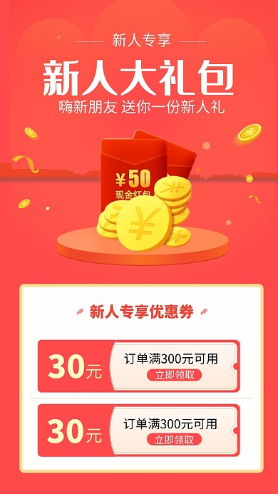
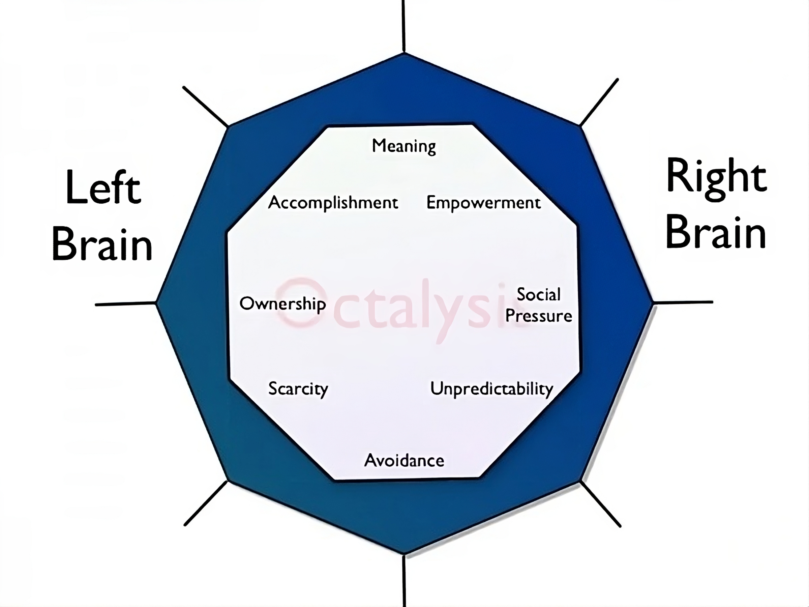

## 什么是游戏化

游戏化是指提取游戏中的那些引人入胜、令人着迷的元素，并应用到现实世界或产品设计的一种方法。

##### 📖传统产品设计

- 以功能为中心
- 关注用户场景，注重效率

##### 💥游戏化产品设计

- 以人的行为为中心
- 关注动机，并进行设计

> 你想体验哪种矿工？

游戏实际上是为了取悦玩家而存在，但也因此，经过几十年的发展，游戏行业是最能掌握“以人为本”的设计理念的行业，比如人的行为动机、心理感受、参与感。

要进行游戏化产品设计就要求我们先能搞清楚为什么游戏能吸引人，进而探索如何把这些吸引人的特质应用在现实场景中。

### 行为模型

$$
B=M\cdot A\cdot T \\
B:behavior\quad M:motivation\quad A:ability\quad T:triggers
$$

这是由福格提出的行为模型，即人的行为是由动机、能力、触发器三个要素组成，只有这三者都具备，行为才会发生。能力很好理解，一个人要做某种行为，前提是自己有能力做。动机是一个人做某件事的强烈意愿，是一种内在动力。我们在讲游戏化产品设计时，就是在对用户行为动机在进行设计，希望用户自发地进行我们期望的产品动作。如果有动机，有能力，那么在某些信号的触发下，人们就可能做出特定的行为，比如我突然想吃 KFC，也买得起，那么也许某个周四的中午，在疯狂星期四的活动驱使下，我就会去吃 KFC。

---

## Octalysis

原先在教育部门，我们想提升小朋友学习的兴趣，提升各个功能的使用渗透和活跃，专门成立一个部门运用游戏化的手段，在产品中引入游戏元素或改造现有功能，也是从那时起，我接触到了 Octalysis 的概念。

Octalysis 是一种游戏化产品设计的理论框架，由 [Yu-kai Chou](https://yukaichou.com/gamification-examples/octalysis-complete-gamification-framework/) 创造。本文的很多概念和观点整理自 Yu-kai chou 的文章和演讲。

$$
Octagon + Analysis \Rightarrow Octalysis
$$

回到 `Octalysis` 这个词，它是一个人造词，由 Octagon 和 Analysis 两个词拼起来的。

Octalysis 引入了“核心驱动力”的概念来归纳人们的行为动机，如上图所示，一共抽象了八种核心驱动力，形成了这样的八边形（Octagon shape）。基于这八种核心驱动力，我们可以进一步分析（Analysis）产品现状、设计游戏化体验。

### 核心驱动力

#### 使命召唤（Epic Meaning & Calling）

美德、道义、信仰、责任等等，一个普通人在这些主题面前，自己反而显得微不足道。没有什么比让人觉得自己参与了一个无比伟大、荣耀的事业中更令人斗志昂扬了，这就是一种使命感。身处其中的人们，被自己深深认同的使命所召唤，也许自己并不能从中获得实质的好处，但却乐此不疲。

这项核心驱动力在我们的生活中随处可见：

- 维护开源项目
- 参与公益活动（跳跳糖）
- 撰写维基百科词条
- 品牌信仰，出新品就买
- 见义勇为，甚至为民族、为家国而牺牲……

如果我们的产品中能够让用户感受到自己成为某个伟大项目的一部分时，可以是我们的愿景或理念、激动人心的用户故事、活跃社群等等，这项核心驱动力可能被激活。被“使命召唤”所驱动的用户会表现出更强的积极性，他们更愿意推广你的产品，更不在意金钱和精力的投入，有时候甚至会达到非理性的程度。

使命召唤这种驱动力当然适用于产品的全部生命周期，但最常在用户刚接触产品时引入（discovery & on-boarding phase）。比如对我而言，字节范在我刚入职前几周的时间里带给了我最多触动。

接下来看看我们如何在产品中引入这种核心驱动力：

- **讲故事**
  这是游戏中最常用的手段，在游戏的一开始就营造一个世界观，谁能拒绝去拯救世界、营救公主、打败魔王、寻找宝藏，或是帮鳄鱼洗澡。
  在游戏之外，在任何产品设计中，会讲故事都是很有用的，可能可以让一件枯燥的、不感兴趣的事情变得不一样。

- **人性光辉**
  帮助陌生人，参与慈善，对于很多人来说是非常崇高的使命。

- **新手运**
  如果一个人第一次坐上德州扑克的牌桌，是一手好牌能让他原意继续玩下去，还是输个精光能让他继续玩下去。游戏中不光会给玩家一个世界观，一个出去冒险的理由，同时也会营造出非你不可的感觉，在游戏中，你不是一个普通人，而是被选中的人（超能力、强大的装备等等）。那么在现实场景中，像新人礼包、生日优惠等等已经被应用得很成熟了。

💊 可信度是关键，意义太大，而故事太小，只会让人觉得荒谬。

#### 成长与成就（Development & Accomplishment）

人们常常会被成就感驱使着，朝着一个目标不断前进。

幼儿园的小朋友很在意自己被老师奖励了几个小星星、小红花，尽管这并不是什么实质的奖品；游客在景区拿着“旅游护照”在各个景点穿梭，敲章打卡。这些都能带来成就感。而在游戏中，成就感就被设计得更全面了——积分、徽章、排行榜、进度条、章节、等级、更好的装备等等。

游戏中，玩家体验到的是通往胜利的过程中，角色在不断成长的乐趣，整个流程分成无数的阶段、里程碑、关卡等等，成就点非常密集。当好不容易打败一个怪物正兴奋时，角色经验值也积攒得很快能再长一级；等升完这一级后，很快也能收集齐任务所需要的道具……

##### 🗒️极端的反面例子

1995 - DC - 《沙漠巴士》

##### 💊成就感的获得不仅仅来源于看到了某个目标的进展，更在于这个过程中的挑战。

人为的挑战和限制是游戏最有趣的地方。设想一下，如果高尔夫球的规则和限制都取消了，只要把球放到小洞里就能得分，那么这个运动还会有人玩吗？让人们感到兴奋的不在于达成目标，而在于克服了因难达成了目标，我们在产品的设计中不妨记住这点。

不光在游戏中，在产品设计中成长与成就这一核心驱动力也是最容易被设计的，也是最常被应用的。我们不妨稍加展开，谈谈一些常见的应用及存在的问题。

- **进度条**
  进度条应用非常广泛，它激励着人们想办法促使看到的进度条完整。

  

  

  

  

  

  

  第一张图是我非常喜欢的一个问卷工具 typeform 做出来的问卷，问卷的最上方是一个进度条，当完成了一道枯燥的问卷问题后，相应地会有进度的更新反馈，让人直观地觉得离完成又近了一步。早年间 linkedin 在用户信息填写页面增加了一个进度条提示，从而让用户信息完整度提升了 55%，我已无法追溯这段历史，不过在第二张图中可以看出，脉脉也引入了类似的设计。进度条的另一广泛应用在于会员的成长体系，通过进度条直观地感受到自己距离下个级别还有多远，可以如何努力。

- **徽章与成就系统**

  

  

  

  成就系统几乎也已成为互联网产品的标配，通过发放徽章、徽章的升级等来激励用户使用产品。

  那如何设计成就系统呢？成就系统的核心在于“成就”而不是“徽章”。如果你设计出来的徽章并不能代表成就，那么这将让人觉得很愚蠢。我们回到徽章的本来意义：徽章是表彰军队里战功卓著的士兵，比如取得了某某战役胜利、营救了战友等等，士兵们向别人展示这些徽章时一定无比荣耀；可如果一个士兵收到的徽章是“当兵的第一天”、“收获 5 个战友”这种，他一定耻于向别人展示。

  所以徽章象征的一定是用户经过了某种努力而达成的一些目标，这才会让人有成就感，否则甚至会被污辱的感觉。不过请注意，同一个目标对于不同的人来说，感受是不同的。对于成年人的产品，也许交 5 个朋友根本不值一提，可如果是小孩子的产品，也许意义大不一样。

  

- **排行榜**
  排行榜的目标是激励用户取得更好的排名，但如今很多产品会把排行榜做得很精细。
  排行榜还有啥运营的空间？要回答这个问题我们先得理解排行榜的局限。当一个新用户进入到一个 app 中时，他的积分排名在第 100 万名，请问他会有动力把自己的排名提升到前 10 万名吗？未必，这个排名对于他已经毫无意义了。

  

  

  

  

  

  我随便截了几个常用 app 的界面，可以发现，抛弃总榜拆分小榜是趋势。你看网易云音乐的排行榜数量非常多，从各种维度拆出小榜。再比如大众点评，哪里还有什么总榜，某某地区某某方面的小榜应有尽有。如果有音乐人或者餐厅想要提升自己的排名，那么提升的路径其实是非常明确的，只需要与有限的对手进行竞争就可以了。另外一种做法类似于微信读书、微信运动的排行榜，用户不需要与所有人对比，只需要与自己的好友对比，每个人看到的排行榜都不一样，同时还能兼顾社交需求。

#### 创意赋能（Empowerment of Creativity & Feedback）

有时候我们评价游戏，会用“可玩性”这个词，那么可玩性从何而来？通俗来说，可以这么玩，也可以那么玩，就是可玩性（比如五子棋与围棋的对比）。在游戏机制和设定之下，越是能让玩家有探索和创造的空间，也越能带来快乐和满足感。满足这个特征的游戏它们的生命力会特别顽强，经久不衰。

还记得在谈及“使命召唤”时，曾介绍说这项核心驱动力常常在用户刚接触游戏/产品时引入；而“创意赋能”则不同，更强调“终局”的感受，让人不愿离开，或想再次体验。很多游戏在玩家玩过一阵子之后就再也不玩了，但像积木、画画、扑克、篮球、麻将，这些游戏和运动却能一直经历时间的考验，依然受欢迎。

“创意赋能”在八个核心驱动力中的位置非常重要，它既是代表长期积极的情绪（下面白帽核心驱动中会谈及），又是强调内在的动力（下面右脑核心驱动中会提及），然而要想正确地设计和实现这个核心驱动力，却是最难的。

- **助推器**
  游戏里有很多道具，可以帮助玩家提升能力，降低挑战的难度，比如马里奥里无敌的星星。这些可以看作是助推器，帮助玩家更容易获得胜利，但并不是绝对，依然需要玩家自己的努力，同时助推的过程是短暂的，很快就会失效了。
  我们在大力台灯中设计了一个功能，提供一种特殊的描红机制，让小朋友更容易画出好看的画。其实描红很简单，只是让小朋友更容易掌握构图，轻松画出主体线条，然后实际细节的完善和画面内容填充还是依靠小朋友的观察力和想象力，但这样的产品能让小朋友更喜欢画画这件事。
  剪映之于抖音可能也有类似的作用，它让抖音视频的创作变得简单，激发用户的创作热情。
- **里程碑解锁**
  很多游戏中都有升到某个等级才能解锁某个技能，比如植物大战僵尸，完成了一关后可能得到了一个全新的植物，还不知道这个植物怎么玩呢，不如再玩一关体验一下吧。于是一关又一关地闯、一级又一级地升。
  在成长与成就中我举过会员等级的例子，当你的会员等级又升了一级，获得了新的会员权益，你确定不要去体验一下？
- **（虚假的）选择权**
  如果想培养小孩学习乐器，直接强迫他学习，很可能会有逆反心理，不会很配合，可如果一开始就给他一个选择：“你最想学什么乐器？”就会好很多，哪怕一段时间之后小孩会后悔，但也不原意承认是自己选择错了。
  对于小孩来说，这个选择是没有意义的，因为不管选什么，都达成了父母的期望：学乐器。但这一招在成人世界并不一定管用，因为如果一个选择明显没有意义，会让人感觉到受冒犯。然而，更多时候，我们并不一定能意识到自己的选择正在被操纵。最直观的例子是价格锚定，比如去快餐店点餐，一个汉堡 20 块，可以一个包含相同汉堡，以及薯条、可乐的套餐只要 22 块，你选哪个。单点的选项虽然给到你了，但并不是真的让你去选它，而是用来衬托出套餐的实惠，让顾客自发地做出“更好的”选择。

#### 所有权（Ownership & Possession）

当你拥有一件东西的时候，你会想改进它、保护它，并获得更多，所有权这种核心驱动力正是基于这种心理而产生的。在游戏中，这通常与虚拟商品、虚拟货币等元素相关。不过更进一步讲，只要是自己花费了很长时间定制的（avatar），或者一个系统一直在了解自己的偏好并塑造成独特的东西（抖音），你都会产生对它的所有权。工作中我们也常说 owner 意识，什么是 owner 意识？就是把一件抽象的事情当成是自己的，从而更原意主动地让它变得更好，哪怕付出更多的精力和时间。

- **从头构建**
  也许只有花费数十小时完成的高达模型拼贴的人才会真的珍视它。宜家家具真的好吗？也许大家更享受自己动手搭建时的那份归属感。
- **收集系统**
  游戏里与成就系统并行的通常还有一个收集系统（图鉴、日志等等），当然，成就系统本身也可以认为是一种收集系统。生活中，我们随处可以看到这种收集系统。像拼命吃小浣熊干脆面来收集水浒卡片、买盲盒集齐全套等等，收集系统的特点是一套东西中，有些比较容易收集到，有些却很难，需要花费很多时间和精力，甚至金钱。

#### 社交影响（Social Influence & Relatedness）

社交影响这项核心驱动力来源于人们普遍的、不可避免的相互联系、相互比较的愿望。现在所有的产品都很注重社交关系，无处不在的“分享”、“点赞”、“邀请好友”、“助力”充斥着手机屏幕，这些大家都很熟悉，我也不展开讲了。还有一些产品形态本身就基于群体用户、社区社群而建立，例如团购、众筹等等。

- **导师制**
  想必大家入职的时候都会有一个相对资深的同事作为 mentor 来带领我们熟悉公司和业务，这其实能带来很多好处，比如新人的感受更好、企业文化的得到传承等等。
  导师的关系也能应用在产品设计中吗？抛开知乎、小红书这类问答或分享的社区不谈，在电商网站中就有很多实践：

#### 稀缺（Scarcity & Impatience）

稀缺这种核心驱动力极其不直观、不理性，仅仅因为我们得不到，或者很难得到某样东西。比如我们买不起的东西、没有资格加入的团体、集不齐的盲盒、还未发布的产品。

有些诱惑毫无意义。

有人这么分析人们大脑的行为逻辑：

- 追逐离我们远去的东西
- 渴望得不到的东西
- 只重视难以获得的东西

想想看成功的砍价是不是转身欲走，成功的销售是不是卖给“别人”。

- **制造稀缺**
  微博限制了用户只能输入 140 个字，抖音限制了几十秒的视频时长，这些限制都是人为的，但似乎并没有阻碍用户的创作。朋友圈限制了内容的触达与传播，但却实实在在地定义了一种社交方式。如果我们想增加用户的某种行为，一种有效的方式是对这个行为加以限制。与稀缺相对应的是富足感，越富足，越无聊，有稀缺才会有挑战，也才会有动力。然而同样，过于稀缺就会制造焦虑，这就走向了另一个极端。
  网易阅读和微信听书，这两个产品有些相似的设计，每天都有免费的使用时长，这其实是就是在设计一种使用时长上的稀缺，但我相信，这种产品的用户活跃时长数据未必会比完全免费的产品差。商场里不限购的商品你不会多想，但一旦标明限购多少件，可能你就要想想这个便宜要不要多占一下。

  

  

  

  这是我打开微博常常看到的一个页面，非常讨厌，不仅每个分类可以左右划，上下竟然有两三屏之多，它似乎在告诉我“我这儿信息很多”，但我却无动于衷。

  一个人真的关心很多信息，那么他一定是什么也不关心的。

  另一种有趣的做法是，一个产品对于用户兴趣标签加以限制，最多选择 5 个，当然这个稀缺也是不存在的，有可能网站调研过自己的用户选择的兴趣标签数量，90% 的人都只选择了小于 5 个标签。那么这个限制对于大多数人并不会真的影响使用，反而让用户在选择标签时更认真。可对于真的需要更多标签的人怎么办呢？也许那少数的用户才是网站更核心的用户！如果我们开始这样思考问题，那很可能产品的会员成长体系就能逐步建立起来了。

  

  

- **时间窗口**
  当我办了一张盒马的会员卡后，我第一次知道有“会员日”这个概念，并不是任何时候去店里都有优惠，而是一周内特定的一天去购物才会有折扣。初看很不科学，但实际很精妙，它在时间上制造了一种稀缺，反而让我总想着它，并促使我把一段时间的购物需求都集中到一起。类似的做法还有 618、双 11 等购物节。
- **强制中断**
  与直观的理解不同，很多休闲类的手机游戏对用户游玩时间加以限制，比如玩一次消耗 5 点能量，20 点能量消耗完了就要等待两个小时补充能量才能继续玩；或者赢一局游戏获得一个宝箱，打开宝箱需要等两个小时，最多只能获得 4 个宝箱，再继续玩就无法获得奖励了。
  这么做其实有一定的道理，一方面是促使玩家每隔一段时间都想进入游戏游玩，另一方面是这些游戏本身机制都比较简单，一直玩很容易产生厌烦，以后再也不玩了，强行把玩家的游玩体验打断，也是为了在厌烦情绪到来之前，把最有趣的记忆保留下来，延长游戏的生命力。

#### 不可预测（Unpredictability & Curiosity）

这是一种极其强大的驱动力，游戏里刷装备、买彩票、抽盲盒、赌博、看电影等等行为背后都有它的影子。本身它是一种黑帽驱动力，如果与其他黑帽驱动力比如稀缺一同使用，可能会产生令人强迫或上瘾的行为（赌博）；但如果与白帽驱动力配合，则能提升它们的效果。

- **随机奖励**
  游戏中打败敌人后会掉落随机的奖励，每次可能都不一样。这种不可预测性给游戏带来了乐趣，甚至促使玩家反复挑战来获得自己想要的装备。
  就像小朋友突然收到一件礼物的时候，最开心的事情不是获得了什么东西，而是打开礼物前的期待。
  盲盒经济充分利用了这个心理——我不想选，我想要惊喜。
- **彩蛋**
  盲盒开出啥大体上都是预期之内的，而彩蛋则不同，它完全是用户预期外的惊喜，比如深夜软件上的温馨提醒、生日时收到的祝福和优惠券、电影里致敬另一部你喜爱作品的片段等等。

#### 损失厌恶（Loss & Avoidance）

这项驱动力是在人们害怕失去一些东西或害怕发生不好的事情时激发。很多游戏都设计了死亡惩罚，可能要从头重来，可能失去金币和经验，这些都是玩家不愿意看到的，于是会更加认真对待游戏。在现实生活中，我们为了避免失去金钱、时间、精力等而行动。很多人被优惠券驱使着去商店购买东西，有可能他不是被优惠金额驱使的，而是被优惠券有效期驱使的。电商购物节中，有人花费很多时间计算跨店满减的凑单，他们宁愿多买一些不那么实用的东西或超支，也不原意放弃优惠的机会。虽然如果错过了这个优惠券，下个月可能还会拿到一张一样的，虽然错过了满减活动，可能以后还是能低价买想要的东西，但我们总觉得错过了，就会永远失去这个机会了。

在若干年前有一个噩梦般的游戏叫《开心农场》，也许好多人没有听说过，它的机制是在游戏中种菜，一定时间后成熟后就可以收获了。但如果主人没有及时收获，好友就可以过来“偷菜”，而主人则颗粒无收。人们厌恶缺失的程度是获得收益的两倍，我收获两次的快乐也不如被人偷了一次菜的痛苦大。于是很多人半夜设置好多闹钟提醒自己收菜，更有甚者定闹钟提醒自己去偷好友的菜。

早期支付宝的蚂蚁森林也是类似的设计，只是把菜换成了能量。不过如今已经增加了很多其他的机制来淡化这种零和竞争的互动，比如你可以帮好友收能量，把损失厌恶的驱动力向社交和所有权转移。

- **倒计时**
  新人礼包倒计时一天，不用就作废；商品优惠，倒计时 48 个小时恢复原价。这样的营销手段我们见过无数次了，但还是次次会上钩。
- **签到系统**
  直观上签到系统应该受所有权或成长与成就这类核心驱动力影响，我觉得都对，但更起到作用的损失厌恶。签到系统一般有两个规律，一是奖励是确定的，二是越往后，尤其是最后一天签到的奖励是最丰厚的。对于用户来说，从签到的第一天开始，只要自己不中断，那么所有的奖励，尤其是最后一天的奖励都是自己的。得到这个奖励也许不会让人有多激动，但到手的奖励没有了，这个损失厌恶的情绪是更强烈的。
- **沉没成本监狱**
  用户投入在你的产品中的时间越长，就越难说服自己离开。
  从小处说，如果用户没有注册时先写了一篇帖子，点发布时提示登录，那他已经投入时间写帖子了，大概率会完成注册。相反如果先让他注册，可能他拒绝的成本就低很多。
  同样一个人如果在一个游戏/产品中投入了大量的时间，即使有体验不好的地方，他也不会轻易迁移到其他产品中。

### 左脑与右脑核心驱动

在前文中已经提及过左脑和右脑驱动，这里的左脑和右脑只是一个文字符号，并不是真正意义上的左脑和右脑，这个文字符号用以说明各个核心驱动理性的或是感性的倾向而已。

#### 左脑核心驱动

与逻辑、所有权、分析思维相关

- 成长与成就
- 所有权
- 稀缺

##### ✅外在动机

源自目标、目的或奖励，而任务本身不一定有趣。
外在动机更关注结果。

#### 右脑核心驱动

与创造力、社会性和好奇心相关

- 创意赋能
- 社交影响
- 不可预测

##### ✅内在动机

源自享受任务，有些事甚至愿意主动花钱花时间去做。
内在动机更关注过程。

左脑核心驱动的提升可以通过外部目标的引入，起到短期激励的作用；而右脑核心驱动的提升则通常能起到长期的激励作用。

### 白帽与黑帽核心驱动

#### 白帽核心驱动

让我们感到强大、满足、充实，能掌握生活

- 史命召唤
- 成长与成就
- 创意赋能

#### 黑帽核心驱动

让我们感到痴迷、焦虑、上瘾，对生活失控

- 稀缺
- 不可预测
- 损失厌恶

白帽核心驱动的好处显而易见，但它有一个问题：缺乏紧迫感。对，我们是要去拯救世界，可以什么时候去呢？吃完早饭再去也还来得及吧。而黑帽核心驱动则相反，它会形成紧迫感，强迫我们采取一些行动。也正是因为如此，游戏化产品设计有时与数据驱动的产品设计会有冲突，因为所有的黑帽核心驱动都可能达成更好的数据表现，但会让用户在使用产品后有空虚感，最终离开产品。

实际上不管黑帽还是白帽核心驱动，它们本身并不存在好与坏的区分，好与坏取决于这些行为的意图和结果。黑帽核心驱动力也可以用来帮助人们激发好的行为，而白帽核心驱动力也可能用于邪恶的目的产生更严重的影响。

## 其他未涉及到的内容：

- 用户角色划分
- 产品阶段的划分
- 用 Octalysis 对产品进行分析
- 设计不同用户角色在不同产品阶段的体验
