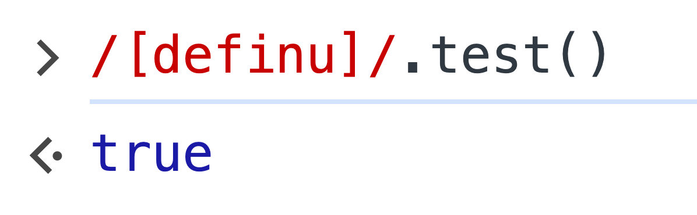

The issue arose from a piece of code that led to unexpected results, similar to:

```javascript
const tokens = sentence.split('');
let index = 0;

while (true) {
  const token = tokens[index];
  if (/[a-z]/i.test(token)) {
    // do something
  } else {
    break;
  }
}
```

In some cases, `index` might exceed the array bounds, causing `token` to become `undefined`. For some reason, under such conditions, the result of `javascript±/[a-z]/i.test(token)` turns out to be true.

I conducted a few simple tests:

<div><div style="max-width: 360px; margin: 0 auto" class="mix-light mix-both">


</div></div>

oing further, I discovered that only the letters d, e, f, i, n, u passed the test:

<div><div style="max-width: 320px; margin: 0 auto" class="mix-light mix-both">



</div></div>

This problem initially puzzled me, making me wonder if I had encountered another hidden JavaScript bug. However, consistent phenomena across several browsers suggested it may not be a bug in the language itself.

Wanting to see exactly what the regex was matching, I attempted to use `javascript±RegExp.exec`:

<div><div style="max-width: 560px; margin: 0 auto" class="mix-light mix-both">


</div></div>

This result finally made it clear what was happening. Essentially, the `test` and `exec` methods always take a string as their first argument. When the first argument is not a string (non-existence equates to `javascript±undefined`), it's forcibly converted into a string, likely via a direct call to `javascript±String()`.

Understanding this, the test results suddenly became obvious, and I made a minor adjustment to my code:

```javascript
const tokens = sentence.split('');
let index = 0;

while (true) {
  const token = tokens[index];
  if (/[a-z]/i.test(token || '')) {
    // do something
  } else {
    break;
  }
}
```
