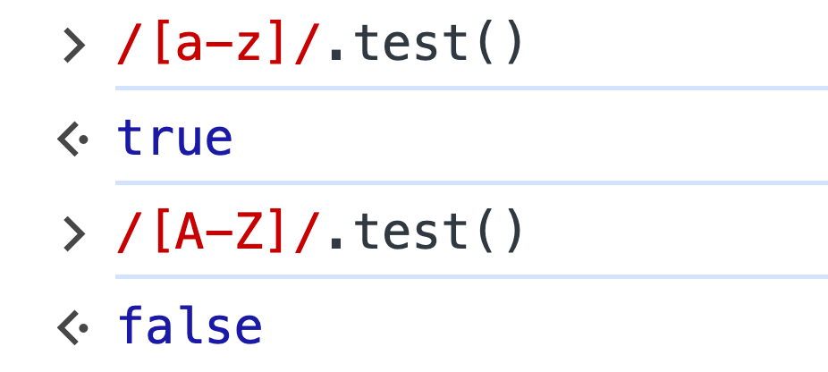
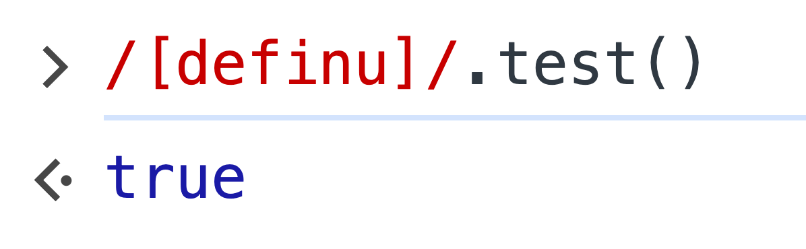
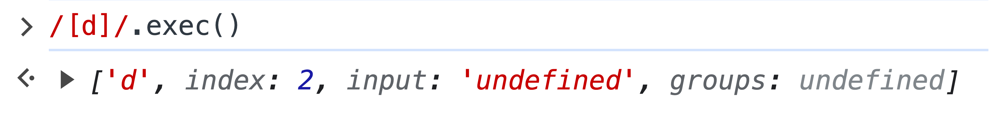

起因是我的一段代码运行后得到了出乎意料的结果，类似于：

```javascript
const tokens = sentence.split('');
let index = 0;

while (true) {
  const token = tokens[index];
  if (/[a-z]/i.test(token)) {
    // do something
  } else {
    break;
  }
}
```

某些情况下，`index` 可能越界，因而 `token` 可能是 `undefined`。可不知为何，在这种情况下，`javascript±/[a-z]/i.test(token)` 的结果竟然是 true。

做几个简单的试验：

<div><div style="max-width: 360px; margin: 0 auto" class="mix-light mix-both">



</div></div>

再进一步实验，我发现只有 d、e、f、i、n、u 几个字母会通过测试：

<div><div style="max-width: 320px; margin: 0 auto" class="mix-light mix-both">



</div></div>

起初这个问题很困扰我，莫非又遇到了什么隐藏的 js 的 bug。可接连测试了几个浏览器，现象都是一致的，说明可能未必是语言的 bug。

我想看看这个正则到底匹配出来了什么结果，于是尝试用 `javascript±RegExp.exec` 来运行：

<div><div style="max-width: 560px; margin: 0 auto" class="mix-light mix-both">



</div></div>

从这个结果上终于看出了发生了什么，其实只是 `test` 和 `exec` 两个方法始终接受一个字符串作为第一个参数，而当第一个参数不是字符串（不存在是等同于 `javascript±undefined`），强制转换为字符串，猜测是直接调用 `javascript±String()`。

想明白这一点，顿时就觉得这个测试结果是显而易见的，同时我也将我的代码做了一点小修改：

```javascript
const tokens = sentence.split('');
let index = 0;

while (true) {
  const token = tokens[index];
  if (/[a-z]/i.test(token || '')) {
    // do something
  } else {
    break;
  }
}
```
