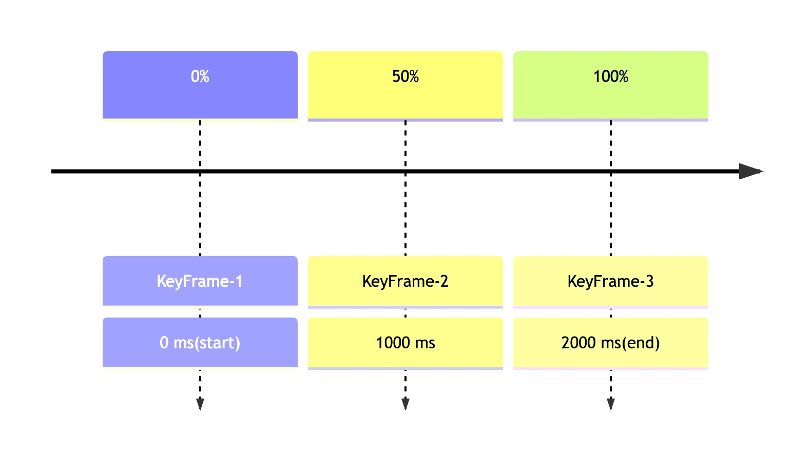
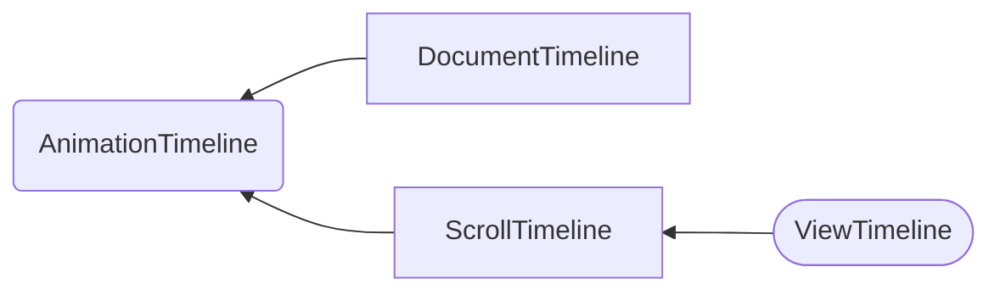

## 什么是 scroll-driven animations

<iframe
  sandbox="allow-scripts allow-same-origin allow-presentation allow-forms allow-popups"
  src="https://scroll-driven-animations.style/demos/cover-flow/css/?embed"
  frameborder="0"
  dragable="false"
  allowfullscreen
  allow="encrypted-media"
  referrerpolicy
  style="border-radius:8px;height:600px;max-width:900px;width:100%;"
></iframe>

先看这个示例，随着横向滚动条的滚动，唱片封面图出现了平滑的翻转、平移等动画效果。先设想一下，如果借助传统的 web 动画技术，我们应该如何实现这个效果。

如果使用传统的 web 动画技术，这个效果实现起来还是非常麻烦的，需要借助 js 对滚动事件进行监听，并不断修改元素样式。虽然很复杂，但我相信很多同学都有一种熟悉感，在我们工作和学习过程中，一定没少写这类与滚动相关的动画效果，这是一种非常常见的 UI 交互效果。

有没有一种能够在滚动条滚动时，直接控制动画效果向前或向后播放的技术呢？这就是今天我们要聊的主题：Scroll-driven animations。

## 先复习一下传统的网页动画

开始新的内容前，我们先简单回顾一下传统的网页动画技术。比如我们要设置一个元素透明度从 0% 到 100% 的动画效果：

### CSS 版本

```css
@keyframes fade-in {
  0% {
    opacity: 0;
  }
  100% {
    opacity: 1;
  }
}

# target {
  animation: 2.5s linear fade-in;
}
```

这是我们非常熟悉的写法，仅通过 css 就完成的了这样的动画效果。我们通过定义起始和结束时的两个关键桢 keyframes 的样式，以及动画持续的时间，那么浏览器就会自动地通过 timing 函数计算出动画过程中每一个时间点的样式。

### JS 版本

通过 css 的方式定义的动画足够简单，但灵活性不足，只能随着时间的流逝播放，不能控制，也不知道何时播放结束。而与 css 对应的，DOM 中也实现了相关的功能。

```javascript
const animation = document.querySelector('#target').animate(
  {
    opacity: [0, 1],
  },
  {
    duration: 2500,
    easing: 'linear',
   }
);
```

Dom 元素可以通过 `animate` 方法定义动画，这与 css 的方式几乎是等价的，不同的是我们可以拿到返回的 `Animation` 对象去进行动画的控制，以及监听播放完成的事件。

回顾完了传统的动画实现方案后，别忘记 css 的 `animation` 属性 和 dom 元素的 `animate` 方法，后面的故事依然与它们息息相关。

### 怎么解决与滚动相关的动画呢

正如前文所述，以前我们只能通过 js 监听滚动事件，然后动态修改元素样式。这有两个弊端：

1. 事件响应的代码运行在主进程，可能有性能问题。
2. 动画可能不连贯、卡顿。

要解决这些问题，还是要靠原生的 scroll-driven animations.

## 正式了解一下 Scroll-Driven animations

### timeline



先引入 Animation Timeline 的概念。Timeline 描述的是如何定义动画的进度。如上图，描述了一个持续时间 2000 ms 的一个动画，时间点为 0 时，动画进度是 0%，而时间流逝，时间点到 2000 ms 时，动画进度是 100%。

如果 timeline 不是基于时间流逝呢？比如页面滚动，如果页面滚动到最上面的时候，定义动画进度是 0%，而滚动到最下面的时候定义动画进度是 100%，行不行呢？当然是可以的。经过这一层抽象，动画就可以简单理解成 keyframes + timing function + timeline 的组合。某一个时刻动画的效果是什么样的，就从 timeline 中获取动画的进度，再由 keyframes 和 timing function 算出这一桢的样式。



在 DOM 的实现中，一共实现了 3 种 `AnimationTimeline`，分别是 `DocumentTimeline`、`ScrollTimeline` 和 `ViewTimeline`。

`DocumentTimeline` 就是最常见的基于时间流逝的动画 timeline，只不过我们几乎不会手动声明这个 timeline。它包含两个要素：动画开始时间点和动画持续时间，默认情况下，开始时间点就是 document 开始加载的时间。

### `ScrollTimeline`

<iframe
  sandbox="allow-scripts allow-same-origin allow-presentation allow-forms allow-popups"
  src="https://scroll-driven-animations.style/tools/scroll-timeline/progress/?embed"
  frameborder="0"
  dragable="false"
  allowfullscreen
  allow="encrypted-media"
  referrerpolicy
  style="border-radius:8px;height:40vmax;max-width:600px;"
></iframe>

ScollTimeline 与 DOM 元素的滚动位置相关，把滚动位置转化成动画进度。从上面的示例可以看出，滚动起始位置表示动画进度 0%，滚动结束位置表示动画进度 100%。

#### CSS 实现

如果要使用这个功能，我们需要使用一个新的 css 属性：`animation-timeline: scroll(<scroller> <axis>)`。

先看一下示例代码：

```css
@keyframes animate-it { … }

.scroller {
  animation: animate-it linear;
  animation-timeline: scroll(root block);
}
```

可以看到，我们没有定义 animation-duration，这是 DocumentTimeline 所需要的，我们通过 scroll 函数创建了一个 `ScrollTimeline`。
具体介绍 一下 scroll 函数的两个参数 `<scroller>` 和 `<axis>` ，描述滚动元素和滚动方向。

`<scroller>` 参数接受的值如下：

- `nearest`：使用最近的祖先滚动容器（默认）。
  - 更准确的说法是使用影响自己位置和大小的最近的祖先滚动容器。设想这样一种情况：

    ```html
    <div class="out" style="position: relative;">
      <div class="middle" style="position: static;">
        <div class="in" style="position: asbsolute;"></div>
      </div>
    </div>
    ```

    即使 `.middle` 和 `.out` 都是滚动容器，对于 `.in` 来说，nearest scroller 是 `.out`，因为 `.middle` 的存在对于 `.in` 的位置和大小没有影响。
- `root`：将文档视口用作滚动容器。
- `self`：将元素本身用作滚动容器。

`<axis>` 参数接受的值如下：

- `block`：与书写方向相垂直的轴，我们日常情况与 y 相同（默认）。
- `inline`：与书写方向相同的轴。
- `y`：滚动容器的垂直轴。
- `x`：滚动容器的水平轴。

<div class="callout">

##### <span class="callout-icon">❗️</span> 注意

`animation-timeline` 不是 `animation` 简写的一部分，必须单独声明，而且需要写在 `animation` 后面，否则会被 `animation` 覆盖。

</div>

有时候通过 scroll 函数指定`<scroller>`的方式并不灵活，比如可能存在复杂的嵌套关系，有多个滚动条。这时有一个替代的方案就是声明具名的 `ScrollTimeline`：

```css
@keyframes animate-it { … }

.scroller {
  scroll-timeline-name: --my-scroller;
  scroll-timeline-axis: inline;
}

.scroller .target {
  animation: animate-it linear;
  animation-timeline: --my-scroller;
}
```

这个例子中就指定 `.scroller` 这个元素为滚动容器，不管它与 `.target` 元素中间嵌套了多少层。当然，这个 `ScrollTimeline` 也可以被多个子元素使用。
不过这其中限制也是很多的：

1. `.scroller` 元素必须是滚动元素，如果内容没有溢出，或者设置 `overflow` 为 `hidden`、`clip`，都会导致 `ScrollTimeline` 不创建；
2. `scroll-timeline-name` 必须以 -- 开头（类似 css variable）；
3. `.scroller` 必须是 `.target` 的祖先元素。

#### JS 实现

如果用 javascript 来实现类似的效果也是比较简单的：

```javascript
const timeline = new ScrollTimeline({
  source: document.documentElement,
  axis: "block",
});

document.querySelector('.target').animate(
  {opacity: [0, 1]},
  { timeline },
);
```

我们通过 `ScrollTimeline` 的构造函数创建一个 timeline 的实例，并把它传给特定 dom 元素的 `animate` 方法中就可以了。
`ScrollTimeline` 构造函数的参数与 css 的 `scroll` 函数类似：

- `source`：表示滚动元素，用 `document.documentElement` 表示根元素。
- `axis`：与 css 的 `scrolll-timeline-axis` 相同，取值也是 'block'、'inline'、'x' 和 'y'。

#### Demo

最后我们看一下实际效果结束这部分内容。

<iframe
  sandbox="allow-scripts allow-same-origin allow-presentation allow-forms allow-popups"
  src="https://scroll-driven-animations.style/demos/progress-bar/css/scroll-defaults.html?embed"
  frameborder="0"
  dragable="false"
  allowfullscreen
  allow="encrypted-media"
  referrerpolicy
  style="border-radius:8px;height:40vmax;max-width:600px;"
></iframe>

### `ViewTimeline`

`ScollTimeline` 还是比较容易理解的，完全是基于滚动条的动画效果。可是有的时候我们关注的可不只是一个滚动容器的滚动条而已，而是滚动过程中特定元素与滚动容器的相对位置的变化。我们先看一个示例直观地感受一下：

<iframe
  sandbox="allow-scripts allow-same-origin allow-presentation allow-forms allow-popups"
  src="https://scroll-driven-animations.style/demos/image-reveal/css/anonymous.html?embed"
  frameborder="0"
  dragable="false"
  allowfullscreen
  allow="encrypted-media"
  referrerpolicy
  style="border-radius:8px;height:40vmax;max-width:600px;"
></iframe>

这个例子中，文章中的图片随着滚动进来和离开时都有淡入淡出和放大缩小的效果，而动画的进度则是由图片与滚动容器的相对位置决定的。

也许你已经感觉到了，这与 `IntersectionObserver` 的运作方式有点像。`ViewTimeline` 是目标元素与滚动元素从相交，进入容器（0%），到最后滚动结束相交，离开容器（100%）的过程。

#### CSS 实现

`ViewTimeline` 的 css 实现与 `ScrollTimeline` 类似，所不同的是通过 `view` 函数创建 `ViewTimeline：`

```css
@keyframes fade-in {
  from { opacity: 0; }
  to { opacity: 1; }
}

img {
  animation: fade-in linear;
  animation-timeline: view(block);
}
```

view 函数接收两个参数，分别是 `<axis>` 和 `<view-timeline-inset>`：

- `<axis>` 与 `ScrollTimeline` 一致，不再赘述。
- `<view-timeline-inset>` 表示对滚动容器边界的修正，可以设置百分比或像素数值（可以为负值）。比如设置：

  ```css
  animation-timeline: view(10% 10%);
  // or...
  view-timeline-inset: 10% 10%;
  ```

  这表示目标元素进入滚动容器下方 10% 的位置才认为相交，而到容器上方 10% 的位置就认为相交结束。

<div class="callout">

##### <span class="callout-icon">❗️</span> 注意

`ViewTimeline` 不能指定滚动容器，始终只能找距离目标元素最近的滚动元素。

</div>

与 `ScrollTimeline` 可以用 `scroll-timeline-name` 创建具名 `ScrollTimeline` 类似，`ViewTimeline` 也可以使用 `view-timeline-name` 创建具名 `ViewTimeline`，不过由于 `ViewTimeline` 不能指定 `<scroller>`，所以这个功能没有什么实际的用处。

#### JS 实现

同样的功能用 javascript 实现也很简单：

```javascript
const subject = document.querySelector(".target");
const timeline = new ViewTimeline({
  subject,
  axis: "block",
  inset: [CSS.px("100"), CSS.percent("10")],
});

subject.animate(
  {opacity: [0, 1]},
  { timeline },
);
```

我们通过 `ViewTimeline` 的构造函数创建一个 `timeline` 的实例，并把它传给特定 dom 元素的 `animate` 方法中就可以了。

`ViewTimeline` 构造函数的参数与 css 的 `view` 函数类似：

- `subject`：对滚动容器内的元素引用，`subject` 的最近祖先滚动元素即为滚动容器。
- `axis`：与 css 的 `view-timeline-axis` 相同，取值也是 'block'、'inline'、'x' 和 'y'。
- `inset`：与 css 的 `view-timeline-inset` 意义相同。

#### Demo

我们再用一个 demo 看一下实际效果：

<iframe
  sandbox="allow-scripts allow-same-origin allow-presentation allow-forms allow-popups"
  src="https://scroll-driven-animations.style/demos/contact-list/css/multiple-animations?embed"
  frameborder="0"
  dragable="false"
  allowfullscreen
  allow="encrypted-media"
  referrerpolicy
  style="border-radius:8px;height:40vmax;max-width:600px;"
></iframe>

### View Timeline Range

从上面的几个 demo 中我们也发现，我们常常不需要把目标元素和滚动容器从相交到相离的全过程都设置为动画范围，虽然 `view-timeline-inset` 可以一定程度上调整，但灵活性远远不够，很多时候我们更需要关注目标元素的行为。`animation-range` 这个属性就可以用来设置 timeline 上开始和结束的点。

`animation-range` 的概念并不复杂，但需要记忆的东西特别多，实际用的时候大多还是要一边查文档一边用。

`animation-range` 包含两个值：`animaion-range-start` 和 `animation-range-end`，取值都是 `<animation-range-name>` + `<offset>`。接下来我们具体看看有哪些 `<animation-range-name>`：

<table>
  <thead>
    <tr>
      <th><code>animation-range-name</code></th>
      <th>说明（以垂直方向滚动为例）</th>
    </tr>
  </thead>
  <tbody>
    <tr>
      <td><code>cover</code></td>
      <td>
        <p>0%：目标元素上边界进入滚动容器（即将进入）；</p>
        <p>100%：目标元素下边界离开滚动容器（完全离开）。</p>
      </td>
    </tr>
    <tr>
      <td><code>contain</code></td>
      <td>
        <ul>
          <li>
            <p>如果目标元素高度 < 滚动容器高度</p>
            <p>0%：目标元素下边界进入滚动容器（完全进入）；</p>
            <p>100%：目标元素上边界离开滚动容器（即将离开）。</p>
          </li>
          <li>
            <p>如果目标元素高度 > 滚动容器高度</p>
            <p>0%：目标元素上边界离开滚动容器（即将离开）；</p>
            <p>100%：目标元素下边界进入滚动容器（完全进入）。</p>
          </li>
        </ul>
      </td>
    </tr>
    <tr>
      <td><code>entry</code></td>
      <td>
        <ul>
          <li>
            <p>如果目标元素高度 < 滚动容器高度</p>
            <p>0%：目标元素上边界进入滚动容器（即将进入）；</p>
            <p>100%：目标元素下边界进入滚动容器（完全进入）。</p>
          </li>
          <li>
            <p>如果目标元素高度 > 滚动容器高度</p>
            <p>0%：目标元素上边界进入滚动容器（即将进入）；</p>
            <p>0%：目标元素上边界离开滚动容器（即将离开）。</p>
          </li>
        </ul>
      </td>
    </tr>
    <tr>
      <td><code>entry-crossing</code></td>
      <td>
        <p>0%：目标元素上边界进入滚动容器（即将进入）；</p>
        <p>100%：目标元素下边界进入滚动容器（完全进入）。</p>
      </td>
    </tr>
    <tr>
      <td><code>exit</code></td>
      <td>
        <ul>
          <li>
            <p>如果目标元素高度 < 滚动容器高度</p>
            <p>0%：目标元素上边界离开滚动容器（即将离开）；</p>
            <p>100%：目标元素下边界离开滚动容器（完全离开）。</p>
          </li>
          <li>
            <p>如果目标元素高度 > 滚动容器高度</p>
            <p>0%：目标元素下边界进入滚动容器（完全进入）；</p>
            <p>0%：目标元素下边界离开滚动容器（完全离开）。</p>
          </li>
        </ul>
      </td>
    </tr>
    <tr>
      <td><code>exit-crossing</code></td>
      <td>
        <p>0%：目标元素上边界进入滚动容器（即将进入）；</p>
        <p>100%：目标元素下边界进入滚动容器（完全进入）。</p>
      </td>
    </tr>
  </tbody>
</table>

我想单纯看这个属性的介绍 ，大家应该还是一头雾水，为了更直观地理解这个属性，大家可以参考以下的可视化工具：

<iframe
  sandbox="allow-scripts allow-same-origin allow-presentation allow-forms allow-popups"
  src="https://scroll-driven-animations.style/tools/view-timeline/ranges/#range-start-name=cover&range-start-percentage=0&range-end-name=cover&range-end-percentage=100&view-timeline-axis=block&view-timeline-inset=0&subject-size=smaller&subject-animation=reveal&interactivity=clicktodrag&show-areas=yes&show-fromto=yes&show-labels=yes"
  frameborder="0"
  dragable="false"
  allowfullscreen
  allow="encrypted-media"
  referrerpolicy
  style="border-radius:8px;height:800px;max-width:1520px;min-width:1200px;"
></iframe>

你可以设置不同的 `animation-range`，拖动滚动条查看实际效果。

## 工具库

为什么要谈工具库？其实我们在聊新特性的时候总绕不开浏览器的兼容性。那么 scroll-driven animations 的兼容性怎么样呢？Chrome 在 115 版本支持了这个特性，与 chrome 相同内核的 edge、opera 等浏览器都支持；firefox 浏览器需要手动开启这个功能；其他浏览器内核不支持。

总体来看，兼容性一般，我们需要工具提供 fallback 到 js 监听 scroll 事件的方案的 polyfill。

### Framer Motion

[https://www.framer.com/motion/scroll-animations](https://www.framer.com/motion/scroll-animations)

Framer Motion 是我非常喜欢的一款 react 动画库，它非常易用，非常强大。它对滚动动画具有比较完善的支持。

```jsx
import { useRef } from "react";
import { motion, useScroll } from "framer-motion";

function Item() {
  const ref = useRef(null);
  const { scrollYProgress } = useScroll({
    target: ref,
    offset: ["end end", "start start"]
  });

  return (
    <section>
      <div ref={ref}>
        <figure className="progress">
          <svg id="progress" width="75" height="75" viewBox="0 0 100 100">
            <circle cx="50" cy="50" r="30" pathLength="1" className="bg" />
            <motion.circle cx="50" cy="50" r="30" pathLength="1" className="indicator"
              style={{ pathLength: scrollYProgress }}
            />
          </svg>
        </figure>
      </div>
    </section>
  );
}

export default function App() {
  return (
    <>
      <Item />
    </>
  );
}
```

[Framer Motion Example](https://wnzctr.csb.app/)

说点题外话：Framer Motion 还有两个我非常喜欢的功能：

1. 组件销毁时的动画效果（如弹窗关闭、路由切换等等场景）[https://www.framer.com/motion/animate-presence/](https://www.framer.com/motion/animate-presence/)。
2. 对非数值的 css 属性实现动画效果（比如把 `justify-content` 从 `flex-start` 切换到 `flex-end` 等等）[https://www.framer.com/motion/layout-animations/](https://www.framer.com/motion/layout-animations/)。

### GSAP

[https://gsap.com/scroll/](https://gsap.com/scroll/)

GSAP 是一个非常流行且重要的动画库。虽然它（目前）并没有引入原生的 scroll-driven animations 支持，但它实现的能力比原生的 scroll-driven animations api 强大得多。与原生的 api 类似，GSAP 实现了自己的 timeline，以更灵活地控制动画。甚至可以通过官方的 scroll trigger 插件，实现与原生 `ViewTimeline` 相似的功能。

## 参考资料

- [https://scroll-driven-animations.style/](https://scroll-driven-animations.style/)
- [https://developer.chrome.com/docs/css-ui/scroll-driven-animations](https://developer.chrome.com/docs/css-ui/scroll-driven-animations)
- [https://developer.mozilla.org/en-US/docs/Web/CSS/CSS_scroll-driven_animations](https://developer.mozilla.org/en-US/docs/Web/CSS/CSS_scroll-driven_animations)
- [https://developer.mozilla.org/en-US/docs/Web/API/ScrollTimeline](https://developer.mozilla.org/en-US/docs/Web/API/ScrollTimeline)
- [https://developer.mozilla.org/en-US/docs/Web/API/ViewTimeline](https://developer.mozilla.org/en-US/docs/Web/API/ViewTimeline)
