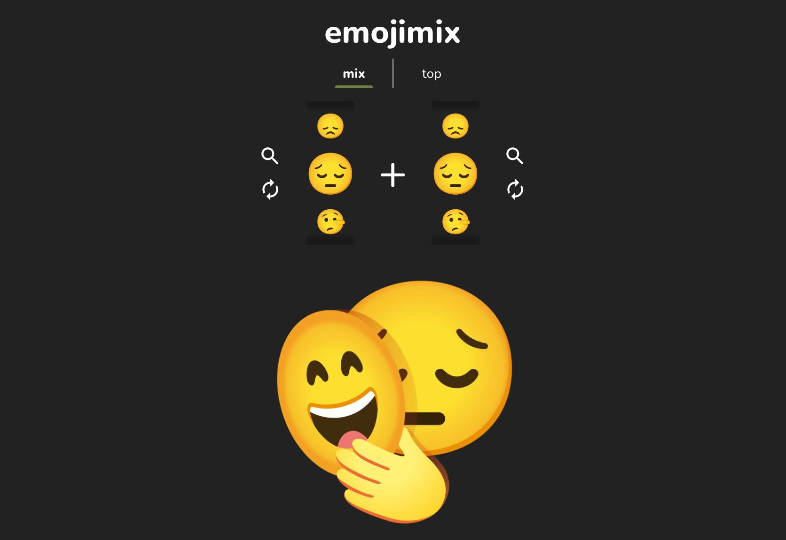

## emoji 组合一下有惊喜

emoji 想必大家都很熟悉了，它已经深度渗透到了我们日常交流中。一个简单的约定俗成的表情就能准确利落地表达出感受和想法，非常有意思。可是有时候人们的情感复合的，比如“又想哭又想笑”，于是经常会有新的 emoji 表情出现来增加表现力。你看，😂 这个表情其实就是😄和😭的组合。

有人就进一步想了，如果任意两个 emoji 组合一下，会怎么样呢？这个想法很有趣，也正有人做了这样的事：https://tikolu.net/emojimix 。这个网站很简单，就是绘制了任意两个 emoji 表情组合后的结果。当然，这些组合后的图片不是 emoji，但很多组合图片让我感受到了艺术性，仿佛看到了一段故事，甚至具备一定的文学性。感兴趣的伙伴可以自己体验一下，我分享一下我最喜欢，同时也是网友投票最多的一组：

出乎意料，不言自明，回味无穷。

如果你也从中发现了什么有趣的组合，不妨一起交流分享一下。
