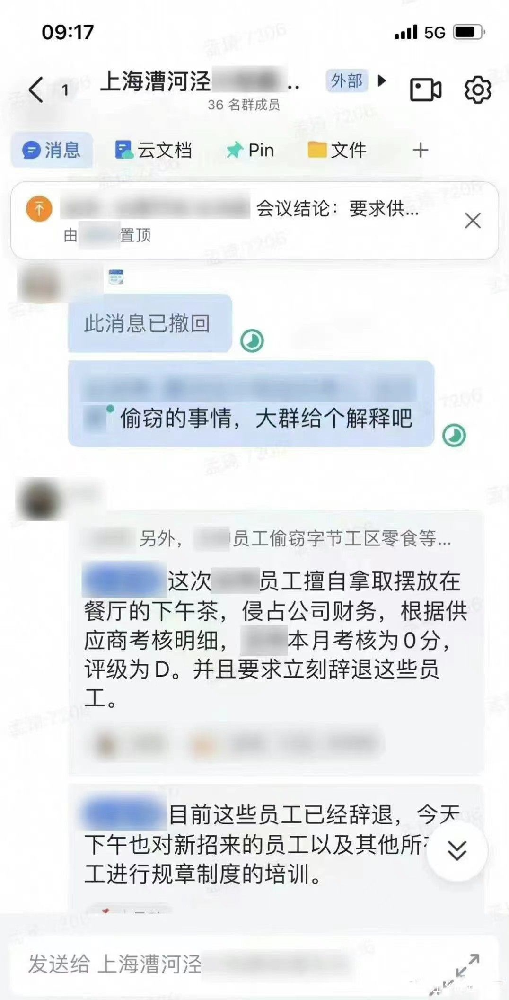

## 真相之难

真相离我们有多远？有时候其实很近，只需要冷静地获取更多的信息，冷静地思考一下为什么。而往往这一步之遥却是难以逾越的，很多人被冲动的情绪奴役，迫不及待地关闭接近真相的大门，冲进断章取义、自以为是的死胡同。

最近我司的一个小八卦在网上流传：

很快被人理解成了外包员工偷吃下午茶被辞退了。

能够引燃群体情绪的是对立，种族、性别、意识形态、阶级等等。不巧的是有些公司里正式员工与外包员工的待遇差异也是一种撩人神经的对立形态。于是，在“字节跳动”、“外包”、“偷吃下午茶”、“辞退”这些关键词面前，是不是已经有一种欺负外包员工的画面感了？至于事情到底是什么样的，好像已经不重要了，为外包员工主持公道才是应该做的。

那么这个不太重要的事实是什么样的呢？这里既没有正式员工的事，也没有外包员工的事，而是餐饮供应商公司的员工偷拿了上百份下午茶，最后供应商开除了他们公司相关的员工。
